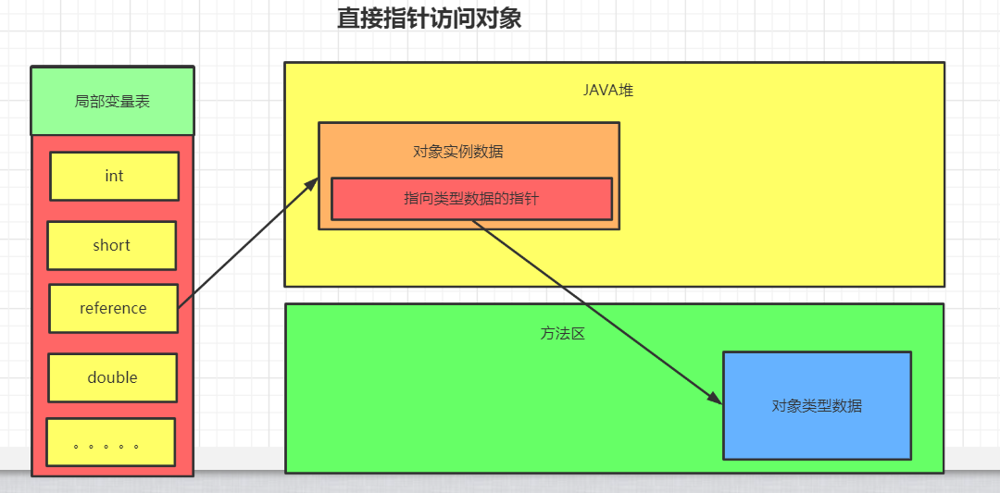
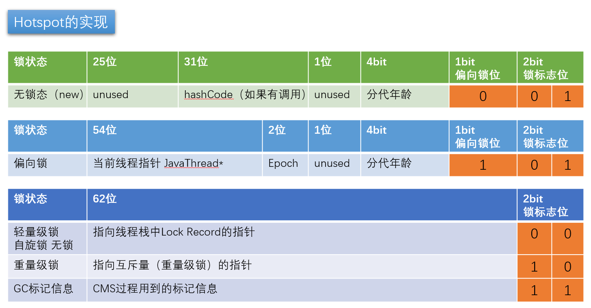
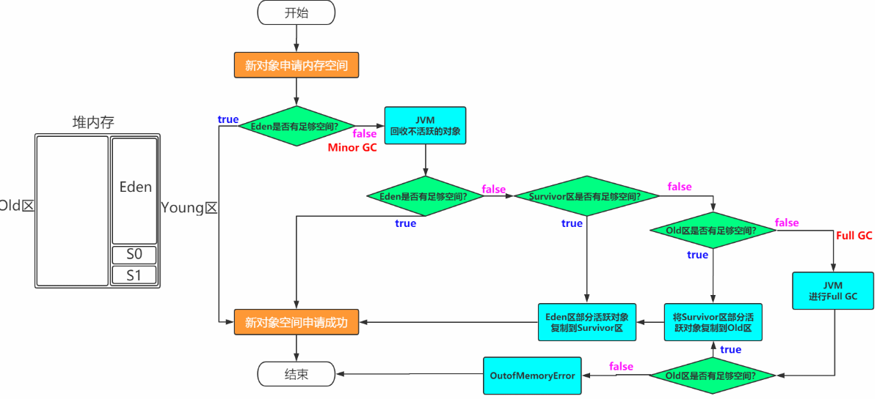
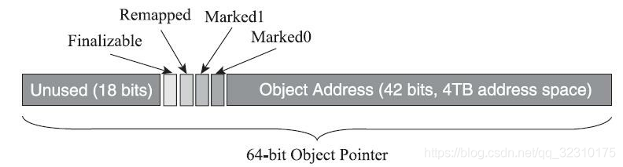

## JVM运行时数据区

JVM中，将内存分为PC寄存器、本地方法栈、虚拟机栈、堆、及元空间(也叫方法区)

### PC寄存器（Program Counter Register）

​	PC寄存器是用来存储指向下一条指令的地址，也即将将要执行的指令代码。由执行引擎读取下一条指令。

​	1.它是一块很小的内存空间，几乎可以忽略不计。也是运行速度最快的存储区域

​	2.在jvm规范中，每个线程都有它自己的程序计数器，是线程私有的，生命周期与线程的生命周期保持一致

​	3.任何时间一个线程都只有一个方法在执行，也就是所谓的当前方法。程序计数器会存储当前线程正在执行的java方法的JVM指令地	      	址；或者，如果实在执行native方法，则是未指定值（undefined）,因为程序计数器不负责本地方法栈。

​	4.它是程序控制流的指示器，分支、循环、跳转、异常处理、线程恢复等基础功能都需要依赖这个计数器来完成

jmap	java内存印象工具

​	6.它是唯一一个在java虚拟机规范中没有规定任何OOM（Out Of Memery）情况的区域,而且没有垃圾回收

### 虚拟机栈

**线程私有**      虚拟机栈描述的是JAVA方法执行的线程内存模型：

​		每个方法被执行的时候，会同步创建一个栈桢用于存储**局部变量表，操作数栈，动态连接，方法出口等**

> 局部变量表：存放了JAVA虚拟机中可知的各种基本数据类型(八大基本数据类型)，对象引用和returnAddress
>
> 操作数栈：每个独立的栈帧中处理包含局部标量表以外还包含一个后进先出的**操作数栈**，也可以称为**表达式栈**。操作数栈，在执行方法过程中，根据字节码指令，往栈中写入数据或提取数据，即入栈(push)/出栈(pop)。
>
> 如果当前方法有返回的话，其返回值将会压入当前栈帧的操作数栈中，并更新PC寄存器中的下一条需要执行的字节码指令。
>
> 其中需要注意的是，long,duble是占两个数组的位置的   **StackOverflowError**
>
> 动态链接:每个栈帧都包含一个指向运行时常量池中该栈帧所属方法的引用，持有这个引用是为了支持方法调用过程中的动态连接(Dynamic Linking)。
>
> 方法返回地址:当一个方法开始执行后,只有两种方式可以退出，一种是遇到方法返回的字节码指令；一种是遇见异常，并且这个异常没有在方法体内得到处理。

### 本地方法栈

> 和Java虚拟机栈很类似，不同的是本地方法栈为Native方法服务。  **StackOverflowError**

### Java堆

> 是Java虚拟机所管理的内存中最大的一块。由所有线程共享，在虚拟机启动时创建。堆区唯一目的就是存放对象实例。
>
>   堆中可细分为新生代和老年代，再细分可分为Eden空间、From Survivor空间、To Survivor空间。
>
>   堆无法扩展时，抛出OutOfMemoryError异常  **Java Heap space**

### 方法区

> 所有线程共享，存储内容：类型信息、常量、静态变量、及时编译器编译后的代码缓存。
>
>   当方法区无法满足内存分配需求时，抛出OutOfMemoryError **PermGen space**

### 运行时常量池

> 它是方法区的一部分，Class文件中除了有类的版本、字段、方法、接口等描述信息外，还有一项是常量池（Const Pool Table），用于存放编译期生成的各种字面量和符号引用。并非预置入Class文件中常量池的内容才进入方法运行时常量池，运行期间也可能将新的常量放入池中，这种特性被开发人员利用得比较多的便是String类的intern()方法。
>
>   当方法区无法满足内存分配需求时，抛出OutOfMemoryError   **PermGen space**

### 直接内存

> 并不是虚拟机运行时数据区的一部分，也不是Java虚拟机规范中定义的内存区域。
>
> JDK1.4加入了NIO，引入一种基于通道与缓冲区的I/O方式，它可以使用Native函数库直接分配堆外内存，然后通过一个存储在Java堆中的DirectByteBuffer对象作为这块内存的引用进行操作。因为避免了在Java堆和Native堆中来回复制数据，提高了性能。
>
> 当各个内存区域总和大于物理内存限制，抛出OutOfMemoryError异常。

## 对象的实例化内存布局与访问定位

### 	创建对象的方式

1. new 关键字
2. class.newInsatnce			
3. Contructor的newInstance
4. 使用clone
5. 使用反序列化
6. 第三方库：Objenesjs

### 创建对象的步骤

1. 判断对象的类是否有加载、连接、初始化(这个过程可以判断对象的大小)

2. 为对象开辟内存空间

   内存分配方式:

   - ​	**指针碰撞**(仅仅是把指针往空闲的地方挪动与对象大小的相等的距离)Serial,ParNew
   - ​    **空闲列表**(虚拟机维护一个表，记录哪块空间是可用的)CMS

   **TLAB**(对象分配过程，Thread Local Allocation Buffer) 

   即：每个线程预先分配一块小内存，哪个线程要分配内存就在哪个线程的缓冲区进行分配	

   - 从内存模型而不是垃圾回收的角度，对Eden区域据继续进行划分，**JVM为每个线程分配了一个私有的缓存区域**，他包含在Eden区域

   - 多线程同时分配内存时，使用TLAB可以避免一系列的非线程安全问题，同时还能提升内存分配的吞吐量，因此我们称这种内存分配为**快速分配策略**

3. 初始化分配的空间--所有属性设置默认值，保证对象不赋值时可以直接使用

4. 设置对象的对象头

5. 显示初始化（代码块中初始化、构造器中初始化）


### 对象的内存布局

#### 对象头(Header)

- 运行时元数据MarkWord    **8字节**
  1. 哈希值 hascode(实际上会延后到真正调用Object::hashCode()方法时才计算)
  2. GC分代年龄    **4字节,所以分代年龄最大15**
  3. 锁状态标志
  4. 线程持有的锁
  5. 偏向线程ID
  6. 偏向时间戳
- 类型指针：  指向类元数据InstanceClass，确定该对象的类型    **4字节(默认,也有可能是8字节,并不是所有虚拟机都保存在对象头)**
- 如果是数组，则还需要记录数组的长度      **4字节**

#### 示例数据（Instance Data）

- 他是对象真正存储的有效信息，包括程序代码中定义的各种类型的字段（包括从父类继承的及本身的字段）

- 规则
  1. 相同宽度的字段总数被分配在一起
  2. 父类中定义的变量会出现在自身变量之前
  3. 如果CompactField参数为true，子类的窄变量可能会插入到父类变量的空隙

#### 对齐填充（Padding）

不是必须的，也没特别含义，仅仅起到占位符作用

### 对象的访问定位

目前主流方式主要有两种：

- 划出一块内存作为句柄池，reference中存储这对象的访问句柄，而句柄中包含了对象的实例数据与类型数据。
- 直接指针：refrence存储这直接对象地址，然后对象再存储着类型指针。(也就是markwork保存着classpoint)



HotSpot主要使用第二种方式，因为JAVA访问对象非常频繁，可以减少一次类型指针的访问开销



> https://cloud.tencent.com/developer/article/1480590 
>
> https://cloud.tencent.com/developer/article/1484167
>
> https://cloud.tencent.com/developer/article/1485795
>
> https://cloud.tencent.com/developer/article/1482500

### Java对象生命周期

1. 创建阶段（Created）：创建Java对象
   1. 为对象分配内存空间。
   2. 构造对象。
   3. 从超类到子类对static成员进程初始化，类的static成员的初始化在ClassLoader加载该类时进行。
   4. 超类成员变量按顺序初始化化，递归调用超类的构造函数。
   5. 子类成员变量按顺序初始化，一旦对象被创建，子类的构造函数就调用该对象并为一些变量赋值。完成以上这些后对象的状态就切换到了应用阶段InUse。
2. 应用阶段（InUse）：对象至少被一个强引用持有，除非显示的使用软引用、弱引用、虚引用。
3. 不可见阶段（Invisible）：不可见阶段的对象在虚拟机的对象根引用集合中再也找不到直接或者间接的强引用，最常见的就是线程或者函数中的临时变量。
4. 不可达阶段（Unreachable）：指对象不再被任何强引用持有，GC发现该对象已经不可达。
5. 收集阶段（Collected）：GC发现对象处于不可达阶段并且GC已经对该对象的内存空间重新分配做好准备，对象进程收集阶段。如果，该对象的finalize()函数被重写，则执行该函数。
6. 终结阶段（Finalized）：对象的finalize()函数执行完成后，对象仍处于不可达状态，该对象进程终结阶段。
7. 对象内存空间重新分配阶段（Deallocaled）：GC对该对象占用的内存空间进行回收或者再分配，该对象彻底消失。

------


## 垃圾收集器与内存分配策略

### 如何定位垃圾

1. 引用计数法

2. 可达性分析算法（Reachability Analysis）

   GC roots：**线程变量、静态变量、常量池、JNI引用对象(即Native方法)、class对象**
   
   1. 虚拟机栈中引用的对象，比如：各个线程中被调用的方法堆栈中使用的到的参数，局部变量，临时变量
   2. 在方法区中类静态属性应用的对象
   3. 在方法区中常量引用的对象，譬如字符串常量池（String Table）的引用
   4. JNI引用对象
   5. JAVA虚拟机的内部引用，如基本数据类型的Classe对象，一些常驻的异常对象等
   6. 所有被同步锁(**Synchronized**关键字)持有的对象

### 常见的垃圾收集算法

- Mark-Sweep (标记清除)

  > 对需要回收的对象进行标记，然后再进行清除
  >
  > 缺点：
  >
  > 1. 执行效率不稳定，因为大量对象都是进行回收的，所以需要进行大量标记和清除动作，导致标记和清除动作效率随着对象增多而降低
  > 2. 内存碎片化，空间不连续

- Semispace Coping(拷贝)

  > 将活着的对象复制到另外一个空间上面去，从而回收整个下半区。实现简单，运行效率也比较高
  >
  > 缺点：比较浪费空间，老年代不能采用这个算法
  
- Mark-Compact(标记整理) 

  > 对所有活着的对象进行标记，然后向内存的另外一端移动，之后对边界外的空间进行整理
  >
  > 缺点：移动存活的对象必须要STW(Stop The Word),停顿时间更长。

### JVM分代模型

1. 部分垃圾回收器使用模型
2. 新生代、老年代、永久代(1.7)/元数据区(1.8) Metaspace

   > 1. 永久代数据  --Class
   > 2. 永久代必须制定大小限制、元数据区可以设置也可以不设置（受限于物理内存）
   > 3. 字符串常量1.7-永久代、1.8元数据
   > 4. MeathArea逻辑概念，永久区、元数据区
3. 新生代 =Eden+2个suvivor区 

   > 1. YGC之后，大多数对象会被回收，活着的对象进入suvivor0
   > 2. 再次YGC、活着的对象eden+s0->s1
   > 3. 再次YGC、活着对对象eden+s1->s0
   > 4. 年龄足够->老年代
4. 老年代

   > 1. 顽固分子
   > 2. 老年代满了  Major GC
5. GC Tuning(Generation)

   > 1. 尽量减少FGC
   > 2. MinorGC = YGC
   > 3. MajorGC = FGC

**其中：跨代引用是有新生代的记忆集（Remembered Set）来进行标识，Minor GC的时候，这部分也会被加入的GCRoots里面**

### 内存分配与回收策略

针对不同年龄段的对象分配原则如下

- 优先分配到Eden

- 大对象直接分配到老年代

  尽量避免出现过多的大对象

- 动态对象年龄判断

  如果Survivor区中相同年龄的所有对象大小总和大于Survivor空间的一半，年龄大于或等于该年龄的对象可以直接进入老年代，无需等到MaxTenuringThreshold中年龄的要求

- 空间分配担保：

  - -XX:MaxTenuringThreshold
  
- 分配流程



### 常见的垃圾回收器

#### serial

> 年轻代串行回收，只有一个线程，性能比较低

#### PS（Parallel Scavenge）

> 并行回收---**多线程**，与ParNew 区别是：主要关注吞吐量,即：**减少运行垃圾收集的时间**

#### ParNew 

> 年轻代配合CMS的并行回收

#### SerialOld  

> 老年代串行回收，与serial搭配使用

#### ParallelOld

>  PS的老年代收集器。

#### CMS(Concurrent Mark Sweep) 

> 老年代，并发的。垃圾回收和应用程序同时运行，降低STW的时间。其一般跟**ParNew**一起搭配使用，当其预留空间放不下用户进程分配对象的需求的话，则不得不冻结所有用户进程，启用**Serial Old**收集器进行老年代的垃圾回收

##### CMS步骤：

1. **初始标记**（CMS initial mark）

   仅仅只是标记一下 GC Roots 能直接关联到的对象，速度很快，需要停顿（STW -Stop the world）

2. **并发标记（**CMS concurrent mark）

   从 GC Root 开始对堆中对象进行可达性分析，找到存活对象，它在整个回收过程中耗时最长，不需要停顿

3. **重新标记**（CMS remark）

   为了修正并发标记期间因用户程序继续运作而导致标记产生变动的那一部分对象的标记记录，需要停顿(STW)。这个阶段的停顿时间一般会比初始标记阶段稍长一些，但远比并发标记的时间短(因为可能出现漏标，所以remark也是需要全局扫描的)

4. **并发清除**（CMS concurrent sweep）不需要停顿


##### CMS的缺点：

> - CMS收集器无法处理浮动垃圾，可能出现“Concurrent Mode Failure”失败而导致另一次Full GC的产生。在JDK1.5的默认设置下，CMS收集器当老年代使用了68%的空间后就会被激活，JDK6之后，提升到了92%；
>
>
> - CMS是基于“标记-清除”算法实现的收集器，收集结束时会有大量空间碎片产生。空间碎片过多，可能会出现老年代还有很大空间剩余，但是无法找到足够大的连续空间来分配当前对象，不得不提前出发FullGC。

##### **多标-浮动垃圾**

```
在并发标记过程中，如果由于方法运行结束导致部分局部变量(gcroot)被销毁，这个gcroot引用的对象之前又被扫描过 (被标记为非垃圾对象)，那么本轮GC不会回收这部分内存。这部分本应该回收但是没有回收到的内存，被称之为“浮动 垃圾”。浮动垃圾并不会影响垃圾回收的正确性，只是需要等到下一轮垃圾回收中才被清除。

另外，针对并发标记(还有并发清理)开始后产生的新对象，通常的做法是直接全部当成黑色，本轮不会进行清除。这部分 对象期间可能也会变为垃圾，这也算是浮动垃圾的一部分。
```

**漏标-读写屏障**

漏标只有**同时满足**以下两个条件时才会发生：

```
条件一：灰色对象 断开了 白色对象的引用；即灰色对象 原来成员变量的引用 发生了变化。

条件二：黑色对象 重新引用了 该白色对象；即黑色对象 成员变量增加了 新的引用。
```

#### G1(10ms) 三色标记 + SATB

**逻辑分代，物理不分代**

> ▪ 并发收集 
>
> ▪ 压缩空闲空间不会延长GC的暂停时间； 
>
> ▪ 更易预测的GC暂停时间； 
>
> ▪ 适用不需要实现很高的吞吐量的场景

[可能是最全面的G1学习笔记]: https://zhuanlan.zhihu.com/p/54048685

#### ZGC(1ms)

##### 染色指针技术

在64位系统中,如果没有被压缩的话,一个指向对象的指针(即地址值)是占64bit的,我们拿出4个bit,来记录一些信息.

如果这个指针原来指向了一个对象,在并发标记的过程之中,指向的对象有所改变,我们就用这4个bit来记录下这个变化

下一次重新扫描的时候,就扫描这些变化过的对象(因为是地址值,而且是约定的值,比如规定第一位0是已经变化过的,那么下次直接扫描第一位是0的就好了),只不过这样的话,zgc只能支持4tb的内存.但是如果将来前18位也可以被开发出来使用的话,这4个bit直接挪到前面,那么zgc的支持内存立刻就得以扩展.



运作过程

1. **并发标记**   更新染上指针中的Marked0、Marked1位置
2. **并发预备重分配**   根据特定的查询条件统计出这次需要清理那些Region，将这些Region组成重分配集(RegionSet)
3. **并发重分配**    把重分配表中的的存活对象复制到新的Region上，并为重分配集中的每个Region维护一个转发表
4. **并发重映射**    修正整个堆中指向重分配集中旧对象的所有引用
=======
ZGC为了能高效、灵活地管理内存，实现了两级内存管理：虚拟内存和物理内存，并且实现了物理内存和虚拟内存的映射关系。这和操作系统中虚拟地址和物理地址设计思路基本一致。

当应用程序创建对象时，首先在堆空间申请一个虚拟地址，ZGC同时会为该对象在Marked0、Marked1和Remapped三个视图空间分别申请一个虚拟地址，且这三个虚拟地址对应同一个物理地址。

##### 读屏障

请各位注意，之前我们一直在聊写屏障，而这里聊到读屏障，很多同学就会把这个读屏障跟java内存模型的读屏障混淆。这里的读屏障实际上指的是一种手段，并且是一种类似于AOP的手段。

我们之前聊的写屏障是数据写入时候的屏障，而java内存屏障中的读屏障实际上也是类似的。

但是在ZGC中的读屏障，则是JVM向应用代码插入一小段代码的技术，当应用线程从堆中读取对象引用时，就会执行这段代码。他跟我们的java内存屏障中的读屏障根本就不是一个东西。他是在字节码层面或者编译代码层面给读操作增加一个额外的处理。一个类似与面向切面的处理。

并且ZGC的读屏障是只有从中读取对象引用，才需要加入读屏障

##### 指针染色(颜色指针)

读屏障以及指针染色是我们能够实现并发转移的核心技术之一，也是关键所在。

在讲ZGC并发处理算法之前，还需要补充一个知识点——染色指针。

我们都知道，之前的垃圾收集器都是把GC信息（标记信息、GC分代年龄…）存在对象头的Mark Word里。举个例子：

如果某个物品是个垃圾，就在这个物品上盖一个“垃圾”的章；如果这个物品不是垃圾了，就把这个物品上的“垃圾”印章洗掉。

而ZGC是这样做的：

如果某个物品是垃圾。就在这个物品的信息或者标签里面标注这个物品是个垃圾，以后不管这个物品在哪扫描，快递到哪，别人都知道他是个垃圾了。也许哪一天，这个物品不再是垃圾，比如收废品的小王，觉得比如这个物品有利用价值。就把这个物品标签信息里面的“垃圾”标志去掉。

在这例子中，“这个物品”就是一个对象，而“标签”就是指向这个对象的指针。

ZGC将信息存储在指针中，这种技术有一个高大上的名字——染色指针（Colored Pointer）

原理：
Linux下64位指针的高18位不能用来寻址，但剩余的46位指针所能支持的64TB内存在今天仍然能够充分满足大型服务器的需要。鉴于此，ZGC的染色指针技术继续盯上了这剩下的46位指针宽度，将其高4位提取出来存储四个标志信息。通过这些标志位，虚拟机可以直接从指针中看到其引用对象的三色标记状态、是否进入了重分配集（即被移动过）、是否只能通过finalize()方法才能被访问到。当然，由于这些标志位进一步压缩了原本就只有46位的地址空间，也直接导致
ZGC能够管理的内存不可以超过4TB（2的42次幂)  当然，后续的版本可以了，因为开发了更多的位数。前面是觉得没必要，够大了。

而后续开发变成了这个样子：


在64位的机器中，对象指针是64位的。

* ZGC使用64位地址空间的第0~43位存储对象地址，2^44 = 16TB，所以ZGC最大支持16TB的堆。
* 而第44~47位作为颜色标志位，Marked0、Marked1和Remapped代表三个视图标志位，Finalizable表示这个对象只能通过finalizer才能访问。
* 第48~63位固定为0没有利用。
>>>>>>> 84eef0e29dea03ac78100e747719b0b83b87c1df

#### Shenandoah


## CMS收集器和G1收集器的区别？ 

1. 使用范围不一样
   -  CMS收集器是老年代的收集器，可以配合新生代的Serial和ParNew收集器一起使用 
   -  G1收集器收集范围是老年代和新生代。不需要结合其他收集器使用 
2. STW的时间
   -  CMS收集器以最小的停顿时间为目标的收集器。 
   -  G1收集器可预测垃圾回收的停顿时间（建立可预测的停顿时间模型） 
3. 垃圾碎片 
   -  CMS收集器是使用“**标记-清除**”算法进行的垃圾回收，容易产生内存碎片 
   -  G1收集器使用的是“**标记-整理**”算法，进行了空间整合，降低了内存空间碎片。

### 如果采用ParNew + CMS组合，怎样做才能够让系统基本不产生FGC

> 1.加大JVM内存
>
> 2.加大Young的比例
>
> 3.提高Y-O的年龄
>
> 4.提高S区比例
>
> 5.避免代码内存泄漏

------

## 类文件结构

### 魔法数字（MagicNumber）

​		0xCAFEBABE:确定是一个class文件，第4个字节是class文件的版本号，**第5和第6个字节是次版本号，第7和第8个字节是主版本号**，JAVA的版本号是从45开始的

### 常量池

> - 被模块导出或开放的包
> - 类和接口的全限定名
> - 字段的名称和描述符
> - 方法的名称和描述符
> - 方法句柄和方法类型
> - 动态调用点和动态常量

### 访问标志

> 用于标识类或接口的访问信息

### 类索引，父索引与接口索引集合

### 字段表集合

### 方法表集合

### 属性表集合

### InnerClass属性

### Deprecated及Synthetic属性

### StackMapTable属性

### Signature属性


------

## 类加载机制

### JVM类加载过程

​		类的加载过程可以分为： 加载、验证、准备、初始化和卸载这5个阶段的顺序是确定的，类的加载过程必须按照这种顺序进行，而解析阶段则不一定，它在某些情况下可能在初始化阶段后在开始，因为java支持运行时绑定。

#### 1.加载（loading）阶段

```html
	简单的说，类加载阶段就是由类加载器负责根据一个类的全限定名来读取此类的二进制字节流到JVM内部，并存储在运行时内存区的方法区，然后将其转换为一个与目标类型对应的java.lang.Class对象实例（Java虚拟机规范并没有明确要求一定要存储在堆区中，只是hotspot选择将Class对戏那个存储在方法区中），这个Class对象在日后就会作为方法区中该类的各种数据的访问入口。
```

#### 2.链接（linking）阶段

```
1）、验证
		验证类是否符合JVM规范，是否是一个有效的字节码文件，验证内容涵盖了类数据信息的格式验证、语义分析、操作验证等。
- 文件格式验证：验证是否符合class文件规范
- 语义验证：检查一个被标记为final的类型是否包含子类；检查一个类中的final方法视频被子类进行重写；确保父类和子类之间没有不兼容的一些方法声明（比如方法签名相同，但方法的返回值不同）
- 操作验证：在操作数栈中的数据必须进行正确的操作，对常量池中的各种符号引用执行验证（通常在解析阶段执行，检查是否通过符号引用中描述的全限定名定位到指定类型上，以及类成员信息的访问修饰符是否允许访问等）
- 2）、准备
  		为类中的所有静态变量分配内存空间，并为其设置一个初始值（由于还没有产生对象，实例变量不在此操作范围内）被final修饰的静态变量，会直接赋予原值；类字段的字段属性表中存在ConstantValue属性，则在准备阶段，其值就是ConstantValue的值
  3）、解析
  		将常量池中的符号引用转为直接引用（得到类或者字段、方法在内存中的指针或者偏移量，以便直接调用该方法），这个可以在初始化之后再执行。可以认为是一些静态绑定的会被解析，动态绑定则只会在运行是进行解析；静态绑定包括一些final方法(不可以重写),static方法(只会属于当前类)，构造器(不会被重写)
```

#### 3.初始化（init）阶段

```
	将一个类中所有被static关键字标识的代码统一执行一遍，如果执行的是静态变量，那么就会使用用户指定的值覆盖之前在准备阶段设置的初始值；如果执行的是static代码块，那么在初始化阶段，JVM就会执行static代码块中定义的所有操作。
	所有类变量初始化语句和静态代码块都会在编译时被前端编译器放在收集器里头，存放到一个特殊的方法中，这个方法就是<clinit>方法，即类/接口初始化方法。该方法的作用就是初始化一个中的变量，使用用户指定的值覆盖之前在准备阶段里设定的初始值。任何invoke之类的字节码都无法调用<clinit>方法，因为该方法只能在类加载的过程中由JVM调用。
	如果父类还没有被初始化，那么优先对父类初始化，但在<clinit>方法内部不会显示调用父类的<clinit>方法，由JVM负责保证一个类的<clinit>方法执行之前，它的父类<clinit>方法已经被执行。	
	JVM必须确保一个类在初始化的过程中，如果是多线程需要同时初始化它，仅仅只能允许其中一个线程对其执行初始化操作，其余线程必须等待，只有在活动线程执行完对类的初始化操作之后，才会通知正在等待的其他线程。
```


### 类加载器

​	用户自定义类,是由用户自定义加载器进行加载的,java的核心类库，是由引导类加载器进行加载的。

```java
public static void main(String[] args) {

        //系统类加载器
        ClassLoader systemClassLoader = ClassLoader.getSystemClassLoader();
        System.out.println(systemClassLoader);

        //拓展类加载器
        ClassLoader extClassLoader = systemClassLoader.getParent();
        System.out.println(extClassLoader);

        //bootStrap(引导类加载器)加载器,最顶层,获取不到
        ClassLoader bootStrap = extClassLoader.getParent();
        System.out.println(bootStrap);

        //对于用户自定义来说,使用系统类加载器进行加载
        ClassLoader classLoader = ClassLoaderTest.class.getClassLoader();
        System.out.println(classLoader);

        ClassLoader stringClassLoader = String.class.getClassLoader();
        System.out.println(stringClassLoader);
    }
得到结果为
sun.misc.Launcher$AppClassLoader@18b4aac2
sun.misc.Launcher$ExtClassLoader@6659c656
null
sun.misc.Launcher$AppClassLoader@18b4aac2
null
```

### 用户自定义类加载器

​	在日常开发中，用户基本上用引导类加载器、拓展类加载器，系统类加载器这3中互相配合使用的。在必要时，还可以自定义类的加载器，来定制类的加载方式。用户自定义类的加载器的时候，一般继承**URLClassLoader**，可以尽量减少用户的开发

- 隔离加载类
- 修改类的加载方式
- 拓展加载源
- 防止源代码泄露

------


# JMM(JAVA内存模型)

## 主内存与工作内存

所有变量都存储在主内存，每条线程都有自己的工作内存，线程工作内存中保存了被该线程引用变量的主内存副本，线程对变量的所有操作(读取、赋值)都必须在工作内存中进行，而不能直接读写主内存中的数据。不同线程之间也无法访问对方工作内存中的变量，线程之间的变量传递，均需通通过主内存来完成。


## 内存间交互操作

- lock(锁定) ：作用于主内存的变量，它把一个变量标识为一条线程独占的状态
- unlock(解锁)：作用于主内存的变量，它把一个处于锁定状态的变量释放出来，释放后的变量才可以被其他线程锁定
- read(读取)：作用于主内存变量，它把一个变量的值从主内存传输到线程的工作内存中，以便后续load动作使用
- load(载入)：作用于工作内存变量，它把read操作从主内存中得到的变量放入到工作内存的变量当中
- use(使用)：作用于工作内存的变量，它把工作内存的一个变量的值传递给执行引擎，每当虚拟机遇到一个需要使用变量的字节码指令时，会执行这个操作
- assign(赋值)：作用于工作内存的变量，它把一个从执行引擎接收的值赋给工作内存中的一个变量
- store(存储)：作用于工作保存中的变量，它把工作内存中的值传递到主内存中，以便后续的write操作
- write(写入)：作用于主内存中，它把store操作从工作内存中得到的变量的值，放入主内存的变量中

------

# 强软弱虚引用

（1）强引用是使用最普遍的引用。**只要某个对象有强引用与之关联，JVM必定不会回收这个对象，即使在内存不足的情况下，JVM宁愿抛出OutOfMemory错误也不会回收这种对象**

（2）软引用是用来描述一些有用但并不是必需的对象，在Java中用java.lang.ref.SoftReference类来表示。**只有在内存不足的时候JVM才会回收该对象。**软引用可用来实现内存敏感的高速缓存。 软引用可以和一个引用队列（ReferenceQueue）联合使用，如果软引用所引用的对象被垃圾回收，Java虚拟机就会把这个软引用加入到与之关联的引用队列中

（3）只具有弱引用的对象拥有**更短暂的生命周期**。在**GC**的过程中，一旦发现了**只具有弱引用的对象**，不管当前内存空间足够与否，都会**立即**回收它的内存。弱引用可以和一个引用队列（ReferenceQueue）联合使用，如果弱引用所引用的对象被垃圾回收，Java虚拟机就会把这个弱引用加入到与之关联的引用队列中。

（4）虚引用也称为**幻影引用**，一个对象是都有虚引用的存在都不会对生存时间都构成影响，也无法通过虚引用来获取对一个对象的真实引用。唯一的用处：能在对象被GC时收到系统通知，JAVA中用PhantomReference来实现虚引用

虚引用必须和引用队列 （ReferenceQueue）联合使用。当垃圾回收器准备回收一个对象时，如果发现它还有虚引用，就会在回收对象的内存之前，把这个虚引用加入到与之 关联的引用队列中

