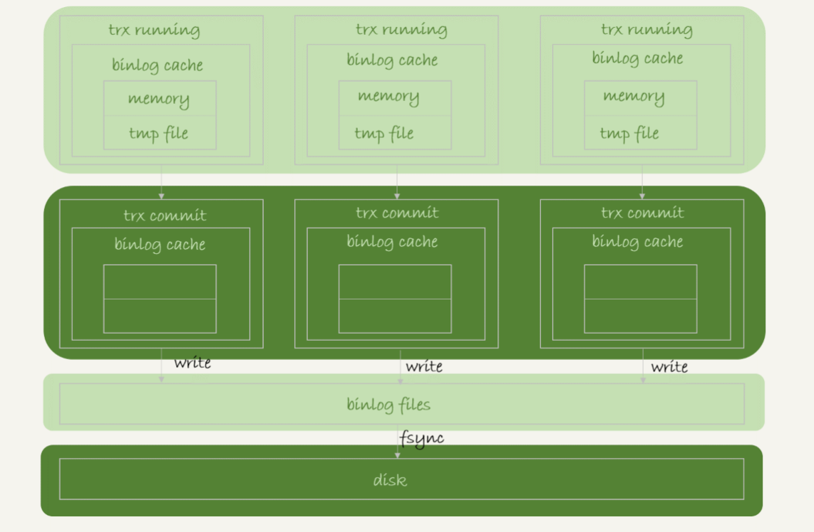
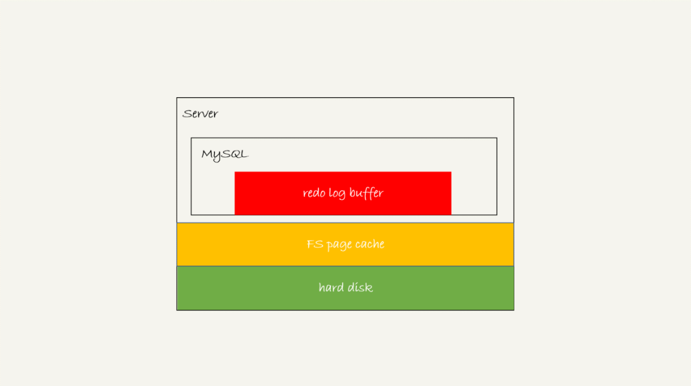

# 一条SQL语句的执行流程


大体来说，MySQL 可以分为 Server 层和存储引擎层两部分。

## Server 层: 

连接器、查询缓存、分析器、优化器、执行器等，涵盖 MySQL 的大多数核心服务功能，以及所有的内置函数（如日期、时间、数学和加密函数等），所有跨存储引擎的功能都在这一层实现，比如存储过程、触发器、视图等。

## 存储引擎层


## 两阶段提交：主要解决回滚

## **MVCC**

### 在两阶段提交的不同时刻，MySQL 异常重启会出现什么现象。

如果在图中时刻 A 的地方，也就是写入 redo log 处于 prepare 阶段之后、写 binlog 之前，发生了崩溃（crash），由于此时 binlog 还没写，redo log 也还没提交，所以崩溃恢复的时候，这个事务会回滚。这时候，binlog 还没写，所以也不会传到备库。到这里，大家都可以理解。

大家出现问题的地方，主要集中在时刻 B，也就是 binlog 写完，redo log 还没 commit 前发生 crash，那崩溃恢复的时候 MySQL 会怎么处理？

#### 崩溃恢复时的判断规则

1. 如果 redo log 里面的事务是完整的，也就是已经有了 commit 标识，则直接提交；

2. 如果 redo log 里面的事务只有完整的 prepare，则判断对应的事务 binlog 是否存在并完整：

   1. 如果是，则提交事务；
   2. 否则，回滚事务。

   

# 索引

​	**索引的作用：提高数据查询效率**

### 常见索引模型：

哈希表：把值放在数组里，用一个哈希函数把key换算成一个确定的位置，然后把value放在数组的这个位置。只有等值查询的场景

有序数组：按顺序存储。查询用二分法就可以快速查询，时间复杂度是：O(log(N))。有序数组查询效率高，更新效率低

搜索树：每个节点的左儿子小于父节点，父节点又小于右儿子。查询时间复杂度O(log(N))，更新时间复杂度O(log(N))

### 索引类型：主键索引、非主键索引

主键索引的叶子节点存的是整行的数据(聚簇索引)，非主键索引的叶子节点内容是主键的值(二级索引)
主键索引和普通索引的区别：主键索引只要搜索ID这个B+Tree即可拿到数据。普通索引先搜索索引拿到主键值，再到主键索引树搜索一次(回表)。

注意： InnoDB 这种引擎导致虽然删除了表的部分记录,但是它的索引还在, 并未释放。只能是重新建表才能重建索引。

1. 覆盖索引：如果查询条件使用的是普通索引（或是联合索引的最左原则字段），查询结果是联合索引的字段或是主键，不用回表操作，直接返回结果，减少IO磁盘读写读取正行数据

2. 最左前缀：联合索引的最左 N 个字段，也可以是字符串索引的最左 M 个字符

3. **联合索引**：根据创建联合索引的顺序，以最左原则进行where检索，比如（age，name）以age=1 或 age= 1 and name=‘张三’可以使用索引，单以name=‘张三’ 不会使用索引，考虑到存储空间的问题，还请根据业务需求，将查找频繁的数据进行靠左创建索引。其中索引的建立是根据最左的列建立，其叶子节点是联合的。

   ```
   1. 条件: 联合索引应用要满足最左原则
   a. 建立联合索引时，选择重复值较少的列作为最左列。
   b. 使用联合索引时，查询条件中，必须包含最左列，才有可能应用到联合索引。 联合索引不同覆盖场景
   ```

   

4. 索引下推：like 'hello%’and age >10 检索，MySQL5.6版本之前，会对匹配的数据进行回表查询。5.6版本后，会先过滤掉age<10的数据，再进行回表查询，减少回表率，提升检索速度(只有联合索引才会有索引下推)

## 普通索引与唯一索引的选择

### change buffer

当需要更新一个数据页时，如果数据页在内存中就直接更新，而如果这个数据页还没有在内存中的话，在不影响数据一致性的前提下，InnoDB 会将这些更新操作缓存在 change buffer 中，这样就不需要从磁盘中读入这个数据页了。在下次查询需要访问这个数据页的时候，将数据页读入内存，然后执行 change buffer 中与这个页有关的操作。通过这种方式就能保证这个数据逻辑的正确性。

对于唯一索引来说，所有的更新操作都要先判断这个操作是否违反唯一性约束。比如，要插入 (4,400) 这个记录，就要先判断现在表中是否已经存在 k=4 的记录，而这必须要将数据页读入内存才能判断。如果都已经读入到内存了，那直接更新内存会更快，就没必要使用 change buffer 了。

**因此, 普通索引和唯一索引的查询性能几乎一样, 但是写性能是普通索引快, 因为可以用到change buffer, 唯一索引会导致内存命中率下降**

## 前缀索引

1：直接创建完整索引，这样可能比较占用空间；

这种方式最简单，如果性能没问题，我会这么创建，简单直接且存储空间的费用越来越低

2：创建前缀索引，节省空间，但会增加查询扫描次数，并且不能使用覆盖索引；

这种方式需要判断出前缀的长度多少合适，需要根据自己的业务来定，主要是看区分度多少合适

3：倒序存储，再创建前缀索引，用于绕过字符串本身前缀的区分度不够的问题；

这种方式用于前缀区分度不高后缀区分度高的场景，目的还是要提高索引的区分度，使用这种方式不适合范围检索

4：创建 hash 字段索引，查询性能稳定，有额外的存储和计算消耗，跟第三种方式一样，都不支持范围扫描。


------

##  **执行计划获取和分析**

```sql
获取语句的执行计划工具，只针对索引应用和优化器算法应用部分信息。
explain (format = tree) 
desc
mysql> desc select * from city where countrycode='CHN';
mysql> explain  select * from city where countrycode='CHN';
```

### 信息介绍

```sql
table :此次查询访问的表
type :索引查询的类型(ALL、index、range、ref、eq_ref、const(system)、NULL) possible_keys :可能会应用的索引
key : 最终选择的索引
key_len :索引覆盖长度，主要是用来判断联合索引应用长度。
rows :需要扫描的行数
Extra :额外信息
```


### type信息详解

```sql
# ALL 没有使用到索引
a. 查询条件没建立索引
mysql> desc select * from city where district='shandong';
b. 有索引不走
mysql> desc select * from city where countrycode!='CHN';
mysql> desc select * from city where countrycode not in ('CHN','USA'); mysql> desc select * from city where countrycode like '%CH%';
```

```sql
# index 全索引扫描
mysql> desc select countrycode from city;
注意: 建议不要出现。特别是聚簇索引INDEX，相当于全表扫描。
```

```sql
# range 索引范围扫描
会受到: B+TREE额外优化，叶子节点双向指针
mysql> desc select * from city where id<10;
mysql> desc select * from city where countrycode like 'CH%';
注意: 范围查找最好缩小查询范围。比如> < 要有上限和下限，或者可以使用limit进行限制。 特别是在做delete 和 update。在索引设计不合理时，使用limit有可能会出现主从数据不一致。
以下两种查询，大几率受不到叶子节点双向指针优化。
mysql> desc select * from city where countrycode in ('CHN','USA');
mysql> desc select * from city where countrycode='CHN' or countrycode='USA';
```

```sql
# ref 辅助索引等值查询
desc select * from city where countrycode='CHN';
```

```sql
#eq_ref : 多表连接查询中，非驱动表的连接条件是主键或唯一键时。
mysql> desc select city.name,country.name
from city
left join country
on city.countrycode=country.code where city.population<100;
```

```sql
# const(system): 主键或唯一键等值查询 
mysql> select * from city where id=1;
```

```sql
# NULL
mysql> desc select * from city where id=1000000000000000;
```

## B+树数据结构


MySQL中InnoDB页的大小默认是**16kB**。也可以自己进行设置。（计算机在存储数据的时候，最小存储单元是扇区，一个扇区的大小是 512 字节，而文件系统（例如 XFS/EXT4）最小单元是块，一个块的大小是 4KB。InnoDB 引擎存储数据的时候，是以页为单位的，每个数据页的大小默认是 16KB，即四个块。）

在B+树中，一个结点就是一页。非[叶子结点](https://so.csdn.net/so/search?q=叶子结点&spm=1001.2101.3001.7020)由主键值和一个指向下一层的地址的指针组成的组合组成。叶子结点中由一组键值对和一个指向该层下一页的指针组成，键值对存储的主键值和数据。

由存储结构，可以大概计算出一个B+树能存储的数据数量。

指针在InnoDB中为6字节，设主键的类型是bigint，占8字节。一组就是14字节。

计算出一个非叶子结点可以存储16 * 1024 / 14 = 1170个索引指针。

假设一条数据的大小是1KB，那么一个叶子结点可以存储16条数据。

得出两层B+树可以存储1170 x 16 = 18720 条数据。

三层B+树可以存储1170 x 1170 x 16 = 21902400条数据。

# 事务

## 事务的特性

事务是由一组SQL语句组成的逻辑处理单元，是满足 ACID 特性的一组操作，可以通过 Commit 提交一个事务，也可以使用 Rollback 进行回滚。事务具有以下4个属性，通常简称为事务的ACID属性:

- 原子性（**Atomicity**）：**事务是一个原子操作单元，其对数据的修改，要么全都执行，要么全都不执行**。比如在同一个事务中的SQL语句，要么全部执行成功，要么全部执行失败。回滚可以用日志来实现，日志记录着事务所执行的修改操作，在回滚时反向执行这些修改操作即可。
- 一致性（**Consistent**）：**在事务开始和完成时，数据都必须保持一致状态**。这意味着所有相关的数据规则都必须应用于事务的修改，以保持数据的完整性；事务结束时，所有的内部数据结构（如B树索引或双向链表）也都必须是正确的。 以转账为例子，A向B转账，假设转账之前这两个用户的钱加起来总共是2000，那么A向B转账之后，不管这两个账户怎么转，A用户的钱和B用户的钱加起来的总额还是2000，这个就是事务的一致性。
- 隔离性（**Isolation**）：数据库系统提供一定的隔离机制，保证事务在不受外部并发操作影响的“独立”环境执行。 **隔离性是当多个用户并发访问数据库时，比如操作同一张表时，数据库为每一个用户开启的事务，不能被其他事务的操作所干扰，多个并发事务之间要相互隔离**。即要达到这么一种效果：对于任意两个并发的事务 T1 和 T2，在事务 T1 看来，T2 要么在 T1 开始之前就已经结束，要么在 T1 结束之后才开始，这样每个事务都感觉不到有其他事务在并发地执行。
- 持久性（**Durable**）：事务完成之后，它对于数据的修改是永久性的，即使出现系统故障也能够保持。 　可以通过数据库备份和恢复来实现，在系统发生奔溃时，使用备份的数据库进行数据恢复。

> MySQL 默认采用**自动提交模式**。也就是说，如果不显式使用 `START TRANSACTION` 语句来开始一个事务，那么每个查询都会被当做一个事务自动提交。

这几个特性不是一种平级关系： > > - 只有满足一致性，事务的执行结果才是正确的。 > - 在无并发的情况下，事务串行执行，隔离性一定能够满足。此时要只要能满足原子性，就一定能满足一致性。 > - 在并发的情况下，多个事务并发执行，事务不仅要满足原子性，还需要满足隔离性，才能满足一致性。 > - 事务满足持久化是为了能应对数据库奔溃的情况。

## 事务的隔离级别

### **Read uncommitted(读未提交)**

​		如果一个事务已经开始写数据，则另外一个事务不允许同时进行写操作，但允许其他事务读此行数据，该隔离级别可以通过“排他写锁”，但是不排斥读线程实现。这样就避免了更新丢失，却可能出现脏读，也就是说事务B读取到了事务A未提交的数据

**解决了更新丢失，但还是可能会出现脏读**

### **Read committed(读提交)**

如果是一个读事务(线程)，则允许其他事务读写，如果是写事务将会禁止其他事务访问该行数据，该隔离级别避免了脏读，但是可能出现不可重复读。事务A事先读取了数据，事务B紧接着更新了数据，并提交了事务，而事务A再次读取该数据时，数据已经发生了改变。

**解决了更新丢失和脏读问题**

### **Repeatable read(可重复读取)**

可重复读取是指在一个事务内，多次读同一个数据，在这个事务还没结束时，其他事务不能访问该数据(包括了读写)，这样就可以在同一个事务内两次读到的数据是一样的，因此称为是可重复读隔离级别，读取数据的事务将会禁止写事务(但允许读事务)，写事务则禁止任何其他事务(包括了读写)，这样避免了不可重复读和脏读，但是有时可能会出现幻读。(读取数据的事务)可以通过“共享读镜”和“排他写锁”实现。

**解决了更新丢失、脏读、不可重复读、但是还会出现幻读**

### Serializable(可序化)

提供严格的事务隔离，它要求事务序列化执行，事务只能一个接着一个地执行，但不能并发执行，如果仅仅通过“行级锁”是无法实现序列化的，必须通过其他机制保证新插入的数据不会被执行查询操作的事务访问到。序列化是最高的事务隔离级别，同时代价也是最高的，性能很低，一般很少使用，在该级别下，事务顺序执行，不仅可以避免脏读、不可重复读，还避免了幻读

**解决了更新丢失、脏读、不可重复读、幻读(虚读)**

innodb支持**RC**(Read Commited)和**RR**(Repeatable read隔离级别实现是用的一致性视图(consistent read view)

## 并发一致性问题

### 1、更新丢失(Lost Update)

**T1 和 T2 两个事务都对一个数据进行修改，T1 先修改，T2 随后修改，T2 的修改覆盖了 T1 的修改**。

例如，两个程序员修改同一java文件。每程序员独立地更改其副本，然后保存更改后的副本，这样就覆盖了原始文档。最后保存其更改副本的编辑人员覆盖前一个程序员所做的更改。

**如果在一个程序员完成并提交事务之前，另一个程序员不能访问同一文件，则可避免此问题**。

### 2、脏读

一句话：事务B读取到了事务A已修改但尚未提交的的数据，还在这个数据基础上做了操作。此时，如果A事务回滚`Rollback`，B读取的数据无效，不符合一致性要求。

解决办法: 把数据库的事务隔离级别调整到 `READ_COMMITTED`

**T1 修改一个数据，T2 随后读取这个数据。如果 T1 撤销了这次修改，那么 T2 读取的数据是脏数据**。

### 3、不可重复读(Non-Repeatable Reads)

在一个事务内，多次读同一个数据。在这个事务还没有结束时，另一个事务也访问该同一数据。那么，在第一个事务的两次读数据之间。由于第二个事务的修改，那么第一个事务读到的数据可能不一样，这样就发生了在一个事务内两次读到的数据是不一样的，因此称为不可重复读，即原始读取不可重复。

**一句话：一个事务范围内两个相同的查询却返回了不同数据**。

同时操作，事务1分别读取事务2操作时和提交后的数据，读取的记录内容不一致。**不可重复读是指在同一个事务内，两个相同的查询返回了不同的结果**。

解决办法: 如果只有在修改事务完全提交之后才可以读取数据，则可以避免该问题。把数据库的事务隔离级别调整到`REPEATABLE_READ`

**T2 读取一个数据，T1 对该数据做了修改。如果 T2 再次读取这个数据，此时读取的结果和第一次读取的结果不同**。

### 4、幻读

一个事务T1按相同的查询条件重新读取以前检索过的数据，却发现其他事务T2插入了满足其查询条件的新数据，这种现象就称为“幻读”。（和可重复读类似，但是事务 T2 的数据操作仅仅是插入和删除，不是修改数据，读取的记录数量前后不一致）

一句话：事务A 读取到了事务B提交的新增数据，不符合隔离性。

解决办法: 如果在操作事务完成数据处理之前，任何其他事务都不可以添加新数据，则可避免该问题。把数据库的事务隔离级别调整到 `SERIALIZABLE_READ`。

T1 读取某个范围的数据，T2 在这个范围内插入新的数据，T1 再次读取这个范围的数据，此时读取的结果和和第一次读取的结果不同。

## MVCC（Multiversion Concurrency Contro）

MySQL在REPEATABLE READ隔离级别下，是可以很大程度避免幻读问题的发生的（**好像解决了，但是又没完全解决**），MySQL是怎么做到的？

### 版本链

**必须要知道的概念（每个版本链针对的一条数据）：**

我们知道，对于使用InnoDB存储引擎的表来说，它的聚簇索引记录中都包含两个必要的隐藏列（row_id并不是必要的，我们创建的表中有主键或者非NULL的UNIQUE键时都不会包含row_id列）：
trx_id：每次一个事务对某条聚簇索引记录进行改动时，都会把该事务的事务id赋值给trx_id隐藏列。
roll_pointer：每次对某条聚簇索引记录进行改动时，都会把旧的版本写入到undo日志中，然后这个隐藏列就相当于一个指针，可以通过它来找到该记录修改前的信息。

（补充点：undo日志：为了实现事务的原子性，InnoDB存储引擎在实际进行增、删、改一条记录时，都需要先把对应的undo日志记下来。**一般每对一条记录做一次改动，就对应着一条undo日志**，但在某些更新记录的操作中，也可能会对应着2条undo日志。一个事务在执行过程中可能新增、删除、更新若干条记录，也就是说需要记录很多条对应的undo日志，这些undo日志会被从0开始编号，也就是说根据生成的顺序分别被称为第0号undo日志、第1号undo日志、...、第n号undo日志等，这个编号也被称之为undo no。）

为了说明这个问题，我们创建一个演示表

```
CREATE TABLE teacher (
number INT,
name VARCHAR(100),
domain varchar(100),
PRIMARY KEY (number)
) Engine=InnoDB CHARSET=utf8;
```

然后向这个表里插入一条数据：

```
INSERT INTO teacher VALUES(1, '李瑾', 'JVM系列');
```

现在表里的数据就是这样的：


假设插入该记录的事务id为60，那么此刻该条记录的示意图如下所示：


假设之后两个事务id分别为80、120的事务对这条记录进行UPDATE操作，操作流程如下：


每次对记录进行改动，都会记录一条undo日志，每条undo日志也都有一个roll_pointer属性（INSERT操作对应的undo日志没有该属性，因为该记录并没有更早的版本），可以将这些undo日志都连起来，串成一个链表，所以现在的情况就像下图一样：


对该记录每次更新后，都会将旧值放到一条undo日志中，就算是该记录的一个旧版本，随着更新次数的增多，所有的版本都会被roll_pointer属性连接成一个链表，我们把这个链表称之为版本链，版本链的头节点就是当前记录最新的值。另外，每个版本中还包含生成该版本时对应的事务id。**于是可以利用这个记录的版本链来控制并发事务访问相同记录的行为，那么这种机制就被称之为多版本并发控制(Mulit-Version Concurrency Control MVCC)。**

### ReadView

**必须要知道的概念（作用于SQL查询语句）**

对于使用READ UNCOMMITTED隔离级别的事务来说，由于可以读到未提交事务修改过的记录，所以直接读取记录的最新版本就好了（**所以就会出现脏读、不可重复读、幻读**）。


对于使用SERIALIZABLE隔离级别的事务来说，InnoDB使用加锁的方式来访问记录（**也就是所有的事务都是串行的，当然不会出现脏读、不可重复读、幻读**）。


对于使用READ COMMITTED和REPEATABLE READ隔离级别的事务来说，都必须保证读到已经提交了的事务修改过的记录，也就是说假如另一个事务已经修改了记录但是尚未提交，是不能直接读取最新版本的记录的，核心问题就是：READ COMMITTED和REPEATABLE READ隔离级别在不可重复读和幻读上的区别是从哪里来的，其实结合前面的知识，这两种隔离级别关键**是需要判断一下版本链中的哪个版本是当前事务可见的**。
**为此，InnoDB提出了一个ReadView的概念（作用于SQL查询语句），**

这个ReadView中主要包含4个比较重要的内容：
**m_ids：**表示在生成ReadView时当前系统中活跃的读写事务的事务id列表。
**min_trx_id：**表示在生成ReadView时当前系统中活跃的读写事务中最小的事务id，也就是m_ids中的最小值。
**max_trx_id：**表示生成ReadView时系统中应该分配给下一个事务的id值。注意max_trx_id并不是m_ids中的最大值，事务id是递增分配的。比方说现在有id为1，2，3这三个事务，之后id为3的事务提交了。那么一个新的读事务在生成ReadView时，m_ids就包括1和2，min_trx_id的值就是1，max_trx_id的值就是4。
**creator_trx_id：**表示生成该ReadView的事务的事务id。

### READ COMMITTED

#### 脏读问题的解决

READ COMMITTED隔离级别的事务在每次查询开始时都会生成一个独立的ReadView。

在MySQL中，READ COMMITTED和REPEATABLE READ隔离级别的的一个非常大的区别就是它们生成ReadView的时机不同。
我们还是以表teacher 为例，假设现在表teacher 中只有一条由事务id为60的事务插入的一条记录，接下来看一下READ COMMITTED和REPEATABLE READ所谓的生成ReadView的时机不同到底不同在哪里。
READ COMMITTED —— 每次读取数据前都生成一个ReadView
比方说现在系统里有两个事务id分别为80、120的事务在执行：Transaction 80

```
UPDATE teacher  SET name = '马' WHERE number = 1;
UPDATE teacher  SET name = '连' WHERE number = 1;
...
```

此刻，表teacher 中number为1的记录得到的版本链表如下所示：


假设现在有一个使用READ COMMITTED隔离级别的事务开始执行：


```
使用READ COMMITTED隔离级别的事务

BEGIN;
SELECE1：Transaction 80、120未提交

SELECT * FROM teacher WHERE number = 1; # 得到的列name的值为'李瑾'
```

第1次select的时间点 如下图：


这个SELECE1的执行过程如下：
在执行SELECT语句时会先生成一个ReadView：

ReadView的m_ids列表的内容就是[80, 120]，min_trx_id为80，max_trx_id为121，creator_trx_id为0。

然后从版本链中挑选可见的记录，从图中可以看出，最新版本的列name的内容是'**连**'，该版本的trx_id值为80，在m_ids列表内，所以不符合可见性要求（trx_id属性值在ReadView的min_trx_id和max_trx_id之间说明创建ReadView时生成该版本的事务还是活跃的，该版本不可以被访问；如果不在，说明创建ReadView时生成该版本的事务已经被提交，该版本可以被访问），根据roll_pointer跳到下一个版本。
下一个版本的列name的内容是'**马**'，该版本的trx_id值也为80，也在m_ids列表内，所以也不符合要求，继续跳到下一个版本。
下一个版本的列name的内容是'**李瑾**'，该版本的trx_id值为60，小于ReadView中的min_trx_id值，所以这个版本是符合要求的，最后返回给用户的版本就是这条列name为'**李瑾**'的记录。

**所以有了这种机制，就不会发生脏读问题！因为会去判断活跃版本，必须是不在活跃版本的才能用，不可能读到没有 commit的记录。**


#### 不可重复读问题

然后，我们把事务id为80的事务提交一下，然后再到事务id为120的事务中更新一下表teacher 中number为1的记录：


```
Transaction120

BEGIN;

更新了一些别的表的记录

UPDATE teacher  SET name = '严' WHERE number = 1;
UPDATE teacher  SET name = '晁' WHERE number = 1;

```

此刻，表teacher 中number为1的记录的版本链就长这样：


然后再到刚才使用READ COMMITTED隔离级别的事务中继续查找这个number为1的记录，如下：

使用READ COMMITTED隔离级别的事务

```
BEGIN;

SELECE1：Transaction 80、120均未提交

SELECT * FROM teacher WHERE number = 1; # 得到的列name的值为'李瑾'

SELECE2：Transaction 80提交，Transaction 120未提交

SELECT * FROM teacher WHERE number = 1; # 得到的列name的值为'连'

```

**第2次select的时间点 如下图：**


这个SELECE2的执行过程如下：

SELECT * FROM teacher WHERE number = 1;

在执行SELECT语句时会又会单独生成一个ReadView，该ReadView信息如下：

m_ids列表的内容就是[120]（事务id为80的那个事务已经提交了，所以再次生成快照时就没有它了），min_trx_id为120，max_trx_id为121，creator_trx_id为0。
然后从版本链中挑选可见的记录，从图中可以看出，最新版本的列name的内容是'**晁**'，该版本的trx_id值为120，在m_ids列表内，所以不符合可见性要求，根据roll_pointer跳到下一个版本。
下一个版本的列name的内容是'**严**'，该版本的trx_id值为120，也在m_ids列表内，所以也不符合要求，继续跳到下一个版本。
下一个版本的列name的内容是'**连**'，该版本的trx_id值为80，小于ReadView中的min_trx_id值120，所以这个版本是符合要求的，最后返回给用户的版本就是这条列name为'**连**'的记录。

以此类推，如果之后事务id为120的记录也提交了，再次在使用READ COMMITTED隔离级别的事务中查询表teacher 中number值为1的记录时，得到的结果就是'**晁**'了，具体流程我们就不分析了。


#### 但会出现不可重复读问题。

明显上面一个事务中两次


### REPEATABLE READ

#### REPEATABLE READ解决不可重复读问题

REPEATABLE READ —— 在第一次读取数据时生成一个ReadView

对于使用REPEATABLE READ隔离级别的事务来说，只会在第一次执行查询语句时生成一个ReadView，之后的查询就不会重复生成了。我们还是用例子看一下是什么效果。

比方说现在系统里有两个事务id分别为80、120的事务在执行：Transaction 80

```
UPDATE teacher  SET name = '马' WHERE number = 1;
UPDATE teacher  SET name = '连' WHERE number = 1;
...
```

此刻，表teacher 中number为1的记录得到的版本链表如下所示：


假设现在有一个使用REPEATABLE READ隔离级别的事务开始执行：


```
使用READ COMMITTED隔离级别的事务

BEGIN;
SELECE1：Transaction 80、120未提交

SELECT * FROM teacher WHERE number = 1; # 得到的列name的值为'李瑾'
```

这个SELECE1的执行过程如下：
在执行SELECT语句时会先生成一个ReadView：

ReadView的m_ids列表的内容就是[80, 120]，min_trx_id为80，max_trx_id为121，creator_trx_id为0。

然后从版本链中挑选可见的记录，从图中可以看出，最新版本的列name的内容是'**连**'，该版本的trx_id值为80，在m_ids列表内，所以不符合可见性要求（trx_id属性值在ReadView的min_trx_id和max_trx_id之间说明创建ReadView时生成该版本的事务还是活跃的，该版本不可以被访问；如果不在，说明创建ReadView时生成该版本的事务已经被提交，该版本可以被访问），根据roll_pointer跳到下一个版本。
下一个版本的列name的内容是'**马**'，该版本的trx_id值也为80，也在m_ids列表内，所以也不符合要求，继续跳到下一个版本。
下一个版本的列name的内容是'**李瑾**'，该版本的trx_id值为60，小于ReadView中的min_trx_id值，所以这个版本是符合要求的，最后返回给用户的版本就是这条列name为'**李瑾**'的记录。
之后，我们把事务id为80的事务提交一下，然后再到事务id为120的事务中更新一下表teacher 中number为1的记录：


```
Transaction120

BEGIN;

更新了一些别的表的记录

UPDATE teacher  SET name = '严' WHERE number = 1;
UPDATE teacher  SET name = '晁' WHERE number = 1;

```

此刻，表teacher 中number为1的记录的版本链就长这样：


然后再到刚才使用REPEATABLE READ隔离级别的事务中继续查找这个number为1的记录，如下：

使用READ COMMITTED隔离级别的事务

```
BEGIN;

SELECE1：Transaction 80、120均未提交

SELECT * FROM teacher WHERE number = 1; # 得到的列name的值为'李瑾'

SELECE2：Transaction 80提交，Transaction 120未提交

SELECT * FROM teacher WHERE number = 1; # 得到的列name的值为'李瑾'

```

这个SELECE2的执行过程如下：

因为当前事务的隔离级别为REPEATABLE READ，而之前在执行SELECE1时已经生成过ReadView了，所以此时直接复用之前的ReadView，之前的ReadView的m_ids列表的内容就是[80, 120]，min_trx_id为80，max_trx_id为121，creator_trx_id为0。

**根据前面的分析，返回的值还是'李瑾'。**

**也就是说两次SELECT查询得到的结果是重复的，记录的列name值都是'李瑾'，这就是可重复读的含义。**


**总结一下就是：**

**ReadView中的比较规则(前两条)**

1、如果被访问版本的trx_id属性值与ReadView中的creator_trx_id值相同，意味着当前事务在访问它自己修改过的记录，所以该版本可以被当前事务访问。

2、如果被访问版本的trx_id属性值小于ReadView中的min_trx_id值，表明生成该版本的事务在当前事务生成ReadView前已经提交，所以该版本可以被当前事务访问。

### MVCC下的幻读解决和幻读现象

前面我们已经知道了，REPEATABLE READ隔离级别下MVCC可以解决不可重复读问题，那么幻读呢？MVCC是怎么解决的？幻读是一个事务按照某个相同条件多次读取记录时，后读取时读到了之前没有读到的记录，而这个记录来自另一个事务添加的新记录。
我们可以想想，在REPEATABLE READ隔离级别下的事务T1先根据某个搜索条件读取到多条记录，然后事务T2插入一条符合相应搜索条件的记录并提交，然后事务T1再根据相同搜索条件执行查询。结果会是什么？按照**ReadView中的比较规则(后两条)：**
3、如果被访问版本的trx_id属性值大于或等于ReadView中的max_trx_id值，表明生成该版本的事务在当前事务生成ReadView后才开启，所以该版本不可以被当前事务访问。
4、如果被访问版本的trx_id属性值在ReadView的min_trx_id和max_trx_id之间(min_trx_id &#x3c; trx_id &#x3c; max_trx_id)，那就需要判断一下trx_id属性值是不是在m_ids列表中，如果在，说明创建ReadView时生成该版本的事务还是活跃的，该版本不可以被访问；如果不在，说明创建ReadView时生成该版本的事务已经被提交，该版本可以被访问。

不管事务T2比事务T1是否先开启，事务T1都是看不到T2的提交的。请自行按照上面介绍的版本链、ReadView以及判断可见性的规则来分析一下。
但是，在REPEATABLE READ隔离级别下InnoDB中的MVCC 可以很大程度地避免幻读现象，而不是完全禁止幻读。怎么回事呢？我们来看下面的情况：


我们首先在事务T1中：

```
select * from teacher where number = 30;
```

很明显，这个时候是找不到number = 30的记录的。
我们在事务T2中，执行：

```
insert into teacher values(30,'豹','数据湖');
```


通过执行insert into teacher values(30,'豹','数据湖');，我们往表中插入了一条number = 30的记录。
此时回到事务T1，执行：

```
update teacher set domain='RocketMQ' where number=30;
select * from teacher where number = 30;
```


嗯，怎么回事？事务T1很明显出现了幻读现象。
在REPEATABLE READ隔离级别下，T1第一次执行普通的SELECT 语句时生成了一个ReadView（但是版本链没有），之后T2向teacher 表中新插入一条记录并提交，然后T1也进行了一个update语句。
ReadView并不能阻止T1执行UPDATE 或者DELETE 语句来改动这个新插入的记录，但是这样一来，这条新记录的trx_id隐藏列的值就变成了T1的事务id。


之后T1再使用普通的SELECT 语句去查询这条记录时就可以看到这条记录了，也就可以把这条记录返回给客户端。因为这个特殊现象的存在，我们也可以认为MVCC 并不能完全禁止幻读（**就是第一次读如果是空的情况，且在自己事务中进行了该条数据的修改**）。

### MVCC小结

从上边的描述中我们可以看出来，所谓的MVCC（Multi-Version Concurrency Control ，多版本并发控制）指的就是在使用READ COMMITTD、REPEATABLE READ这两种隔离级别的事务在执行普通的SELECT操作时访问记录的版本链的过程，这样子可以使不同事务的读-写、写-读操作并发执行，从而提升系统性能。

READ COMMITTD、REPEATABLE READ这两个隔离级别的一个很大不同就是：生成ReadView的时机不同，READ COMMITTD在每一次进行普通SELECT操作前都会生成一个ReadView，而REPEATABLE READ只在第一次进行普通SELECT操作前生成一个ReadView，之后的查询操作都重复使用这个ReadView就好了，从而基本上可以避免幻读现象（**就是第一次读如果ReadView是空的情况中的某些情况则避免不了**）。

另外，所谓的MVCC只是在我们进行普通的SEELCT查询时才生效，截止到目前我们所见的所有SELECT语句都算是普通的查询，至于什么是个不普通的查询，后面马上就会讲到（锁定读）。


# 数据库表的空间回收

参数 innodb_file_per_table表数据既可以存在共享表空间里，也可以是单独的文件。这个行为是由参数 innodb_file_per_table 控制的：

1. 这个参数设置为 OFF 表示的是，表的数据放在系统共享表空间，也就是跟数据字典放在一起；
2. 这个参数设置为 ON 表示的是，每个 InnoDB 表数据存储在一个以 .ibd 为后缀的文件中。

从 MySQL 5.6.6 版本开始，它的默认值就是 ON 了。

## 关于count

按照效率排序的话，count(字段)<count(主键 id)<count(1)≈count(*)，所以我建议你，尽量使用 count(*)。

如果关于count的操作非常频繁的话，可以利用事务的特性，在其他表中记录一个count的记录。把计数放在 Redis 里面，不能够保证计数和 MySQL 表里的数据精确一致的原因，**是这两个不同的存储构成的系统，不支持分布式事务，无法拿到精确一致的视图**。而把计数值也放在 MySQL 中，就解决了一致性视图的问题。

**对于 count(主键 id) 来说，InnoDB 引擎会遍历整张表**，把每一行的 id 值都取出来，返回给 server 层。server 层拿到 id 后，判断是不可能为空的，就按行累加。

**对于 count(1) 来说**，InnoDB 引擎遍历整张表，但不取值。server 层对于返回的每一行，放一个数字“1”进去，判断是不可能为空的，按行累加。

**对于 count(字段) 来说：**

1. 如果这个“字段”是定义为 not null 的话，一行行地从记录里面读出这个字段，判断不能为 null，按行累加；
2. 如果这个“字段”定义允许为 null，那么执行的时候，判断到有可能是 null，还要把值取出来再判断一下，不是 null 才累加。

**但是 count(*) 是例外**，并不会把全部字段取出来，而是专门做了优化，不取值。count(*) 肯定不是 null，按行累加。


## 查询表锁

`mysql> select * from t sys.innodb_lock_waits where locked_table='`test`.`t`'\G`


# binlog 与redo log的写入机制

## binlog 的写入机制

其实，binlog 的写入逻辑比较简单：

​	事务执行过程中，先把日志写到 binlog cache，事务提交的时候，再把 binlog cache 写到 binlog 文件中。一个事务的 binlog 是不能被拆开的，因此不论这个事务多大，也要确保一次性写入。这就涉及到了 binlog cache 的保存问题。系统给 binlog cache 分配了一片内存，每个线程一个，参数 binlog_cache_size 用于控制单个线程内 binlog cache 所占内存的大小。如果超过了这个参数规定的大小，就要暂存到磁盘。事务提交的时候，执行器把 binlog cache 里的完整事务写入到 binlog 中，并清空 binlog cache。如下图所示：



可以看到，每个线程有自己 binlog cache，但是共用同一份 binlog 文件。

- 图中的 write，指的就是指把日志写入到文件系统的 page cache，并没有把数据持久化到磁盘，所以速度比较快。
- 图中的 fsync，才是将数据持久化到磁盘的操作。一般情况下，我们认为 fsync 才占磁盘的 IOPS。

write 和 fsync 的时机，是由参数 sync_binlog 控制的：

1. sync_binlog=0 的时候，表示每次提交事务都只 write，不 fsync；
2. sync_binlog=1 的时候，表示每次提交事务都会执行 fsync；
3. sync_binlog=N(N>1) 的时候，表示每次提交事务都 write，但累积 N 个事务后才 fsync。

## redo log 的写入机制




这三种状态分别是：

1. 存在 redo log buffer 中，物理上是在 MySQL 进程内存中，就是图中的红色部分；
2. 写到磁盘 (write)，但是没有持久化（fsync)，物理上是在文件系统的 page cache 里面，也就是图中的黄色部分；
3. 持久化到磁盘，对应的是 hard disk，也就是图中的绿色部分。

为了控制 redo log 的写入策略，InnoDB 提供了 innodb_flush_log_at_trx_commit 参数，它有三种可能取值：

1. 设置为 0 的时候，表示每次事务提交时都只是把 redo log 留在 redo log buffer 中 ;
2. 设置为 1 的时候，表示每次事务提交时都将 redo log 直接持久化到磁盘；
3. 设置为 2 的时候，表示每次事务提交时都只是把 redo log 写到 page cache。

除了后台线程每秒一次的轮询操作外，还有两种场景会让一个没有提交的事务的 redo log 写入到磁盘中。

- 一种是，redo log buffer 占用的空间即将达到 innodb_log_buffer_size 一半的时候，后台线程会主动写盘。注意，由于这个事务并没有提交，所以这个写盘动作只是 write，而没有调用 fsync，也就是只留在了文件系统的 page cache。
- 另一种是，并行的事务提交的时候，顺带将这个事务的 redo log buffer 持久化到磁盘。假设一个事务 A 执行到一半，已经写了一些 redo log 到 buffer 中，这时候有另外一个线程的事务 B 提交，如果 innodb_flush_log_at_trx_commit 设置的是 1，那么按照这个参数的逻辑，事务 B 要把 redo log buffer 里的日志全部持久化到磁盘。这时候，就会带上事务 A 在 redo log buffer 里的日志一起持久化到磁盘。

## WAL

WAL(Write Ahead Log)预写日志，是数据库系统中常见的一种手段，用于保证数据操作的原子性和持久性。

### **WAL 的优点**

1. 读和写可以完全地并发执行，不会互相阻塞（但是写之间仍然不能并发）。
2. WAL 在大多数情况下，拥有更好的性能（因为无需每次写入时都要写两个文件）。
3. 磁盘 I/O 行为更容易被预测。
4. 使用更少的 fsync()操作，减少系统脆弱的问题。

WAL在mysql中的应用

- redo log 和 binlog 都是顺序写，磁盘的顺序写比随机写速度要快；
- 组提交机制，可以大幅度降低磁盘的 IOPS 消耗。

**如果你的 MySQL 现在出现了性能瓶颈，而且瓶颈在 IO 上，可以通过以下方法来提升性能呢**：

1. 设置 binlog_group_commit_sync_delay 和 binlog_group_commit_sync_no_delay_count 参数，减少 binlog 的写盘次数。这个方法是基于“额外的故意等待”来实现的，因此可能会增加语句的响应时间，但没有丢失数据的风险。
2. 将 sync_binlog 设置为大于 1 的值（比较常见是 100~1000）。这样做的风险是，主机掉电时会丢 binlog 日志。
3. 将 innodb_flush_log_at_trx_commit 设置为 2。这样做的风险是，主机掉电的时候会丢数据。


# mySQL主备同步

备库 B 跟主库 A 之间维持了一个长连接。主库 A 内部有一个线程，专门用于服务备库 B 的这个长连接。一个事务日志同步的完整过程是这样的：

1. 在备库 B 上通过 change master 命令，设置主库 A 的 IP、端口、用户名、密码，以及要从哪个位置开始请求 binlog，这个位置包含文件名和日志偏移量。
2. 在备库 B 上执行 start slave 命令，这时候备库会启动两个线程，就是图中的 io_thread 和 sql_thread。
3. 其中 io_thread 负责与主库建立连接。主库 A 校验完用户名、密码后，开始按照备库 B 传过来的位置，从本地读取 binlog，发给 B。
4. 备库 B 拿到 binlog 后，写到本地文件，称为中转日志（relay log）。
5. sql_thread 读取中转日志，解析出日志里的命令，并执行。