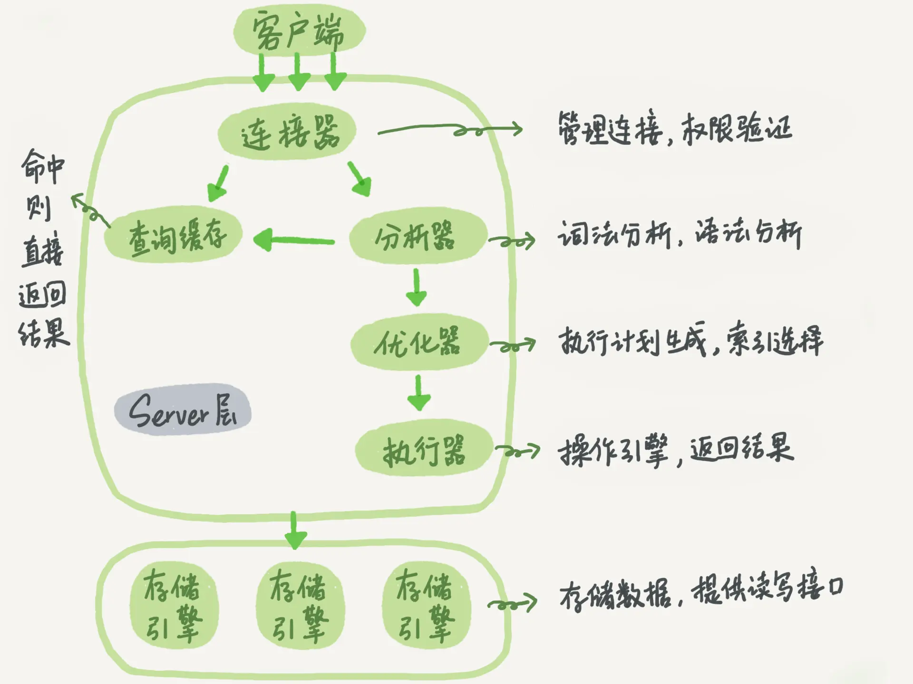

# 一条SQL语句的执行流程



大体来说，MySQL 可以分为 Server 层和存储引擎层两部分。

## Server 层: 

连接器、查询缓存、分析器、优化器、执行器等，涵盖 MySQL 的大多数核心服务功能，以及所有的内置函数（如日期、时间、数学和加密函数等），所有跨存储引擎的功能都在这一层实现，比如存储过程、触发器、视图等。

## 存储引擎层

# 索引

​	**索引的作用：提高数据查询效率**

### 常见索引模型：

哈希表：把值放在数组里，用一个哈希函数把key换算成一个确定的位置，然后把value放在数组的这个位置。只有等值查询的场景

有序数组：按顺序存储。查询用二分法就可以快速查询，时间复杂度是：O(log(N))。有序数组查询效率高，更新效率低

搜索树：每个节点的左儿子小于父节点，父节点又小于右儿子。查询时间复杂度O(log(N))，更新时间复杂度O(log(N))

### 索引类型：主键索引、非主键索引

主键索引的叶子节点存的是整行的数据(**聚簇索引**)，非主键索引的叶子节点内容是主键的值(二级索引)
主键索引和普通索引的区别：主键索引只要搜索ID这个B+Tree即可拿到数据。普通索引先搜索索引拿到主键值，再到主键索引树搜索一次(回表)。

注意： InnoDB 这种引擎导致虽然删除了表的部分记录,但是它的索引还在, 并未释放。只能是重新建表才能重建索引。

1. 覆盖索引：如果查询条件使用的是普通索引（或是联合索引的最左原则字段），查询结果是联合索引的字段或是主键，不用回表操作，直接返回结果，减少IO磁盘读写读取正行数据

2. 最左前缀：联合索引的最左 N 个字段，也可以是字符串索引的最左 M 个字符

3. **联合索引**：根据创建联合索引的顺序，以最左原则进行where检索，比如（age，name）以age=1 或 age= 1 and name=‘张三’可以使用索引，单以name=‘张三’ 不会使用索引，考虑到存储空间的问题，还请根据业务需求，将查找频繁的数据进行靠左创建索引。其中索引的建立是根据最左的列建立，其叶子节点是联合的。

   ```
   1. 条件: 联合索引应用要满足最左原则
   a. 建立联合索引时，选择重复值较少的列作为最左列。
   b. 使用联合索引时，查询条件中，必须包含最左列，才有可能应用到联合索引。 联合索引不同覆盖场景
   ```

   

4. 索引下推：like 'hello%’and age >10 检索，MySQL5.6版本之前，会对匹配的数据进行回表查询。5.6版本后，会先过滤掉age<10的数据，再进行回表查询，减少回表率，提升检索速度(只有联合索引才会有索引下推)

## 普通索引与唯一索引的选择

### change buffer

当需要更新一个数据页时，如果数据页在内存中就直接更新，而如果这个数据页还没有在内存中的话，在不影响数据一致性的前提下，InnoDB 会将这些更新操作缓存在 change buffer 中，这样就不需要从磁盘中读入这个数据页了。在下次查询需要访问这个数据页的时候，将数据页读入内存，然后执行 change buffer 中与这个页有关的操作。通过这种方式就能保证这个数据逻辑的正确性。

对于唯一索引来说，所有的更新操作都要先判断这个操作是否违反唯一性约束。比如，要插入 (4,400) 这个记录，就要先判断现在表中是否已经存在 k=4 的记录，而这必须要将数据页读入内存才能判断。如果都已经读入到内存了，那直接更新内存会更快，就没必要使用 change buffer 了。

**因此, 普通索引和唯一索引的查询性能几乎一样, 但是写性能是普通索引快, 因为可以用到change buffer, 唯一索引会导致内存命中率下降**

## 前缀索引

1：直接创建完整索引，这样可能比较占用空间；

这种方式最简单，如果性能没问题，我会这么创建，简单直接且存储空间的费用越来越低

2：创建前缀索引，节省空间，但会增加查询扫描次数，并且不能使用覆盖索引；

这种方式需要判断出前缀的长度多少合适，需要根据自己的业务来定，主要是看区分度多少合适

3：倒序存储，再创建前缀索引，用于绕过字符串本身前缀的区分度不够的问题；

这种方式用于前缀区分度不高后缀区分度高的场景，目的还是要提高索引的区分度，使用这种方式不适合范围检索

4：创建 hash 字段索引，查询性能稳定，有额外的存储和计算消耗，跟第三种方式一样，都不支持范围扫描。


------

##  **执行计划获取和分析**

```sql
获取语句的执行计划工具，只针对索引应用和优化器算法应用部分信息。
explain (format = tree) 
desc
mysql> desc select * from city where countrycode='CHN';
mysql> explain  select * from city where countrycode='CHN';
```

### 信息介绍

```sql
table :此次查询访问的表
type :索引查询的类型(ALL、index、range、ref、eq_ref、const(system)、NULL) possible_keys :可能会应用的索引
key : 最终选择的索引
key_len :索引覆盖长度，主要是用来判断联合索引应用长度。
rows :需要扫描的行数
Extra :额外信息
```


### type信息详解

```sql
# ALL 没有使用到索引
a. 查询条件没建立索引
mysql> desc select * from city where district='shandong';
b. 有索引不走
mysql> desc select * from city where countrycode!='CHN';
mysql> desc select * from city where countrycode not in ('CHN','USA'); mysql> desc select * from city where countrycode like '%CH%';
```

```sql
# index 全索引扫描
mysql> desc select countrycode from city;
注意: 建议不要出现。特别是聚簇索引INDEX，相当于全表扫描。
```

```sql
# range 索引范围扫描
会受到: B+TREE额外优化，叶子节点双向指针
mysql> desc select * from city where id<10;
mysql> desc select * from city where countrycode like 'CH%';
注意: 范围查找最好缩小查询范围。比如> < 要有上限和下限，或者可以使用limit进行限制。 特别是在做delete 和 update。在索引设计不合理时，使用limit有可能会出现主从数据不一致。
以下两种查询，大几率受不到叶子节点双向指针优化。
mysql> desc select * from city where countrycode in ('CHN','USA');
mysql> desc select * from city where countrycode='CHN' or countrycode='USA';
```

```sql
# ref 辅助索引等值查询
desc select * from city where countrycode='CHN';
```

```sql
#eq_ref : 多表连接查询中，非驱动表的连接条件是主键或唯一键时。
mysql> desc select city.name,country.name
from city
left join country
on city.countrycode=country.code where city.population<100;
```

```sql
# const(system): 主键或唯一键等值查询 
mysql> select * from city where id=1;
```

```sql
# NULL
mysql> desc select * from city where id=1000000000000000;
```

## B+树数据结构


MySQL中InnoDB页的大小默认是**16kB**。也可以自己进行设置。（计算机在存储数据的时候，最小存储单元是扇区，一个扇区的大小是 512 字节，而文件系统（例如 XFS/EXT4）最小单元是块，一个块的大小是 4KB。InnoDB 引擎存储数据的时候，是以页为单位的，每个数据页的大小默认是 16KB，即四个块。）

在B+树中，一个结点就是一页。非[叶子结点](https://so.csdn.net/so/search?q=叶子结点&spm=1001.2101.3001.7020)由主键值和一个指向下一层的地址的指针组成的组合组成。叶子结点中由一组键值对和一个指向该层下一页的指针组成，键值对存储的主键值和数据。

由存储结构，可以大概计算出一个B+树能存储的数据数量。

指针在InnoDB中为6字节，设主键的类型是bigint，占8字节。一组就是14字节。

计算出一个非叶子结点可以存储16 * 1024 / 14 = 1170个索引指针。

假设一条数据的大小是1KB，那么一个叶子结点可以存储16条数据。

得出两层B+树可以存储1170 x 16 = 18720 条数据。

三层B+树可以存储1170 x 1170 x 16 = 21902400条数据。

# 事务

## 事务的特性

事务是由一组SQL语句组成的逻辑处理单元，是满足 ACID 特性的一组操作，可以通过 Commit 提交一个事务，也可以使用 Rollback 进行回滚。事务具有以下4个属性，通常简称为事务的ACID属性:

- 原子性（**Atomicity**）：**事务是一个原子操作单元，其对数据的修改，要么全都执行，要么全都不执行**。比如在同一个事务中的SQL语句，要么全部执行成功，要么全部执行失败。回滚可以用日志来实现，日志记录着事务所执行的修改操作，在回滚时反向执行这些修改操作即可。
- 一致性（**Consistent**）：**在事务开始和完成时，数据都必须保持一致状态**。这意味着所有相关的数据规则都必须应用于事务的修改，以保持数据的完整性；事务结束时，所有的内部数据结构（如B树索引或双向链表）也都必须是正确的。 以转账为例子，A向B转账，假设转账之前这两个用户的钱加起来总共是2000，那么A向B转账之后，不管这两个账户怎么转，A用户的钱和B用户的钱加起来的总额还是2000，这个就是事务的一致性。
- 隔离性（**Isolation**）：数据库系统提供一定的隔离机制，保证事务在不受外部并发操作影响的“独立”环境执行。 **隔离性是当多个用户并发访问数据库时，比如操作同一张表时，数据库为每一个用户开启的事务，不能被其他事务的操作所干扰，多个并发事务之间要相互隔离**。即要达到这么一种效果：对于任意两个并发的事务 T1 和 T2，在事务 T1 看来，T2 要么在 T1 开始之前就已经结束，要么在 T1 结束之后才开始，这样每个事务都感觉不到有其他事务在并发地执行。
- 持久性（**Durable**）：事务完成之后，它对于数据的修改是永久性的，即使出现系统故障也能够保持。 　可以通过数据库备份和恢复来实现，在系统发生奔溃时，使用备份的数据库进行数据恢复。

> MySQL 默认采用**自动提交模式**。也就是说，如果不显式使用 `START TRANSACTION` 语句来开始一个事务，那么每个查询都会被当做一个事务自动提交。

这几个特性不是一种平级关系： > > - 只有满足一致性，事务的执行结果才是正确的。 > - 在无并发的情况下，事务串行执行，隔离性一定能够满足。此时要只要能满足原子性，就一定能满足一致性。 > - 在并发的情况下，多个事务并发执行，事务不仅要满足原子性，还需要满足隔离性，才能满足一致性。 > - 事务满足持久化是为了能应对数据库奔溃的情况。

## 事务的隔离级别

### **Read uncommitted(读未提交)**

​		如果一个事务已经开始写数据，则另外一个事务不允许同时进行写操作，但允许其他事务读此行数据，该隔离级别可以通过“排他写锁”，但是不排斥读线程实现。这样就避免了更新丢失，却可能出现脏读，也就是说事务B读取到了事务A未提交的数据

**解决了更新丢失，但还是可能会出现脏读**

### **Read committed(读提交)**

如果是一个读事务(线程)，则允许其他事务读写，如果是写事务将会禁止其他事务访问该行数据，该隔离级别避免了脏读，但是可能出现不可重复读。事务A事先读取了数据，事务B紧接着更新了数据，并提交了事务，而事务A再次读取该数据时，数据已经发生了改变。

**解决了更新丢失和脏读问题**

### **Repeatable read(可重复读取)**

可重复读取是指在一个事务内，多次读同一个数据，在这个事务还没结束时，其他事务不能访问该数据(包括了读写)，这样就可以在同一个事务内两次读到的数据是一样的，因此称为是可重复读隔离级别，读取数据的事务将会禁止写事务(但允许读事务)，写事务则禁止任何其他事务(包括了读写)，这样避免了不可重复读和脏读，但是有时可能会出现幻读。(读取数据的事务)可以通过“共享读镜”和“排他写锁”实现。

**解决了更新丢失、脏读、不可重复读、但是还会出现幻读**

### Serializable(可序化)

提供严格的事务隔离，它要求事务序列化执行，事务只能一个接着一个地执行，但不能并发执行，如果仅仅通过“行级锁”是无法实现序列化的，必须通过其他机制保证新插入的数据不会被执行查询操作的事务访问到。序列化是最高的事务隔离级别，同时代价也是最高的，性能很低，一般很少使用，在该级别下，事务顺序执行，不仅可以避免脏读、不可重复读，还避免了幻读

**解决了更新丢失、脏读、不可重复读、幻读(虚读)**

innodb支持**RC**(Read Commited)和**RR**(Repeatable read隔离级别实现是用的一致性视图(consistent read view)

## 并发一致性问题

### 1、更新丢失(Lost Update)

**T1 和 T2 两个事务都对一个数据进行修改，T1 先修改，T2 随后修改，T2 的修改覆盖了 T1 的修改**。

例如，两个程序员修改同一java文件。每程序员独立地更改其副本，然后保存更改后的副本，这样就覆盖了原始文档。最后保存其更改副本的编辑人员覆盖前一个程序员所做的更改。

**如果在一个程序员完成并提交事务之前，另一个程序员不能访问同一文件，则可避免此问题**。

### 2、脏读

一句话：事务B读取到了事务A已修改但尚未提交的的数据，还在这个数据基础上做了操作。此时，如果A事务回滚`Rollback`，B读取的数据无效，不符合一致性要求。

解决办法: 把数据库的事务隔离级别调整到 `READ_COMMITTED`

**T1 修改一个数据，T2 随后读取这个数据。如果 T1 撤销了这次修改，那么 T2 读取的数据是脏数据**。

### 3、不可重复读(Non-Repeatable Reads)

在一个事务内，多次读同一个数据。在这个事务还没有结束时，另一个事务也访问该同一数据。那么，在第一个事务的两次读数据之间。由于第二个事务的修改，那么第一个事务读到的数据可能不一样，这样就发生了在一个事务内两次读到的数据是不一样的，因此称为不可重复读，即原始读取不可重复。

**一句话：一个事务范围内两个相同的查询却返回了不同数据**。

同时操作，事务1分别读取事务2操作时和提交后的数据，读取的记录内容不一致。**不可重复读是指在同一个事务内，两个相同的查询返回了不同的结果**。

解决办法: 如果只有在修改事务完全提交之后才可以读取数据，则可以避免该问题。把数据库的事务隔离级别调整到`REPEATABLE_READ`

**T2 读取一个数据，T1 对该数据做了修改。如果 T2 再次读取这个数据，此时读取的结果和第一次读取的结果不同**。

### 4、幻读

一个事务T1按相同的查询条件重新读取以前检索过的数据，却发现其他事务T2插入了满足其查询条件的新数据，这种现象就称为“幻读”。（和可重复读类似，但是事务 T2 的数据操作仅仅是插入和删除，不是修改数据，读取的记录数量前后不一致）

一句话：事务A 读取到了事务B提交的新增数据，不符合隔离性。

解决办法: 如果在操作事务完成数据处理之前，任何其他事务都不可以添加新数据，则可避免该问题。把数据库的事务隔离级别调整到 `SERIALIZABLE_READ`。

T1 读取某个范围的数据，T2 在这个范围内插入新的数据，T1 再次读取这个范围的数据，此时读取的结果和和第一次读取的结果不同。

## MVCC（Multiversion Concurrency Contro）

```sql
MVCC ： 多版本并发控制
功能： 通过UNDO生成多版本的”快照“。非锁定读取。
乐观锁： 乐观。
悲观锁： 悲观。
每个事务操作都要经历两个阶段：
1. MVCC采用乐观锁机制，实现非锁定读取。
2. 在RC级别下，事务中可以立即读取到其他事务commit过的readview
3. 在RR级别下，事务中从第一次查询开始，生成一个一致性readview，直到事务结束。
创建ReadView
– 获取kernel_mutex
• 遍历trx_sys的trx_list链表，获取所有活跃事务，创建ReadView
– Read Committed
• 语句开始，创建ReadView
– Repeatable Read
• 事务开始，创建ReadVie
```

这个ReadView中主要包含4个比较重要的内容：

1. ​	

- **m_ids：**表示在生成ReadView时当前系统中活跃的读写事务的事务id列表。
- **min_trx_id：**表示在生成ReadView时当前系统中活跃的读写事务中最小的事务id，也就是m_ids中的最小值。
- **max_trx_id：**表示生成ReadView时系统中应该分配给下一个事务的id值。注意max_trx_id并不是m_ids中的最大值，事务id是递增分配的。比方说现在有id为1，2，3这三个事务，之后id为3的事务提交了。那么一个新的读事务在生成ReadView时，m_ids就包括1和2，min_trx_id的值就是1，max_trx_id的值就是4。
- **creator_trx_id：**表示生成该ReadView的事务的事务id。

### READ COMMITTED

#### 脏读问题的解决

READ COMMITTED隔离级别的事务在**每次**查询开始时都会生成一个独立的ReadView。


#### 会出现不可重复读问题。


### REPEATABLE READ

解决不可重复读问题

**总结一下就是：**

**ReadView中的比较规则(前两条)**

1、如果被访问版本的trx_id属性值与ReadView中的creator_trx_id值相同，意味着当前事务在访问它自己修改过的记录，所以该版本可以被当前事务访问。

2、如果被访问版本的trx_id属性值小于ReadView中的min_trx_id值，表明生成该版本的事务在当前事务生成ReadView前已经提交，所以该版本可以被当前事务访问。

### MVCC小结

从上边的描述中我们可以看出来，所谓的MVCC（Multi-Version Concurrency Control ，多版本并发控制）指的就是在使用READ COMMITTD、REPEATABLE READ这两种隔离级别的事务在执行普通的SELECT操作时访问记录的版本链的过程，这样子可以使不同事务的读-写、写-读操作并发执行，从而提升系统性能。

READ COMMITTD、REPEATABLE READ这两个隔离级别的一个很大不同就是：**生成ReadView的时机不同**，READ COMMITTD**在每一次进行普通SELECT操作前都会生成一个ReadView**，而REPEATABLE READ只在**第一次进行普通SELECT操作前生成一个ReadView**，之后的查询操作都重复使用这个ReadView就好了，从而基本上可以避免幻读现象（**就是第一次读如果ReadView是空的情况中的某些情况则避免不了**）

# 数据库表的空间回收

参数 innodb_file_per_table表数据既可以存在共享表空间里，也可以是单独的文件。这个行为是由参数 innodb_file_per_table 控制的：

1. 这个参数设置为 OFF 表示的是，表的数据放在系统共享表空间，也就是跟数据字典放在一起；
2. 这个参数设置为 ON 表示的是，每个 InnoDB 表数据存储在一个以 .ibd 为后缀的文件中。

从 MySQL 5.6.6 版本开始，它的默认值就是 ON 了。

## 关于count

按照效率排序的话，count(字段)<count(主键 id)<count(1)≈count(*)，所以我建议你，尽量使用 count(*)。

如果关于count的操作非常频繁的话，可以利用事务的特性，在其他表中记录一个count的记录。把计数放在 Redis 里面，不能够保证计数和 MySQL 表里的数据精确一致的原因，**是这两个不同的存储构成的系统，不支持分布式事务，无法拿到精确一致的视图**。而把计数值也放在 MySQL 中，就解决了一致性视图的问题。

**对于 count(主键 id) 来说，InnoDB 引擎会遍历整张表**，把每一行的 id 值都取出来，返回给 server 层。server 层拿到 id 后，判断是不可能为空的，就按行累加。

**对于 count(1) 来说**，InnoDB 引擎遍历整张表，但不取值。server 层对于返回的每一行，放一个数字“1”进去，判断是不可能为空的，按行累加。

**对于 count(字段) 来说：**

1. 如果这个“字段”是定义为 not null 的话，一行行地从记录里面读出这个字段，判断不能为 null，按行累加；
2. 如果这个“字段”定义允许为 null，那么执行的时候，判断到有可能是 null，还要把值取出来再判断一下，不是 null 才累加。

**但是 count(*) 是例外**，并不会把全部字段取出来，而是专门做了优化，不取值。count(*) 肯定不是 null，按行累加。


## 查询表锁

`mysql> select * from t sys.innodb_lock_waits where locked_table='`test`.`t`'\G`

# InnoDB 存储引擎核心特性介绍

```
MVCC ： 多版本并发控制
聚簇索引 ： 用来组织存储数据和优化查询
支持事务 ： 数据最终一致提供保证
支持行级锁 ： 并发控制
外键 ： 多表之间的数据一致一致性
多缓冲区支持
9.4 存储引擎管理
9.4.1 查询支持的存储引擎
9.4.2 查看某张表的存储引擎
9.4.2 创建表设定存储引擎
9.4.2 修改已有表的存储引擎
自适应Hash索引： AHI
复制中支持高级特性。
备份恢复： 支持热备。
自动故障恢复：CR Crash Recovery
双写机制 ： DWB Double Write Buffer
```

## InnoDB体系结构---线程和内存结构详解

###  线程结构

### Master Thread

```sql
a. 控制刷新脏页到磁盘（CKPT）
b. 控制日志缓冲刷新到磁盘（log buffer ---> redo）
c. undo页回收
d. 合并插入缓冲(change buffer)
e. 控制IO刷新数量
说明：
参数innodb_io_capacity表示每秒刷新脏页的数量，默认为200。
innodb_max_dirty_pages_pct设置出发刷盘的脏页百分比，即当脏页占到缓冲区数据达到这个百分比时，就会刷新innodb_io_capacity个脏页到磁盘。
参数innodb_adaptive_flushing = ON（自适应地刷新），该值影响每秒刷新脏页的数量。原来的刷新规则是：脏页在缓冲池所占的比例小于innodb_max_dirty_pages_pct时，不刷新脏页；大于innodb_max_dirty_pages_pct时，刷新100个脏页。
随着innodb_adaptive_flushing参数的引入，InnoDB存储引擎会通过一个名为buf_flush_get_desired_flush_rate的函数来判断需要刷新脏页最合适的数量。粗略地翻阅源代码后发现buf_flush_get_desired_flush_rate通过判断产生重做日志（redo log）的速度来决定最合适的刷新脏页数量。因此，当脏页的比例小于innodb_max_dirty_pages_pct时，也会刷新一定量的脏页。
```

### IO Thread

```
在InnoDB存储引擎中大量使用Async IO来处理写IO请求,IO Thread的工作主要是负责这些IO请求的回调处理。
写线程和读线程分别由innodb_write_threads和innodb_read_threads参数控制，默认都为4。
```

### Purge Thread

```
事务在提交之前，通过undolog(回滚日志)记录事务开始之前的状态，当事务被提交后，undolog便不再需要，因此需要Purge Thread线程来回收已经使用并分配的undo页。可以在配置文件中添加innodb_purge_threads=1来开启独立的Purge Thread，等号后边控制该线程数量，默认为4个。
```

Page Cleaner Thread

```
InnoDB 1.2.X版本以上引入，脏页刷新，减轻master的工作，提高性能。
```

# Mysql的日志

## REDO日志

### redo log **设计目标**

redo log 是属于引擎层(innodb)的日志，它的设计目标是支持innodb的“事务”的特性，事务ACID特性分别是原子性、一致性、隔离性、持久性， 一致性是事务的最终追求的目标，隔离性、原子性、持久性是达成一致性目标的手段，根据的文章我们已经知道隔离性是通过锁机制来实现的。 而事务的原子性和持久性则是通过redo log 和undo log来保障的。

redo log 能保证对于已经COMMIT的事务产生的数据变更，即使是系统宕机崩溃也可以通过它来进行数据重做，达到数据的一致性，这也就是事务持久性的特征，一旦事务成功提交后，只要修改的数据都会进行持久化，不会因为异常、宕机而造成数据错误或丢失,所以解决异常、宕机而可能造成数据错误或丢是redo log的核心职责。

### **redo log记录的内容**

redo log记录的是操作数据变更的日志，听起来好像和binlog有类似的地方，有时候我都会想有了binlog为什么还要redo log，当然从其它地方可以找到很多的理由，但是我认为最核心的一点就是redo log记录的数据变更粒度和binlog的数据变更粒度是不一样的，也正因为这个binlog是没有进行崩溃恢复事务数据的能力的。

以修改数据为例，binlog 是以表为记录主体，在ROW模式下，binlog保存的表的每行变更记录。

比如update tb_user set age =18 where name ='赵白' ，如果这条语句修改了三条记录的话，那么binlog记录就是

```text
 UPDATE `db_test`.`tb_user` WHERE @1=5 @2='赵白' @3=91 @4='1543571201' SET  @1=5 @2='赵白' @3=18 @4='1543571201'
 UPDATE `db_test`.`tb_user` WHERE @1=6 @2='赵白' @3=91 @4='1543571201' SET  @1=5 @2='赵白' @3=18 @4='1543571201'
 UPDATE `db_test`.`tb_user` WHERE @1=7 @2='赵白' @3=91 @4='1543571201' SET  @1=5 @2='赵白' @3=18 @4='1543571201'
```

redo log则是记录着磁盘数据的变更日志，以磁盘的最小单位“页”来进行记录。上面的修改语句，在redo log里面记录得可能就是下面的形式。

```text
 把表空间10、页号5、偏移量为10处的值更新为18。
 把表空间11、页号1、偏移量为2处的值更新为18。
 把表空间12、页号2、偏移量为9处的值更新为18。
```

当我们把数据从内存保存到磁盘的过程中，Mysql是以页为单位进行刷盘的，这里的页并不是磁盘的页，而是Mysql自己的单位，Mysql里的一页数据单位为16K，所以在刷盘的过程中需要把数据刷新到磁盘的多个扇区中去。 而把16K数据刷到磁盘的每个扇区里这个过程是无法保证原子性的，也就意味着Mysql把数据从内存刷到磁盘的过程中，如果数据库宕机，那么就可能会造成一步分数据成功，一部分数据失败的结果。而这个时候通过binlog这种级别的日志是无法恢复的，一个update可能更改了多个磁盘区域的数据，如果根据SQL语句回滚，那么势必会让那些已经刷盘成功的数据造成数据不一致。所以这个时候还是得需要通过redo log这种记录到磁盘数据级别的日志进行数据恢复。

### **redo log写入策略**

redo lo占用的空间是一定的，并不会无线增大（可以通过参数设置），写入的时候是进顺序写的，所以写入的性能比较高。当redo log空间满了之后又会从头开始以循环的方式进行覆盖式的写入。

在写入redo log的时候也有一个redo log buffer，日志什么时候会刷到磁盘是通过innodb_flush_log_at_trx_commit 参数决定。

innodb_flush_log_at_trx_commit=0 ，表示每次事务提交时都只是把 redo log 留在 redo log buffer 中 ;

innodb_flush_log_at_trx_commit=1，表示每次事务提交时都将 redo log 直接持久化到磁盘；

innodb_flush_log_at_trx_commit=2，表示每次事务提交时都只是把 redo log 写到 page cache。

除了上面几种机制外，还有其它两种情况会把redo log buffer中的日志刷到磁盘。

1、定时处理：有线程会定时(每隔 1 秒)把redo log buffer中的数据刷盘。

2、根据空间处理：redo log buffer 占用到了一定程度( innodb_log_buffer_size 设置的值一半)占，这个时候也会把redo log buffer中的数据刷盘。

## UNDO日志

### **undo log设计目标**

redo log 是也属于引擎层(innodb)的日志，从上面的redo log介绍中我们就已经知道了，redo log 和undo log的核心是为了保证innodb事务机制中的持久性和原子性，事务提交成功由redo log保证数据持久性，而事务可以进行回滚从而保证事务操作原子性则是通过undo log 来保证的。

要对事务数据回滚到历史的数据状态，所以我们也能猜到undo log是保存的是数据的历史版本，通过历史版本让数据在任何时候都可以回滚到某一个事务开始之前的状态。undo log除了进行事务回滚的日志外还有一个作用，就是为数据库提供[MVCC](https://zhuanlan.zhihu.com/p/52977862)多版本数据读的功能。

### **undo log记录内容**

在Mysql里数据每次修改前，都首先会把修改之前的数据作为历史保存一份到undo log里面的，数据里面会记录操作该数据的事务ID，然后我们可以通过事务ID来对数据进行回滚。

比如我们执行 update user_info set name =“李四”where id=1的时候。整个undo log的记录形式会如下。

## binlog

### binlog **记录内容**

binlog应该说是Mysql里最核心的日志， 它记录了除了查询语句(select、show)之外的所有的 `DDL` 和 `DML` 语句,也就意味着我们基本上所有对数据库的操作变更都会记录到binlog里面。binlog以事件形式记录，不仅记录了操作的语句，同时还记录了语句所执行的消耗的时间。 binlog 有三种记录格式，分别是ROW、STATEMENT、MIXED。

**1、ROW：** 基于变更的数据行进行记录，如果一个update语句修改一百行数据，那么这种模式下就会记录100行对应的记录日志。

**2、STATEMENT：**基于SQL语句级别的记录日志，相对于ROW模式，STATEMENT模式下只会记录这个update 的语句。所以此模式下会非常节省日志空间，也避免着大量的IO操作。

**3、MIXED：** 混合模式，此模式是ROW模式和STATEMENT模式的混合体，一般的语句修改使用statment格式保存binlog，如一些函数，statement无法完成主从复制的操作，则采用row格式保存binlog。

### binlog 的写入机制

在进行事务的过程中，首先会把binlog 写入到binlog cache中（因为写入到cache中会比较快，一个事务通常会有多个操作，避免每个操作都直接写磁盘导致性能降低），事务最终提交的时候再吧binlog 写入到磁盘中。当然事务在最终commit的时候binlog是否马上写入到磁盘中是由参数 sync_binlog 配置来决定的。

**1、sync_binlog=0** 的时候，表示每次提交事务binlog不会马上写入到磁盘，而是先写到page cache,相对于磁盘写入来说写page cache要快得多,不过在Mysql 崩溃的时候会有丢失日志的风险。

**2、sync_binlog=1** 的时候，表示每次提交事务都会执行 fsync 写入到磁盘 ；

**3、sync_binlog的值大于1** 的时候，表示每次提交事务都 先写到page cach，只有等到积累了N个事务之后才fsync 写入到磁盘，同样在此设置下Mysql 崩溃的时候会有丢失N个事务日志的风险。

很显然三种模式下，sync_binlog=1 是强一致的选择，选择0或者N的情况下在极端情况下就会有丢失日志的风险，具体选择什么模式还是得看系统对于一致性的要求。

## redo、undo、binlog的生成流程与崩溃恢复

当我们执行update user_info set name =“李四”where id=1 的时候大致流程如下：

**1、从磁盘读取到id=1的记录，放到内存。**

**2、记录undo log 日志。**

**3、记录redo log (预提交状态)**

**4、修改内存中的记录。**

**5、记录binlog**

**6、提交事务，写入redo log (commit状态)**


我们根据上面的流程来看，如果在上面的某一个阶段数据库崩溃，如何恢复数据。

**1、在第一步、第二步、第三步执行时据库崩溃：**因为这个时候数据还没有发生任何变化，所以没有任何影响，不需要做任何操作。

**2、在第四步修改内存中的记录时数据库崩溃**：因为此时事务没有commit，所以这里要进行数据回滚，所以这里会通过undo log进行数据回滚。

**3、第五步写入binlog时数据库崩溃：**这里和第四步一样的逻辑，此时事务没有commit，所以这里要进行数据回滚，会通过undo log进行数据回滚。

**4、执行第六步事务提交时数据库崩溃：**如果数据库在这个阶段崩溃，那其实事务还是没有提交成功，但是这里并不能像之前一样对数据进行回滚，因为在提交事务前,binlog可能成功写入磁盘了，所以这里要根据两种情况来做决定。

如果binlog存在事务记录：那么就**"认为"**事务已经提交了，这里可以根据redo log对数据进行重做。其实你应该有疑问，其实这个阶段发生崩溃了，最终的事务是没提交成功的,这里应该对数据进行回滚。 这里主要的一个考虑是因为binlog已经成功写入了，而binlog写入后，那么依赖于binlog的其它扩展业务（比如：从库已经同步了日志进行数据的变更）数据就已经产生了，如果这里进行数据回滚，那么势必就会造成主从数据的不一致。

另外一种情况就 是binlog不存在事务记录，那么这种情况事务还未提交成功，所以会对数据进行回滚。

## WAL

WAL(Write Ahead Log)预写日志，是数据库系统中常见的一种手段，用于保证数据操作的原子性和持久性。

### **WAL 的优点**

1. 读和写可以完全地并发执行，不会互相阻塞（但是写之间仍然不能并发）。
2. WAL 在大多数情况下，拥有更好的性能（因为无需每次写入时都要写两个文件）。
3. 磁盘 I/O 行为更容易被预测。
4. 使用更少的 fsync()操作，减少系统脆弱的问题。

WAL在mysql中的应用

- redo log 和 binlog 都是顺序写，磁盘的顺序写比随机写速度要快；
- 组提交机制，可以大幅度降低磁盘的 IOPS 消耗。

**如果你的 MySQL 现在出现了性能瓶颈，而且瓶颈在 IO 上，可以通过以下方法来提升性能呢**：

1. 设置 binlog_group_commit_sync_delay 和 binlog_group_commit_sync_no_delay_count 参数，减少 binlog 的写盘次数。这个方法是基于“额外的故意等待”来实现的，因此可能会增加语句的响应时间，但没有丢失数据的风险。
2. 将 sync_binlog 设置为大于 1 的值（比较常见是 100~1000）。这样做的风险是，主机掉电时会丢 binlog 日志。
3. 将 innodb_flush_log_at_trx_commit 设置为 2。这样做的风险是，主机掉电的时候会丢数据。


# mySQL主备同步

备库 B 跟主库 A 之间维持了一个长连接。主库 A 内部有一个线程，专门用于服务备库 B 的这个长连接。一个事务日志同步的完整过程是这样的：

1. 在备库 B 上通过 change master 命令，设置主库 A 的 IP、端口、用户名、密码，以及要从哪个位置开始请求 binlog，这个位置包含文件名和日志偏移量。
2. 在备库 B 上执行 start slave 命令，这时候备库会启动两个线程，就是图中的 io_thread 和 sql_thread。
3. 其中 io_thread 负责与主库建立连接。主库 A 校验完用户名、密码后，开始按照备库 B 传过来的位置，从本地读取 binlog，发给 B。
4. 备库 B 拿到 binlog 后，写到本地文件，称为中转日志（relay log）。
5. sql_thread 读取中转日志，解析出日志里的命令，并执行。