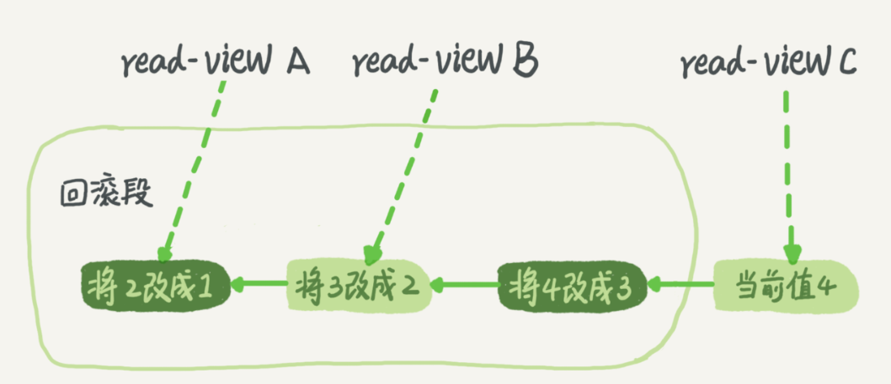

# 事务隔离


隔离级别： 读未提交、读提交、可重复读、串行化


在实现上，数据库里面会创建一个视图，访问的时候以视图的逻辑结果为准。

- 读未提交：直接返回记录上的最新值，没有视图概念；

- 读提交：视图是在每个 SQL 语句开始执行的时候创建的；

- 可重复读：视图是在事务启动时创建的，整个事务存在期间都用这个视图；

- 串行化：直接用加锁的方式来避免并行访问。


配置的方式：将启动参数 `transaction-isolation` 的值设置成 `READ-COMMITTED`。你可以用 `show variables` 来查看当前的值：

```sql
mysql> show variables like 'transaction_isolation';
+-----------------------+-----------------+
| Variable_name         | Value           |
+-----------------------+-----------------+
| transaction_isolation | REPEATABLE-READ |
+-----------------------+-----------------+
1 row in set (0.30 sec)
```

## 事务隔离的实现

以可重复读展开说明

在 MySQL 中，实际上每条记录在更新的时候都会同时记录一条回滚操作，记录上的最新值，通过回滚操作，都可以得到前一个状态的值。

假设一个值从 1 被按顺序改成了 2、3、4，在回滚日志里面就会有类似下面的记录。




当前值是 4，但是在查询这条记录的时候，不同时刻启动的事务会有不同的 read-view。如图中看到的，在视图 A、B、C 里面，这一个记录的值分别是 1、2、4，同一条记录在系统中可以存在多个版本，就是数据库的多版本并发控制（MVCC）。对于 read-view A，要得到 1，就必须将当前值依次执行图中所有的回滚操作得到。

同时你会发现，即使现在有另外一个事务正在将4改成5，这个事务跟 read-view A、B、C对应的事务是不会冲突的。

你一定会问，回滚日志总不能一直保留吧，什么时候删除呢？答案是，在不需要的时候才删除。也就是说，系统会判断，当没有事务再需要用到这些回滚日志时，回滚日志会被删除。

什么时候才不需要了呢？就是当系统里没有比这个回滚日志更早的 read-view 的时候。


基于上面的说明，我们来讨论一下为什么建议你尽量不要使用长事务。

长事务意味着系统里面会存在很老的事务视图。由于这些事务随时可能访问数据库里面的任何数据，所以这个事务提交之前，数据库里面它可能用到的回滚记录都必须保留，这就会导致大量占用存储空间。


## 事务的启动方式

如前面所述，长事务有这些潜在风险。其实很多时候业务开发同学并不是有意使用长事务，通常是由于误用所致。MySQL 的事务启动方式有以下几种：

- 显式启动事务语句，`begin` 或 `start transaction`。配套的提交语句是 `commit`，回滚语句是 `rollback`。

- `set autocommit=0`，这个命令会将这个线程的自动提交关掉。意味着如果你只执行一个 `select` 语句，这个事务就启动了，而且并不会自动提交。这个事务持续存在直到你主动执行 `commit` 或 `rollback` 语句，或者断开连接。

有些客户端连接框架会默认连接成功后先执行一个 `set autocommit=0` 的命令。这就导致接下来的查询都在事务中，如果是长连接，就导致了意外的长事务。

因此，我会建议你总是使用 `set autocommit=1`, 通过显式语句的方式来启动事务。

```sql
mysql> show variables like 'autocommit';
+---------------+-------+
| Variable_name | Value |
+---------------+-------+
| autocommit    | ON    |
+---------------+-------+
1 row in set (0.01 sec)
```

## Q & A

现在知道了系统里面应该避免长事务，如果你是业务开发负责人同时也是数据库负责人，你会有什么方案来避免出现或者处理这种情况呢？

A:

**从应用开发端来看：**

1. 确认是否使用了 `set autocommit=0`。这个确认工作可以在测试环境中开展，把 MySQL 的 `general_log` 开起来，然后随便跑一个业务逻辑，通过 `general_log` 的日志来确认。一般框架如果会设置这个值，也就会提供参数来控制行为，你的目标就是把它改成 1。

2. 认是否有不必要的只读事务。有些框架会习惯不管什么语句先用 `begin/commit` 框起来。我见过有些是业务并没有这个需要，但是也把好几个 `select` 语句放到了事务中。这种只读事务可以去掉。

3. 业务连接数据库的时候，根据业务本身的预估，通过 `SET MAX_EXECUTION_TIME` 命令，来控制每个语句执行的最长时间，避免单个语句意外执行太长时间。

**从数据库端来看：**

1. 监控 `information_schema.Innodb_trx` 表，设置长事务阈值，超过就报警/或者kill；

2. 	Percona 的 pt-kill 这个工具不错，推荐使用；

3. 在业务功能测试阶段要求输出所有的 `general_log`，分析日志行为提前发现问题；

4. 如果使用的是 MySQL 5.6 或者更新版本，把 `innodb_undo_tablespaces` 设置成 2（或更大的值）。如果真的出现大事务导致回滚段过大，这样设置后清理起来更方便。