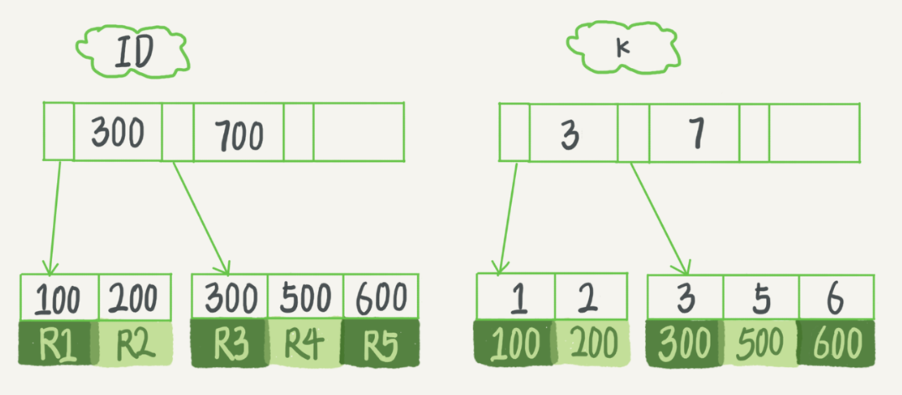

# 04-深入浅出索引（上）


一棵100万节点的平衡二叉树，树高 20。一次查询可能需要访问 20 个数据块。在机械硬盘时代，从磁盘随机读一个数据块需要 10 ms 左右的寻址时间。也就是说，对于一个 100 万行的表，如果使用二叉树来存储，单独访问一个行可能需要 20 个 10 ms 的时间，这个查询可真够慢的。

为了让一个查询尽量少地读磁盘，就必须让查询过程访问尽量少的数据块。那么，我们就不应该使用二叉树，而是要使用 “N叉” 树。这里，“N叉” 树中的 “N” 取决于数据块的大小。

以 InnoDB 的一个整数字段索引为例，这个 N 差不多是 1200。这棵树高是 4 的时候，就可以存1200 的 3 次方个值，这已经 17 亿了。考虑到树根的数据块总是在内存中的，一个 10 亿行的表上一个整数字段的索引，查找一个值最多只需要访问 3 次磁盘。其实，树的第二层也有很大概率在内存中，那么访问磁盘的平均次数就更少了。

N 叉树由于在读写上的性能优点，以及适配磁盘的访问模式，已经被广泛应用在数据库引擎中了。


## B+ 树索引


在 MySQL 中，索引是在存储引擎层实现的，所以并没有统一的索引标准，即不同存储引擎的索引的工作方式并不一样。而即使多个存储引擎支持同一种类型的索引，其底层的实现也可能不同。由于 InnoDB 存储引擎在 MySQL 数据库中使用最为广泛，以 InnoDB 为例，分析一下其中的索引模型。


在 InnoDB 中，表都是根据主键顺序以索引的形式存放的，这种存储方式的表称为索引组织表。又因为前面我们提到的，InnoDB 使用了 B+ 树索引模型，所以数据都是存储在 B+ 树中的。

每一个索引在 InnoDB 里面对应一棵 B+ 树。

假设，我们有一个主键列为 ID 的表，表中有字段 k，并且在 k 上有索引。

这个表的建表语句是：

```sql
mysql> create table T(
	id int primary key, 
	k int not null, 
	name varchar(16),
	index (k)
)engine=InnoDB;
```
	
表中 R1~R 5的 (ID,k) 值分别为 (100,1)、(200,2)、(300,3)、(500,5) 和 (600,6)，两棵树的示例示意图如下。
	



从图中不难看出，根据叶子节点的内容，索引类型分为主键索引和非主键索引。

**主键索引的叶子节点存的是整行数据**。在 InnoDB 里，主键索引也被称为聚簇索引（clustered index）。

**非主键索引的叶子节点内容是主键的值**。在InnoDB里，非主键索引也被称为二级索引（secondary index）。


根据上面的索引结构说明，讨论一个问题：基于主键索引和普通索引的查询有什么区别？

- 如果语句是 `select * from T where ID=500`，即主键查询方式，则只需要搜索 ID 这棵 B+ 树；

- 如果语句是 `select * from T where k=5`，即普通索引查询方式，则需要先搜索 k 索引树，得到 ID 的值为 500，再到ID索引树搜索一次。这个过程称为回表。

也就是说，基于非主键索引的查询需要多扫描一棵索引树。因此，我们在应用中应该尽量使用主键查询。


## 索引维护

B+ 树为了维护索引有序性，在插入新值的时候需要做必要的维护。以上面这个图为例，如果插入新的行 ID 值为 700，则只需要在 R5 的记录后面插入一个新记录。如果新插入的 ID 值为 400，就相对麻烦了，需要逻辑上挪动后面的数据，空出位置。

而更糟的情况是，如果 R5 所在的数据页已经满了，根据 B+ 树的算法，这时候需要申请一个新的数据页，然后挪动部分数据过去。这个过程称为页分裂。在这种情况下，性能自然会受影响。

除了性能外，页分裂操作还影响数据页的利用率。原本放在一个页的数据，现在分到两个页中，整体空间利用率降低大约 50%。

当然有分裂就有合并。当相邻两个页由于删除了数据，利用率很低之后，会将数据页做合并。合并的过程，可以认为是分裂过程的逆过程。


## 自增主键

自增主键是指自增列上定义的主键，在建表语句中一般是这么定义的： `NOT NULL PRIMARY KEY AUTO_INCREMENT`。

插入新记录的时候可以不指定 ID 的值，系统会获取当前 ID 最大值加 1 作为下一条记录的 ID 值。

也就是说，自增主键的插入数据模式，正符合了我们前面提到的递增插入的场景。每次插入一条新记录，都是追加操作，都不涉及到挪动其他记录，也不会触发叶子节点的分裂。

而有业务逻辑的字段做主键，则往往不容易保证有序插入，这样写数据成本相对较高。

> 除了考虑性能外，我们还可以从存储空间的角度来看。假设你的表中确实有一个唯一字段，比如字符串类型的身份证号，那应该用身份证号做主键，还是用自增字段做主键呢？

> 由于每个非主键索引的叶子节点上都是主键的值。如果用身份证号做主键，那么每个二级索引的叶子节点占用约20个字节，而如果用整型做主键，则只要4个字节，如果是长整型（bigint）则是8个字节。

**显然，主键长度越小，普通索引的叶子节点就越小，普通索引占用的空间也就越小**。


所以，从性能和存储空间方面考量，自增主键往往是更合理的选择。有没有什么场景适合用业务字段直接做主键的呢？还是有的。比如，有些业务的场景需求是这样的：

- 只有一个索引；

- 该索引必须是唯一索引。

这就是典型的 KV 场景。由于没有其他索引，所以也就不用考虑其他索引的叶子节点大小的问题。这时候我们就要优先考虑上一段提到的 “尽量使用主键查询” 原则，直接将这个索引设置为主键，可以避免每次查询需要搜索两棵树。


## Q & A

上面例子中的 InnoDB 表 T，如果你要重建索引 k，你的两个 SQL 语句可以这么写：

```sql
alter table T drop index k;
alter table T add index(k);
```

如果你要重建主键索引，也可以这么写：

```sql
alter table T drop primary key;
alter table T add primary key(id);
```

对于上面这两个重建索引的作法，说出你的理解。如果有不合适的，为什么，更好的方法是什么？

> 为什么要重建索引，索引可能因为删除，或者页分裂等原因，导致数据页有空洞，重建索引的过程会创建一个新的索引，把数据按顺序插入，这样页面的利用率最高，也就是索引更紧凑、更省空间。


A：重建索引 k 的做法是合理的，可以达到省空间的目的。但是，重建主键的过程不合理。**不论是删除主键还是创建主键，都会将整个表重建**。所以连着执行这两个语句的话，第一个语句就白做了。这两个语句，你可以用这个语句代替 ：`alter table T engine=InnoDB`。在专栏的第12篇文章《为什么表数据删掉一半，表文件大小不变？》中，我会和你分析这条语句的执行流程。

