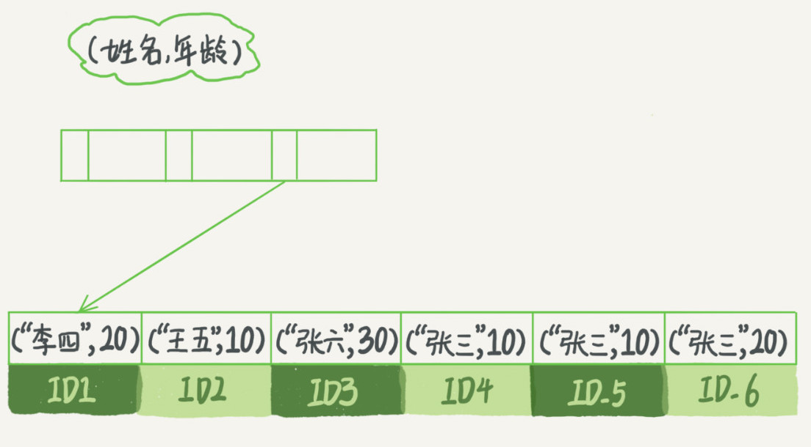
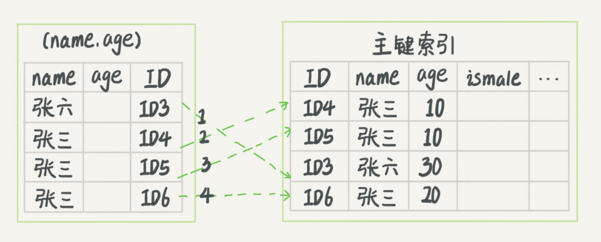
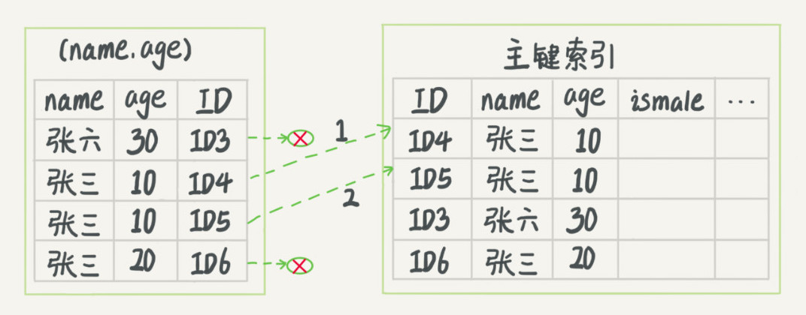

# 05-深入浅出索引（下）


在下面这个表T中，如果我执行 `select * from T where k between 3 and 5`，需要执行几次树的搜索操作，会扫描多少行？

```sql
mysql> create table T (
	ID int primary key,
	k int NOT NULL DEFAULT 0, 
	s varchar(16) NOT NULL DEFAULT '',
	index k(k)
) engine=InnoDB;

insert into T values(100,1, 'aa'),(200,2,'bb'),(300,3,'cc'),(500,5,'ee'),(600,6,'ff'),(700,7,'gg');
```

索引树如下所示：


现在，我们一起来看看这条 SQL 查询语句的执行流程：

1. 在 k 索引树上找到 k=3 的记录，取得 ID = 300；

2. 再到 ID 索引树查到 ID=300 对应的 R3；

3. 在 k 索引树取下一个值 k=5，取得 ID=500；

4. 再回到 ID 索引树查到 ID=500 对应的 R4；

5. 在 k 索引树取下一个值 k=6，不满足条件，循环结束。

在这个过程中，回到主键索引树搜索的过程，我们称为回表。可以看到，这个查询过程读了 k 索引树的 3 条记录（步骤 1、3 和 5），回表了两次（步骤 2 和 4）。

## 覆盖索引

如果执行的语句是 `select ID from T where k between 3 and 5`，这时只需要查 ID 的值，而 ID 的值已经在 k 索引树上了，因此可以直接提供查询结果，不需要回表。也就是说，在这个查询里面，索引 k 已经“覆盖了”我们的查询需求，我们称为覆盖索引。

**由于覆盖索引可以减少树的搜索次数，显著提升查询性能，所以使用覆盖索引是一个常用的性能优化手段。**


基于上面覆盖索引的说明，我们来讨论一个问题：在一个市民信息表上，是否有必要将身份证号和名字建立联合索引？

```sql
CREATE TABLE `tuser` (
  `id` int(11) NOT NULL,
  `id_card` varchar(32) DEFAULT NULL,
  `name` varchar(32) DEFAULT NULL,
  `age` int(11) DEFAULT NULL,
  `ismale` tinyint(1) DEFAULT NULL,
  PRIMARY KEY (`id`),
  KEY `id_card` (`id_card`),
  KEY `name_age` (`name`,`age`)
) ENGINE=InnoDB
```

我们知道，身份证号是市民的唯一标识。也就是说，如果有根据身份证号查询市民信息的需求，我们只要在身份证号字段上建立索引就够了。而再建立一个（身份证号、姓名）的联合索引，是不是浪费空间？

如果现在有一个高频请求，要根据市民的身份证号查询他的姓名，这个联合索引就有意义了。它可以在这个高频请求上用到覆盖索引，不再需要回表查整行记录，减少语句的执行时间。

当然，索引字段的维护总是有代价的。因此，在建立冗余索引来支持覆盖索引时就需要权衡考虑了。这正是业务 DBA，或者称为业务数据架构师的工作。


## 最左前缀原则

单独为一个不频繁的请求创建一个（身份证号，地址）的索引又感觉有点浪费。应该怎么做呢？**B+树这种索引结构，可以利用索引的“最左前缀”，来定位记录**。

为了直观地说明这个概念，我们用（name，age）这个联合索引来分析。



当你的逻辑需求是查到所有名字是 “张三” 的人时，可以快速定位到 ID4，然后向后遍历得到所有需要的结果。

如果你要查的是所有名字第一个字是 “张” 的人，你的SQL语句的条件是 `where name like ‘张%’`。这时，你也能够用上这个索引，查找到第一个符合条件的记录是 ID3，然后向后遍历，直到不满足条件为止。

**这个最左前缀可以是联合索引的最左 N 个字段，也可以是字符串索引的最左 M 个字符**。

> 在建立联合索引的时候，如何安排索引内的字段顺序 ？
> 
> 第一原则是，如果通过调整顺序，可以少维护一个索引，那么这个顺序往往就是需要优先考虑采用的；
> 第二原则是，考虑的原则就是空间。比如上面这个市民表的情况，name 字段是比 age 字段大的 ，那我就建议你创建一个（name,age) 的联合索引和一个(age)的单字段索引。


## 索引下推


以市民表的联合索引（name, age）为例。如果现在有一个需求：检索出表中 “名字第一个字是张，而且年龄是10岁的所有男孩”。那么，SQL语句是这么写的：

```sql
mysql> select * from tuser where name like '张%' and age=10 and ismale=1;
```

你已经知道了前缀索引规则，所以这个语句在搜索索引树的时候，只能用 “张”，找到第一个满足条件的记录 ID3。当然，这还不错，总比全表扫描要好。

- 在 MySQL 5.6 之前，只能从 ID3 开始一个个回表，到主键索引上找出数据行，再对比字段值；

- MySQL 5.6 引入的索引下推优化（index condition pushdown)，可以在索引遍历过程中，对索引中包含的字段先做判断，直接过滤掉不满足条件的记录，**减少回表次数**。


下图中，每一个虚线箭头表示回表一次。








两图的区别是，InnoDB 在 (name,age) 索引内部就判断了 age 是否等于 10，对于不等于 10 的记录，直接判断并跳过。在我们的这个例子中，只需要对 ID4、ID5 这两条记录回表取数据判断，就只需要回表 2 次。


## Q & A

小明

```sql
CREATE TABLE `geek` (
  `a` int(11) NOT NULL,
  `b` int(11) NOT NULL,
  `c` int(11) NOT NULL,
  `d` int(11) NOT NULL,
  PRIMARY KEY (`a`,`b`),
  KEY `c` (`c`),
  KEY `ca` (`c`,`a`),
  KEY `cb` (`c`,`b`)
) ENGINE=InnoDB;
```

由于历史原因，这个表需要 a、b 做联合主键，这个可以理解。

既然主键包含了 a、b 这两个字段，那意味着单独在字段 c 上创建一个索引，就已经包含了三个字段了呀，为什么要创建 “ca”、“cb” 这两个索引？

是因为他们的业务里面有这样的两种语句：

```sql
select * from geek where c=N order by a limit 1;
select * from geek where c=N order by b limit 1;
```

为了这两个查询模式，这两个索引是否都是必须的？为什么呢？


A： 结论“ca” 可以去掉，“cb” 需要保留。

关于对联合主键索引和 InnoDB 索引组织表的理解

表记录，主键 (a, b) 的聚簇索引组织顺序相当于 order by a,b ，也就是先按 a 排序，再按 b 排序，c 无序：

| a | b | c | d |
|:--:|:--:|:--:|:--:|
| 1 | 2 | 3 | d |
| 1	 | 3 | 2 | d |
| 1 | 4 | 3 | d |
| 2 | 1 | 3 | d |
| 2 | 2 | 2 | d |
| 2 | 3 | 4 | d |


索引 (c, b) 的组织是先按 c 排序，在按 b 排序，同时记录主键

| c | b | 主键部分 a |
|:--:|:--:|:--:|
| 2 | 2 | 2 | 
| 2	 | 3 | 1 | 
| 3 | 1 | 2 | 
| 3 | 2 | 1 | 
| 3 | 4 | 1 | 
| 4 | 3 | 2 | 


索引 (c, a) 的组织是先按 c 排序，再按 a 排序，同时记录主键：


| c | a | 主键部分 b |
|:--:|:--:|:--:|
| 2 | 1 | 3 | 
| 2	 | 2 | 2 | 
| 3 | 1 | 2 | 
| 3 | 1 | 4 | 
| 3 | 2 | 1 | 
| 4 | 2 | 3 | 

> 与索引 (c) 的数据是一模一样的，所以是冗余索引。