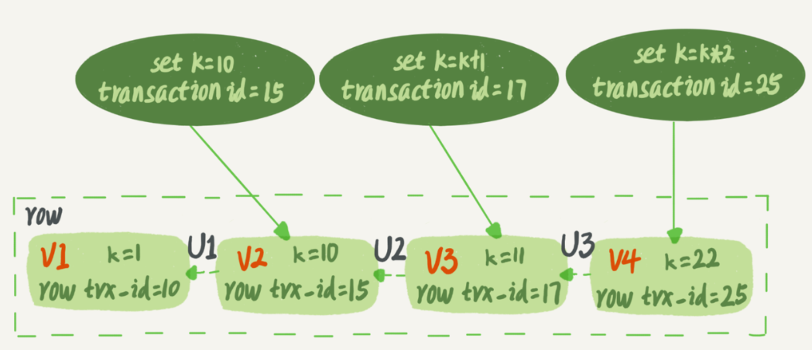
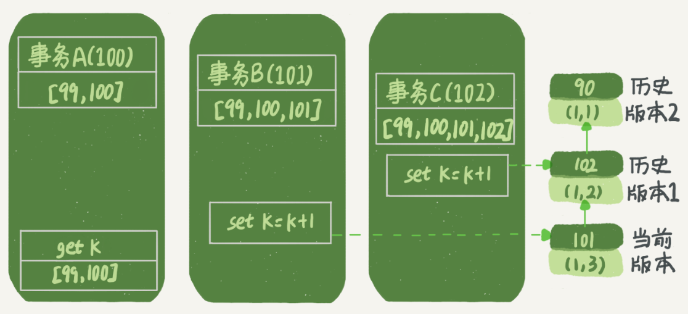
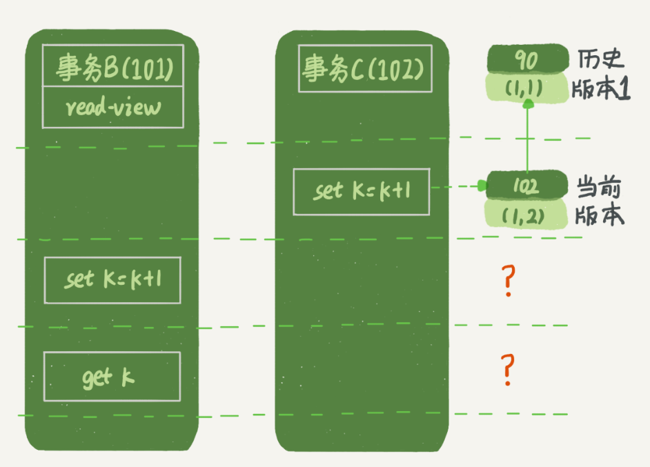
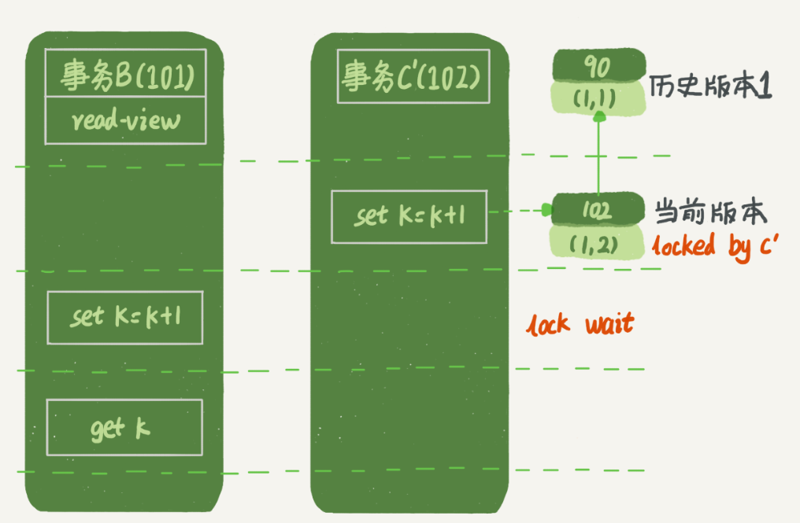
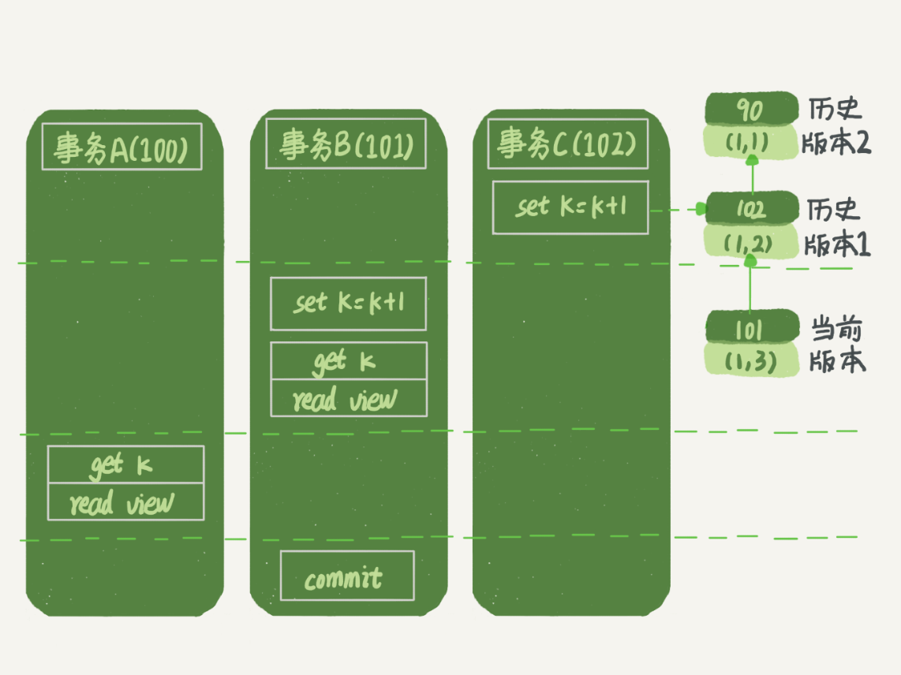
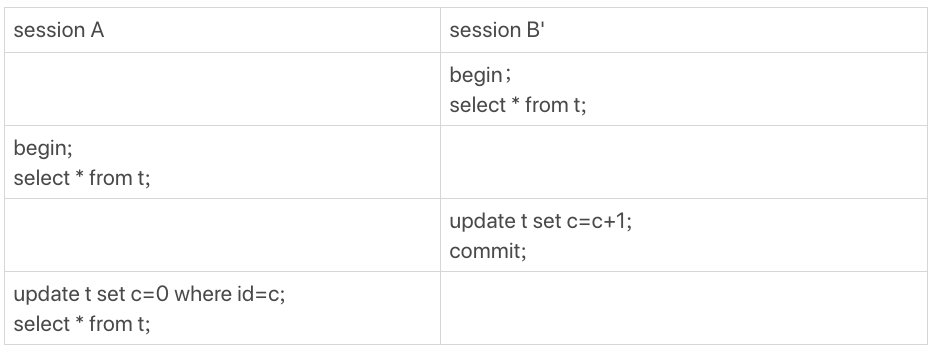

# 08-事务隔离的判断


下面是一个只有两行的表的初始化语句。


```sql
mysql> CREATE TABLE `t` (
  `id` int(11) NOT NULL,
  `k` int(11) DEFAULT NULL,
  PRIMARY KEY (`id`)
) ENGINE=InnoDB;

insert into t(id, k) values(1,1),(2,2);
```

在整个《MySQL 实战》专栏里面，我们的例子中如果没有特别说明，都是默认 `autocommit=1`。然后执行三个事务：


需要注意的是事务的启动时机：**`begin/start transaction` 不是一个事务的起点，而是执行到它们之后的第一个操作 InnoDB 表的语句（第一个快照读语句），事务才真正启动。马上启动一个事务，使用 `start transaction with consistent snapshot`**


在 MySQL 里，有两个 “视图” 的概念：

- view：一个用查询语句定义的虚拟表，在调用的时候执行查询语句并生成结果。创建视图的语法是`create view ...`，而它的查询方法与表一样

- InnoDB 在实现 MVCC 时用到的一致性读视图，即 consistent read view：支持 RC 和 RR 隔离级别的实现


一致性读视图的作用是事务执行期间用来定义 “自身能看到什么数据”。

## “快照” 在 MVCC 的工作模式

在可重复读隔离级别下，事务在启动的时候就 “拍了个快照”。**这个快照是基于整库的**。

InnoDB 里面每个事务有一个唯一的事务 ID，叫作 `transaction id`。它是在事务开始的时候向 InnoDB 的事务系统申请的，是按申请顺序严格递增的。

而每行数据也都是有多个版本的。每次事务更新数据的时候，都会生成一个新的数据版本，并且把 `transaction id` 赋值给这个数据版本的事务ID，记为 `row trx_id`。同时，旧的数据版本要保留，并且在新的数据版本中，能够有信息可以直接拿到它。

也就是说，数据表中的一行记录，其实可能有多个版本(row)，每个版本有自己的 `row trx_id`。

如下图所示，就是一个记录被多个事务连续更新后的状态。




***undo log：*** 上图中的三个虚线箭头，就是 undo log；而 V1、V2、V3 并不是物理上真实存在的，而是每次需要的时候根据当前版本和 undo log 计算出来的。比如，需要 V2 的时候，就是通过 V4 依次执行 U3、U2 算出来。


按照可重复读的定义，一个事务启动的时候，能够看到所有已经提交的事务结果。但是之后，这个事务执行期间，其他事务的更新对它不可见。

在实现上， InnoDB 为每个事务构造了一个数组，用来保存这个事务启动瞬间，当前正在 “活跃” 的所有事务ID。

> “活跃” 指的就是，启动了但还没提交。

> - 低水位：数组里面事务 ID 的最小值
> - 高水位：当前系统里面已经创建过的事务 ID 的最大值加 1

这个视图数组和高水位，就组成了当前事务的一致性视图（read-view）。而数据版本的可见性规则，就是基于数据的 `row trx_id` 和这个一致性视图的对比结果得到的。

这个视图数组把所有的 `row trx_id` 分成了几种不同的情况。


对于当前事务的启动瞬间来说，一个数据版本的 `row trx_id`，有以下几种可能：

- 如果落在绿色部分，表示这个版本是已提交的事务或者是当前事务自己生成的，这个数据是可见的；

- 如果落在红色部分，表示这个版本是由将来启动的事务生成的，是肯定不可见的；

- 如果落在黄色部分，那就包括两种情况
	
	- a. 若 `row trx_id` 在数组中，表示这个版本是由还没提交的事务生成的，不可见；

	- b. 若 `row trx_id` 不在数组中，表示这个版本是已经提交了的事务生成的，可见。


比如，对于上上图中的数据来说，如果有一个事务，它的低水位是 18，那么当它访问这一行数据时，就会从 V4 通过 U3 计算出 V3，所以在它看来，这一行的值是 11。


一个数据版本，对于一个事务视图来说，除了自己的更新总是可见以外，有三种情况：

- 版本未提交，不可见；

- 版本已提交，但是是在视图创建后提交的，不可见；

- 版本已提交，而且是在视图创建前提交的，可见。


如下图所示，表示的是事务的查询逻辑，并做如下假设：

- 事务 A 开始前，系统只有一个活跃事务 ID 为 99；
- 事务 A、B、C 的版本号分别为 100、101、102，且当前系统只存在 4 个事务；
- 事务 A、B、C 启动前，数据行 (1, 1) 的 `row trx_id` 是 90。


这样，事务 A 的视图数组为 [99, 100]，事务 B 的视图数组为 [99, 100, 101]，事务 C 的视图数组为 [99, 100, 101, 102]。



用规则判断事务 A 对数据版本的可见性，事务 A 查询语句的视图数组是在事务 A 启动时生成的。

> 1. (1, 3) 未提交，不可见
> 2. (1, 2) 已提交，但是在事务 A 的视图数组创建之后生成的，不可见
> 3. (1, 1) 已提交，在事务 A 的视图数组创建之前生成的，可见


### 更新逻辑

> 疑惑：对于事务 B 的 `update` 语句，如果按照一致性读，好像结果不对？
> 
> 事务 B 的视图数组是先生成的，之后事务 C 才提交，不是应该看不见 (1,2) 吗，怎么能算出(1,3) 来？





对于的回答是：如果事务 B 在更新之前查询一次数据，这个查询返回的 k 的值确实是1。但是，当事务要更新数据的时，就不能再在历史版本上更新了，否则事务 C 的更新就丢失了。因此，事务 B 此时的 `set k=k+1` 是在（1,2）的基础上进行的操作。

更新规则：**更新数据都是先读后写的，而这个读，只能读当前的值，称为“当前读”（current read**

因此，在更新的时候，当前读拿到的数据是 (1,2)，更新后生成了新版本的数据 (1,3)，这个新版本的 `row trx_id` 是 101。

所以，在执行事务 B 查询语句的时候，一看自己的版本号是 101，最新数据的版本号也是 101，是自己的更新，可以直接使用，所以查询得到的 k 的值是 3。

所以，如果把事务 A 的查询语句 `select * from t where id=1` 修改一下，加上 `lock in share mode` 或 `for update`，也都可以读到版本号是 101 的数据，返回的 k 的值是3。下面这两个 select 语句，就是分别加了读锁（S锁，共享锁）和写锁（X锁，排他锁）。

```sql
mysql> select k from t where id=1 lock in share mode;
mysql> select k from t where id=1 for update;
```

## 当前读

再往前一步，假设事务 C 不是马上提交的，而是变成了下面的事务 C’，会怎么样呢？


事务 C’ 的不同是，更新后并没有马上提交，在它提交前，事务 B 的更新语句先发起了。前面说过了，虽然事务 C’ 还没提交，但是 (1,2) 这个版本也已经生成了，并且是当前的最新版本。那么，事务 B 的更新语句会怎么处理呢？


这时候，我们在上一篇文章中提到的 “两阶段锁协议” 就要上场了。事务 C’ 没提交，也就是说(1,2) 这个版本上的写锁还没释放。而事务 B 是当前读，必须要读最新版本，而且必须加锁，因此就被锁住了，必须等到事务 C’ 释放这个锁，才能继续它的当前读。



到这里，我们把一致性读、当前读和行锁就串起来了。

事务的可重复读的能力是怎么实现的？

> 可重复读的核心就是一致性读（consistent read），而事务更新数据的时候，只能用当前读，如果当前的记录的行锁被其他事务占用的话，就需要进入锁等待。


RC 和 RR 最主要的区别是：

- 在可重复读隔离级别下，只需要在事务开始的时候创建一致性视图，之后事务里的其他查询都共用这个一致性视图；

- 在读提交隔离级别下，每一个语句执行前都会重新算出一个新的视图。


那么，在读提交隔离级别下，事务 A 和事务 B 的查询语句查到的 k，分别应该是多少呢？

>这里需要说明一下，`start transaction with consistent snapshot;` 的意思是从这个语句开始，创建一个持续整个事务的一致性快照。所以，在读提交隔离级别下，这个用法就没意义了，等效于普通的 `start transaction`。

下面是读提交时的状态图，可以看到这两个查询语句的创建视图数组的时机发生了变化，就是图中的read view 框。（注意：这里，我们用的还是事务 C 的逻辑直接提交，而不是事务 C’）



这时，事务 A 的查询语句的视图数组是在执行这个语句的时候创建的，时序上 (1,2)、(1,3) 的生成时间都在创建这个视图数组的时刻之前。但是，在这个时刻：

- (1,3) 未没提交，不可见；
- (1,2) 已提交，数据版本在事务 A 创建视图数组之后创建，可见。

所以，这时候事务 A 查询语句返回的是 k=2。显然地，事务 B 查询结果 k=3。


> 最后，为什么表结构不支持 “可重复读”？
> 
> 这是因为表结构没有对应的行数据，也没有 `row trx_id`，因此只能遵循当前读的逻辑。


## Q & A

用下面的表结构和初始化语句作为试验环境，事务隔离级别是可重复读。现在，要把所有 “字段 c 和 id 值相等的行” 的 c 值清零，但是却发现了一个“诡异”的、改不掉的情况。请你构造出这种情况，并说明其原理。

```sql
mysql> CREATE TABLE `t` (
  `id` int(11) NOT NULL,
  `c` int(11) DEFAULT NULL,
  PRIMARY KEY (`id`)
) ENGINE=InnoDB;

insert into t(id, c) values(1,1),(2,2),(3,3),(4,4);
```


A：

```sql
mysql> set autocommit = 1;
mysql> set transaction isolation level REPEATABLE READ;
```


还有另外一种场景：



这个 session B’ 启动的事务比 A 要早，其实是上期我们描述事务版本的可见性规则时留的彩蛋，因为规则里还有一个 “活跃事务的判断”：

> 在 session A 视图数组创建的瞬间，session B’ 是活跃的，属于 “版本未提交，不可见” 这种情况。