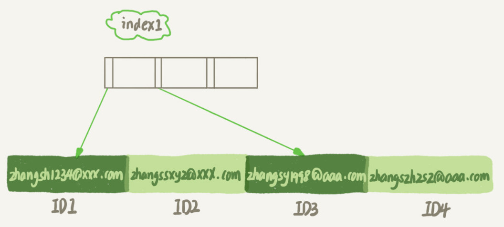
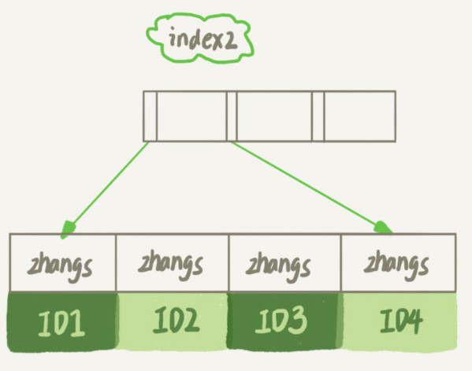

# 11-字符串字段的索引


假设，现在维护一个支持邮箱登录的系统，用户表是这么定义的：

```sql
mysql> create table SUser(
	ID bigint unsigned primary key,
	email varchar(64), 
	... 
)engine=innodb; 
```

由于要使用邮箱登录，所以业务代码中一定会出现类似于这样的语句：

```sql
mysql> select f1, f2 from SUser where email='xxx';
```


如果 email 这个字段上没有索引，那么这个语句就只能做全表扫描。同时，MySQL 是支持前缀索引的，可以定义字符串的一部分作为索引。默认地，如果你创建索引的语句不指定前缀长度，那么索引就会包含整个字符串。

```sql
mysql> alter table SUser add index index1(email);
或
mysql> alter table SUser add index index2(email(6));
```

第一个语句创建的 index1 索引里面，包含了每个记录的整个字符串；而第二个语句创建的 index2 索引里面，对于每个记录都是只取前 6 个字节。






从图中可以看到，由于 email(6) 这个索引结构中每个邮箱字段都只取前 6 个字节（即：zhangs），所以占用的空间会更小，这就是使用前缀索引的优势。但，这同时带来的损失是，可能会增加额外的记录扫描次数。

在这两个索引定义下分别执行下面的语句

```sql
select id,name,email from SUser where email='zhangssxyz@xxx.com';
```

如果使用的是index1（即 email 整个字符串的索引结构），执行顺序是这样的：

1. 从 index1 索引树找到满足索引值是 ’zhangssxyz@xxx.com’ 的这条记录，取得 ID2 的值；

2. 到主键上查到主键值是 ID2 的行，判断 email 的值是正确的，将这行记录加入结果集；

3. 取 index1 索引树上刚刚查到的位置的下一条记录，发现已经不满足 email='zhangssxyz@xxx.com’ 的条件了，循环结束。

这个过程中，只需要回主键索引取一次数据，所以系统认为只扫描了一行。

如果使用的是 index2（即 email(6) 索引结构），执行顺序是这样的：

1. 从 index2 索引树找到满足索引值是 ’zhangs’ 的记录，找到的第一个是 ID1；

2. 到主键上查到主键值是ID1的行，判断出email的值不是’zhangssxyz@xxx.com’，这行记录丢弃；

3. 取 index2 上刚刚查到的位置的下一条记录，发现仍然是 ’zhangs’，取出 ID2，再到 ID 索引上取整行然后判断，这次值对了，将这行记录加入结果集；

4. 重复上一步，直到在 index2 上取到的值不是 ’zhangs’时，循环结束。

在这个过程中，要回主键索引取 4 次数据，也就是扫描了 4 行。使用前缀索引后，可能会导致查询语句读数据的次数变多。


## 索引的区分度

当要给字符串创建前缀索引时，有什么方法能够确定我应该使用多长的前缀呢？

实际上，我们在建立索引时关注的是区分度，区分度越高越好。因为区分度越高，意味着重复的键值越少。因此，我们可以通过统计索引上有多少个不同的值来判断要使用多长的前缀。

依次选取不同长度的前缀来看这个值，比如我们要看一下 4~7 个字节的前缀索引，可以用这个语句：

```sql
mysql> select 
  count(distinct email) as L,
  count(distinct left(email,4)）as L4,
  count(distinct left(email,5)）as L5,
  count(distinct left(email,6)）as L6,
  count(distinct left(email,7)）as L7,
from SUser;
```

当然，使用前缀索引很可能会损失区分度，所以你需要预先设定一个可以接受的损失比例，比如 5%。然后，在返回的 L4~L7 中，找出不小于 L * 95% 的值，假设这里 L6、L7 都满足，你就可以选择前缀长度为 6。


## 前缀索引对覆盖索引的影响


前面我们说了使用前缀索引可能会增加扫描行数，这会影响到性能。其实，前缀索引的影响不止如此，我们再看一下另外一个场景。


```sql
mysql> select id,email from SUser where email='zhangssxyz@xxx.com';
```

所以，如果使用 index1（即email整个字符串的索引结构）的话，可以利用覆盖索引，从 index1 查到结果后直接就返回了，不需要回到 ID 索引再去查一次。而如果使用 index2（即email(6)索引结构）的话，就不得不回到ID索引再去判断email字段的值。

即使你将 index2 的定义修改为 email(18) 的前缀索引，这时候虽然 index2 已经包含了所有的信息，但 InnoDB 还是要回到 id 索引再查一下，因为系统并不确定前缀索引的定义是否截断了完整信息。

也就是说，使用前缀索引就用不上覆盖索引对查询性能的优化了，这也是你在选择是否使用前缀索引时需要考虑的一个因素。


## 倒序索引或 hash 索引


假设你维护的数据库是一个市的公民信息系统，这时候如果对身份证号做长度为6的前缀索引的话，这个索引的区分度就非常低了。按照我们前面说的方法，可能你需要创建长度为12以上的前缀索引，才能够满足区分度要求。但是，索引选取的越长，占用的磁盘空间就越大，相同的数据页能放下的索引值就越少，搜索的效率也就会越低。


第一种方式是使用倒序存储。如果你存储身份证号的时候把它倒过来存，每次查询的时候，你可以这么写：

```
mysql> select field_list from t where id_card = reverse('input_id_card_string');
```

由于身份证号的最后6位没有地址码这样的重复逻辑，所以最后这 6 位很可能就提供了足够的区分度。当然了，实践中你不要忘记使用 count(distinct) 方法去做个验证。

第二种方式是使用 hash 字段。你可以在表上再创建一个整数字段，来保存身份证的校验码，同时在这个字段上创建索引。


```sql
mysql> alter table t add id_card_crc int unsigned, add index(id_card_crc);
```

然后每次插入新记录的时候，都同时用 crc32() 这个函数得到校验码填到这个新字段。由于校验码可能存在冲突，也就是说两个不同的身份证号通过 crc32() 函数得到的结果可能是相同的，所以你的查询语句 where 部分要判断 id\_card 的值是否精确相同。

```sql
mysql> select field_list from t where id_card_crc=crc32('input_id_card_string') and id_card='input_id_card_string'
```

这样，索引的长度变成了 4 个字节，比原来小了很多。


使用倒序存储和使用 hash 字段这两种方法的异同点。

**相同点：都不支持范围查询。**

**不同点**

- 从占用的额外空间来看，倒序存储方式在主键索引上，不会消耗额外的存储空间，而 hash 字段方法需要增加一个字段。当然，倒序存储方式使用 4 个字节的前缀长度应该是不够的，如果再长一点，这个消耗跟额外这个 hash 字段也差不多抵消了。

- 在 CPU 消耗方面，倒序方式每次写和读的时候，都需要额外调用一次 reverse 函数，而 hash 字段的方式需要额外调用一次 crc32() 函数。如果只从这两个函数的计算复杂度来看的话， reverse 函数额外消耗的 CPU 资源会更小些。

- 从查询效率上看，使用 hash 字段方式的查询性能相对更稳定一些。因为 crc32 算出来的值虽然有冲突的概率，但是概率非常小，可以认为每次查询的平均扫描行数接近 1。而倒序存储方式毕竟还是用的前缀索引的方式，也就是说还是会增加扫描行数。


## Q & A

如果你在维护一个学校的学生信息数据库，学生登录名的统一格式是 ”学号@gmail.com", 而学号的规则是：十五位的数字，其中前三位是所在城市编号、第四到第六位是学校编号、第七位到第十位是入学年份、最后五位是顺序编号。

系统登录的时候都需要学生输入登录名和密码，验证正确后才能继续使用系统。就只考虑登录验证这个行为的话，你会怎么设计这个登录名的索引呢？

A：

1. 只保留 “入学年份+顺序编号” 为 s
2. s 可转为 int 值

