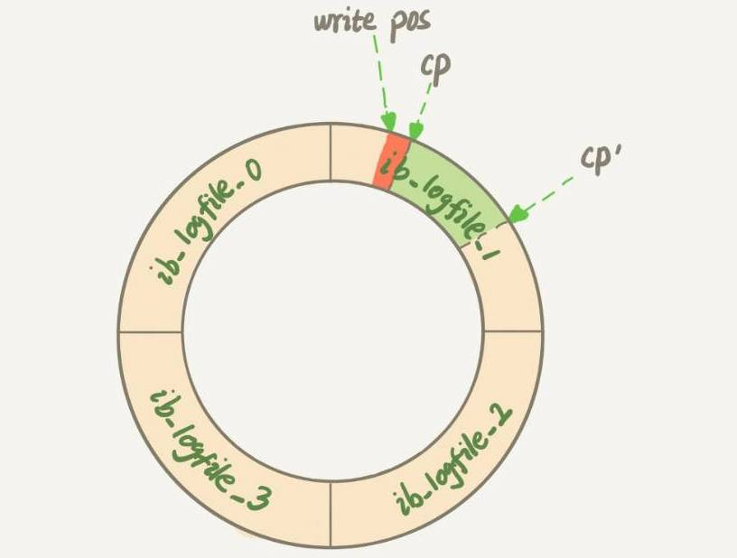

# 12-MySQL 抖动

一条SQL语句，正常执行的时候特别快，但是有时也不知道怎么回事，它就会变得特别慢，并且这样的场景很难复现，它不只是随机，而且持续时间还很短。

## SQL 突然变慢的原因

InnoDB 在处理更新语句的时候，只做了写日志这一个磁盘操作。这个日志叫作 redo log（重做日志），就返回给客户端，本次更新成功。

把内存里的数据写入磁盘的过程，术语就是 `flush`。在这个 `flush` 操作执行之前，内存数据页跟磁盘数据页内容不一致的时候，我们称这个内存页为“脏页”。内存数据写入到磁盘后，内存和磁盘上的数据页的内容就一致了，称为“干净页”。


平时执行很快的更新操作，其实就是在写内存和日志，而 MySQL 偶尔“抖”一下的那个瞬间，可能就是在刷脏页（flush）。

那么，什么情况会引发数据库的 flush 过程呢？


#### InnoDB 的 redo log 写满

这时候系统会停止所有更新操作，把 checkpoint 往前推进，redo log 留出空间可以继续写。




> checkpoint 不是随便往前修改一下位置就可以的。比如上图中，把 checkpoint 位置从 CP 推进到 CP’，就需要将两个点之间的日志（浅绿色部分），对应的所有脏页都flush到磁盘上。之后，图中从 write pos 到 CP’ 之间就是可以再写入的 redo log 的区域。

#### 系统内存不足

当需要新的内存页，而内存不够用的时候，就要淘汰一些数据页，空出内存给别的数据页使用。如果淘汰的是 “脏页”，就要先将脏页写到磁盘。

难道不能直接把内存淘汰掉，下次需要请求的时候，从磁盘读入数据页，然后拿 redo log 出来应用不就行了？这里其实是从性能考虑的。如果刷脏页一定会写盘，就保证了每个数据页有两种状态：

- 一种是内存里存在，内存里就肯定是正确的结果，直接返回；

- 另一种是内存里没有数据，就可以肯定数据文件上是正确的结果，读入内存后返回。


#### MySQL 认为系统“空闲”

只要有机会就刷一点“脏页”。


#### MySQL 正常关闭

MySQL 会把内存的脏页都 flush 到磁盘上，这样下次 MySQL 启动的时候，就可以直接从磁盘上读数据，启动速度会很快。


**性能分析**

第三种情况是属于 MySQL 空闲时的操作，这时系统没什么压力，而第四种场景是数据库本来就要关闭了。这两种情况下，不会太关注“性能”问题。所以这里，我们主要来分析一下前两种场景下的性能问题。


第一种是 “redo log写满了，要flush脏页”，这种情况是 InnoDB 要尽量避免的。因为出现这种情况的时候，整个系统就不能再接受更新了，所有的更新都必须堵住。如果你从监控上看，这时候更新数会跌为 0。

第二种是“内存不够用了，要先将脏页写到磁盘”，这种情况其实是常态。InnoDB 用缓冲池（buffer pool）管理内存，缓冲池中的内存页有三种状态：

- 第一种是，还没有使用的；
- 第二种是，使用了并且是干净页；
- 第三种是，使用了并且是脏页。

InnoDB 的策略是尽量使用内存，因此对于一个长时间运行的库来说，未被使用的页面很少。

而当要读入的数据页没有在内存的时候，就必须到缓冲池中申请一个数据页。这时候只能把最久不使用的数据页从内存中淘汰掉：如果要淘汰的是一个干净页，就直接释放出来复用；但如果是脏页呢，就必须将脏页先刷到磁盘，变成干净页后才能复用。

所以，刷脏页虽然是常态，但是出现以下这两种情况，都是会明显影响性能的：

- 一个查询要淘汰的脏页个数太多，会导致查询的响应时间明显变长；

- 日志写满，更新全部堵住，写性能跌为 0，这种情况对敏感业务来说，是不能接受的。

所以，InnoDB 需要有控制脏页比例的机制，来尽量避免上面的这两种情况。


## InnoDB 刷脏页的控制策略

**正确地告诉 InnoDB 所在主机的IO能力，这样 InnoDB s才能知道需要全力刷脏页的时候，可以刷多快**

这就要用到 `innodb_io_capacity` 这个参数了，它会告诉 InnoDB 磁盘能力。这个值建议你设置成磁盘的 IOPS。磁盘的 IOPS 可以通过 fio 这个工具来测试，下面的语句是我用来测试磁盘随机读写的命令：


```sh
$ fio -filename=$filename -direct=1 -iodepth 1 -thread -rw=randrw -ioengine=psync -bs=16k -size=500M -numjobs=10 -runtime=10 -group_reporting -name=mytest 
```

其实，因为没能正确地设置 `innodb_io_capacity` 参数，而导致的性能问题也比比皆是。比如 MySQL 的写入速度很慢，TPS 很低，但是数据库主机的IO压力并不大。经过一番排查，发现罪魁祸首就是这个参数的设置出了问题。

> 主机磁盘用的是 SSD，但是 `innodb_io_capacity` 的值设置的是 300。于是，InnoDB 认为这个系统的能力就这么差，所以刷脏页刷得特别慢，甚至比脏页生成的速度还慢，这样就造成了脏页累积，影响了查询和更新性能。

虽然我们现在已经定义了“全力刷脏页”的行为，但平时总不能一直是全力刷吧？毕竟磁盘能力不能只用来刷脏页，还需要服务用户请求。所以接下来，我们就一起看看InnoDB怎么控制引擎按照 “全力” 的百分比来刷脏页。

InnoDB 的刷盘速度就是要参考这两个因素：一个是**脏页比例**，一个是**redo log写盘速度**。

参数 `innodb_max_dirty_pages_pct` 是脏页比例上限，默认值是 75%。

其中，脏页比例是通过 `Innodb_buffer_pool_pages_dirty/Innodb_buffer_pool_pages_total` 得到的

> 需要合理地设置 `innodb_io_capacity` 的值，并且平时要多关注脏页比例，不要让它经常接近 75%。


接下来，我们再看一个有趣的策略。

一旦一个查询请求需要在执行过程中先 flush 掉一个脏页时，这个查询就可能要比平时慢了。而 MySQL 中的一个机制，可能让你的查询会更慢：在准备刷一个脏页的时候，如果这个数据页旁边的数据页刚好是脏页，就会把这个“邻居”也带着一起刷掉；而且这个把“邻居”拖下水的逻辑还可以继续蔓延，也就是对于每个邻居数据页，如果跟它相邻的数据页也还是脏页的话，也会被放到一起刷。

在InnoDB中，`innodb_flush_neighbors` 参数就是用来控制这个行为的，值为 1 的时候会有上述的“连坐”机制，值为0时表示不找邻居，自己刷自己的。

找“邻居”这个优化在机械硬盘时代是很有意义的，可以减少很多随机IO。机械硬盘的随机 IOPS 一般只有几百，相同的逻辑操作减少随机 IO 就意味着系统性能的大幅度提升。

而如果使用的是 SSD 这类 IOPS 比较高的设备的话，我就建议你把 `innodb_flush_neighbors` 的值设置成 0。因为这时候 IOPS 往往不是瓶颈，而“只刷自己”，就能更快地执行完必要的刷脏页操作，减少 SQL 语句响应时间。

在MySQL 8.0中，`innodb_flush_neighbors` 参数的默认值已经是 0 了。


## Q & A

一个内存配置为 128GB、`innodb_io_capacity` 设置为 20000 的大规格实例，正常会建议你将 redo log 设置成 4 个 1GB 的文件。

但如果你在配置的时候不慎将 redo log 设置成了 1 个 100M 的文件，会发生什么情况呢？又为什么会出现这样的情况呢？

A：

每次事务提交都要写redo log，如果设置太小，很快就会被写满，也就是下面这个图的状态，这个“环”将很快被写满。

这时候系统不得不停止所有更新，去推进 checkpoint。这时，你看到的现象就是磁盘压力很小，但是数据库出现间歇性的性能下跌。


一些问题

当内存不够用了，要将脏页写到磁盘，会有一个数据页淘汰机制（最久不使用），假设淘汰的是脏页，则此时脏页所对应的redo log的位置是随机的，当有多个不同的脏页需要刷，则对应的redo log可能在不同的位置，这样就需要把redo log的多个不同位置刷掉，这样对于redo log的处理不是就会很麻烦吗？（合并间隙，移动位置？）

> 其实由于淘汰的时候，刷脏页过程不用动redo log文件的。

> 这个有个额外的保证，是redo log在“重放”的时候，如果一个数据页已经是刷过的，会识别出来并跳过。


“内存不够用了，要先将脏页写到磁盘“和“redo log 写满了，要 flush 脏页”可以理解为一个脏页本身占用内存，释放内存需要将脏页写入到磁盘才能释放。而redo log写满只有当redo log对应的脏页flush到磁盘上才能释放对应空间。有几个问题：
1、“内存不够用了，要先将脏页写到磁盘“redo log对应的空间会释放嘛？“redo log 写满了，要 flush 脏页”对应的内存页会释放嘛？
2、将脏页flush到磁盘上是直接将脏页数据覆盖到对应磁盘上的数据？还是从磁盘上取到数据后取根据redo log记录进行更新后再写入到磁盘？
3、redo log是怎么记录对应脏页是否已经flush了？如果断电了重启导致内存丢失，前面几章说通过redo log进行数据恢复那redo log又怎么去释放空间？

> 1. Redolog 的空间是循环使用的，无所谓释放。 对应的内存页会变成干净页。但是等淘汰的时候才会逐出内存

> 2. 好问题，前者

> 3. 不用记，重启了就从checkpoint 的位置往后扫。 如果已经之前刷过盘的, 不会重复应用redi log。 好问题


redo log 是关系型数据库的核心啊,保证了 ACID 里的 D。所以 redo log 是牵一发而动全身的操作。当内存数据页跟磁盘数据页不一致的时候,把内存页称为'脏页'。如果 redo log
设置得太小, redo log 写满.那么会涉及到哪些操作呢,我认为是以下几点:

1. 把相对应的数据页中的脏页持久化到磁盘,checkpoin t往前推

2. 由于 redo log 还记录了 undo的变化,undo log buffer也要持久化进undo log

3. 当 `innodb_flush_log_at_trx_commit` 设置为非1,还要把内存里的redo log持久化到磁盘上

4. redo log 还记录了 change buffer 的改变,那么还要把change buffer purge到idb
以及merge change buffer.merge生成的数据页也是脏页,也要持久化到磁盘
上述4种操作,都是占用系统I/O,影响DML,如果操作频繁,会导致'抖'得向现在我们过冬一样。
但是对于select操作来说,查询时间相对会更快。因为系统脏页变少了,不用去淘汰脏页,直接复用
干净页即可。还有就是对于宕机恢复,速度也更快,因为checkpoint很接近LSN,恢复的数据页相对较少
所以要控制刷脏的频率,频率快了,影响DML I/O,频率慢了,会导致读操作耗时长。


