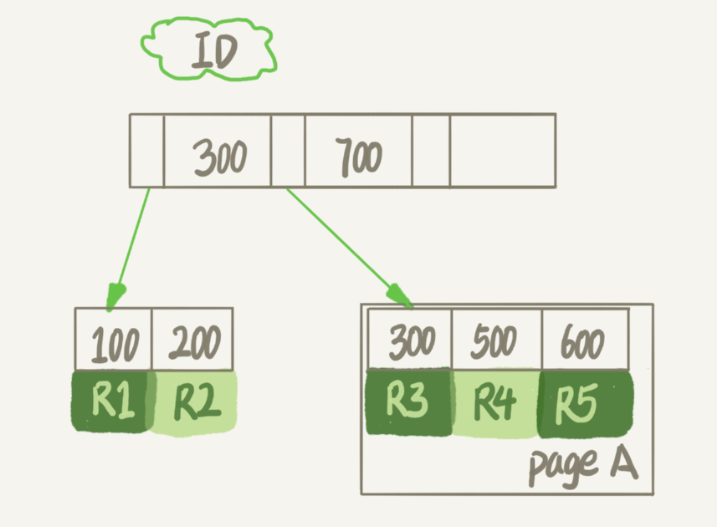
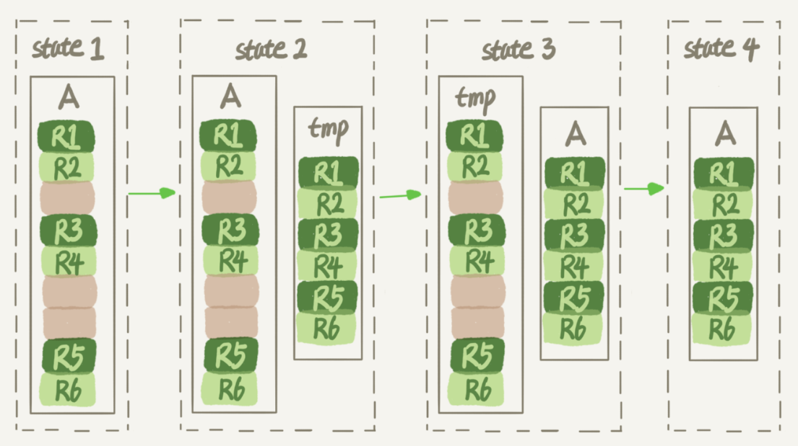

# 13-删除表，文件大小不变


常见的问题：数据库占用空间太大，最大的表删掉了一半的数据，表文件的大小还是没变？


本文涉及到数据库表的空间回收，针对 MySQL 中应用最广泛的 InnoDB 引擎展开讨论。一个 InnoDB 表包含两部分，即：表结构定义和数据。在 MySQL 8.0 版本以前，表结构是存在以 .frm 为后缀的文件里。而 MySQL 8.0 版本，则已经允许把表结构定义放在系统数据表中了。因为表结构定义占用的空间很小，所以我们今天主要讨论的是表数据。


**简单地删除表数据达不到表空间回收的效果**

## 参数 `innodb_file_per_table`


表数据既可以存在共享表空间里，也可以是单独的文件。这个行为是由参数 `innodb_file_per_table` 控制的：

- OFF：表的数据放在系统共享表空间，也就是跟数据字典放在一起；

- ON：每个 InnoDB 表数据存储在一个以 .ibd 为后缀的文件中。

从 MySQL 5.6.6 版本开始，它的默认值就是 ON s了。

一个表单独存储为一个文件更容易管理，而且在你不需要这个表的时候，通过 `drop table` 命令，系统就会直接删除这个文件。而如果是放在共享表空间中，即使表删掉了，空间也是不会回收的。

**将 `innodb_file_per_table` 设置为 ON，是推荐做法，接下来的讨论都是基于这个设置展开的。**


我们在删除整个表的时候，可以使用 `drop table` 命令回收表空间。

但是，我们遇到的更多的删除数据的场景是删除某些行，这时就遇到了我们文章开头的问题：表中的数据被删除了，但是表空间却没有被回收。


## 数据删除流程

InnoDB 中一个索引的示意图




假设，我们要删掉 R4 这个记录，InnoDB 引擎只会把 R4 这个记录标记为删除。如果之后要再插入一个 ID 在 300 和 600 之间的记录时，可能会复用这个位置。但是，磁盘文件的大小并不会缩小。

InnoDB 的数据是按页存储的，那么如果我们删掉了一个数据页上的所有记录，会怎么样？

答案是，整个数据页就可以被复用了。但是，**数据页的复用跟记录的复用是不同的**。


#### 记录的复用

记录的复用，只限于符合范围条件的数据。比如上面的这个例子，R4 这条记录被删除后，如果插入一个 ID 是 400 的行，可以直接复用这个空间。但如果插入的是一个 ID 是 800 的行，就不能复用这个位置了。

而当整个页从 B+ 树里面摘掉以后，可以复用到任何位置。以上图为例，如果将数据页 page A 上的所有记录删除以后，page A 会被标记为可复用。这时候如果要插入一条 ID=50 的记录需要使用新页的时候，page A 是可以被复用的。

如果相邻的两个数据页利用率都很小，系统就会把这两个页上的数据合到其中一个页上，另外一个数据页就被标记为可复用。

**delete 命令的作用**

进一步地，如果我们用 delete 命令把整个表的数据删除呢？结果就是，所有的数据页都会被标记为可复用。但是磁盘上，文件不会变小。

你现在知道了，delete 命令其实只是把记录的位置，或者数据页标记为了 “可复用”，但磁盘文件的大小是不会变的。也就是说，通过 delete 命令是不能回收表空间的。这些可以复用，而没有被使用的空间，看起来就像是“空洞”。

**不止是删除数据会造成空洞，插入数据也会。**

> 如果数据是按照索引递增顺序插入的，那么索引是紧凑的。但如果数据是随机插入的，就可能造成索引的数据页分裂。


delete、truncate、drop 对于表和索引空间区别：

- delete: 删除记录，可复用，不会减小表或索引空间
- drop: 表的占用空间释放
- truncate: 可以理解为 drop + create，表和索引空间初始化

> truncate 和 delete 只删除数据， drop 则删除整个表（表结构和数据）。

## 重建表

试想一下，如果你现在有一个表 A，需要做空间收缩，为了把表中存在的空洞去掉，你可以怎么做呢？

你可以新建一个与表 A 结构相同的表 B，然后按照主键 ID 递增的顺序，把数据一行一行地从表 A 里读出来再插入到表 B 中。

```sql
mysql> alter table A engine=InnoDB;
```



显然，花时间最多的步骤是往临时表插入数据的过程，如果在这个过程中，有新的数据要写入到表 A 的话，就会造成数据丢失。因此，在整个 DDL 过程中，表 A 中不能有更新。也就是说，这个 DDL 不是 Online 的。


MySQL 5.6 版本开始引入的 Online DDL，对这个操作流程做了优化。

1. 建立一个临时文件，扫描表 A 主键的所有数据页；

2. 用数据页中表 A 的记录生成 B+ 树，存储到临时文件中；

3. 生成临时文件的过程中，将所有对 A 的操作记录在一个日志文件（row log）中，对应的是图中 state2 的状态；

4. 临时文件生成后，将日志文件中的操作应用到临时文件，得到一个逻辑数据上与表 A 相同的数据文件，对应的就是图中 state3 的状态；

5. 用临时文件替换表A的数据文件。


由于日志文件记录和重放操作这个功能的存在，这个方案在重建表的过程中，允许对表 A 做增删改操作。这也就是 Online DDL 名字的来源。

DDL 之前是要拿 MDL 写锁的，这样还能叫 Online DDL 吗？`alter` 语句在启动的时候需要获取 MDL 写锁，但是这个写锁在真正拷贝数据之前就退化成读锁了。

为什么要退化呢？为了实现 Online MDL 读锁不会阻塞增删改操作。

那为什么不干脆直接解锁呢？为了保护自己，禁止其他线程对这个表同时做DDL。

而对于一个大表来说，Online DDL 最耗时的过程就是拷贝数据到临时表的过程，这个步骤的执行期间可以接受增删改操作。所以，相对于整个 DDL 过程来说，锁的时间非常短。对业务来说，就可以认为是 Online 的。

需要补充说明的是，上述的这些重建方法都会扫描原表数据和构建临时文件。对于很大的表来说，这个操作是很消耗 IO 和 CPU 资源的。


`optimize table`、`analyze table` 和 `alter table` 重建表的区别

- 从 MySQL 5.6 版本开始，`alter table t engine = InnoDB` 表示的是重新建表的逻辑

- `analyze table t` 只是对表的索引信息做重新统计，没有修改数据，这个过程中加了 MDL 读锁

- `optimize table t` 等于 `alter table` + `analyze`。


## Q & A

假设现在有人碰到了一个“想要收缩表空间，结果适得其反”的情况，看上去是这样的：

1. 一个表 t 文件大小为 1TB；

2. 对这个表执行 `alter table t engine=InnoDB`；

3. 发现执行完成后，空间不仅没变小，还稍微大了一点儿，比如变成了 1.01TB。


A：

就是这个表，本身就已经没有空洞的了，比如说刚刚做过一次重建表操作。

在 DDL 期间，如果刚好有外部的 DML 在执行，这期间可能会引入一些新的空洞。

> 在重建表的时候，InnoDB不会把整张表占满，每个页留了1/16给后续的更新用。也就是说，其实重建表之后不是“最”紧凑的。

1. 将表t重建一次；

2. 插入一部分数据，但是插入的这些数据，用掉了一部分的预留空间；

3. 这种情况下，再重建一次表 t，就可能会出现问题中的现象。