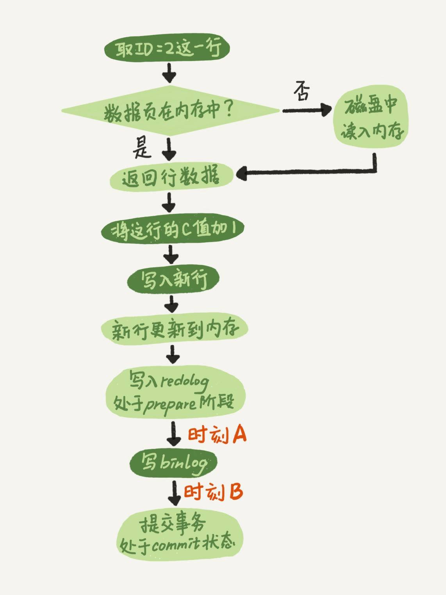
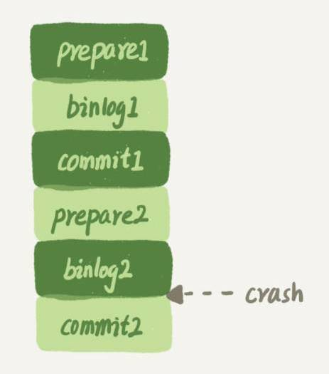
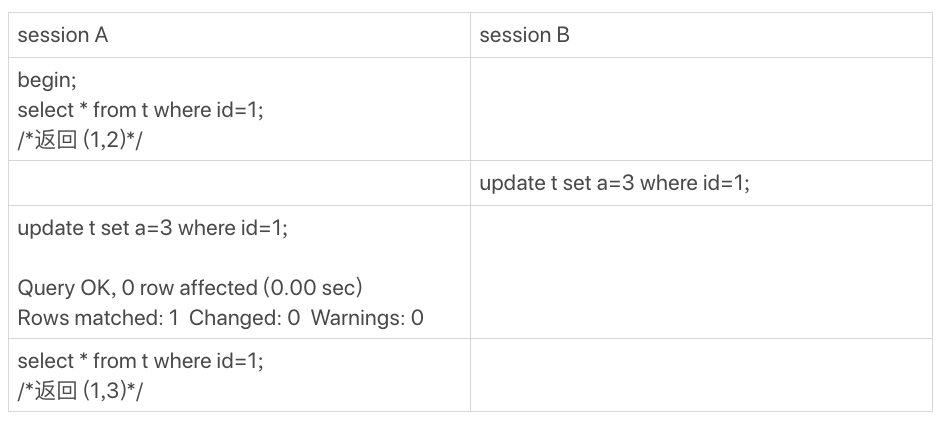

# 15-日志 & 索引问题


## 日志相关

***问题 1：*** 在两阶段提交的不同瞬间，MySQL 如果发生异常重启，是怎么保证数据完整性的？




- 时刻 A：由于此时 binlog 还没写，redo log 也还没提交，所以崩溃恢复的时候，这个事务会回滚。这时候，binlog 还没写，所以也不会传到备库；

- 时刻 B：binlog 写完，redo log 还没 commit 前发生 crash，那崩溃恢复的时候 MySQL 的处理方式：

	- redo log 事务完整：有了commit标识，则直接提交；
	
	- redo log 事务不完整：根据 binlog 是否存在并完整决定 commit/rollback


***追问 1：*** MySQL 怎么知道 binlog 是完整的 ？

一个事务的 binlog 是有完整格式的：

- statement 格式的 binlog：最后会有COMMIT；

- row 格式的 binlog，最后会有一个 XID event。


另外，在 MySQL 5.6.2 版本以后，还引入了 binlog-checksum 参数，用来验证 binlog 内容的正确性。对于 binlog 日志由于磁盘原因，可能会在日志中间出错的情况，MySQL 可以通过校验 checksum 的结果来发现。所以，MySQL 还是有办法验证事务 binlog 的完整性的。

 ***追问 2：*** redo log 和 binlog 是怎么关联起来的?
 
它们有一个共同的数据字段，叫 XID。崩溃恢复的时候，会按顺序扫描 redo log：

- 如果碰到既有 prepare、又有 commit 的 redo log，就直接提交；

- 果碰到只有 parepare、而没有 commit 的 redo log，就拿着 XID 去 binlog 找对应的事务。

***追问 3：*** 处于 prepare 阶段的 redo log 加上完整 binlog，重启就能恢复，MySQL 为什么要这么设计?

与备份的一致性有关。在时刻 B，也就是 binlog 写完以后 MySQL 发生崩溃，这时候 binlog 已经写入了，之后就会被从库（或者用这个 binlog 恢复出来的库）使用。

所以，在主库上也要提交这个事务。采用这个策略，主库和备库的数据就保证了一致性。

***追问 4：*** 如果这样的话，为什么还要两阶段提交呢？干脆先 redo log 写完，再写 binlog。崩溃恢复的时候，必须得两个日志都完整才可以。是不是一样的逻辑 ？

两阶段提交是经典的分布式系统问题，并不是 MySQL 独有的。

如果必须要举一个场景，来说明这么做的必要性的话，那就是事务的持久性问题。

对于 InnoDB 引擎来说，如果 redo log 提交完成了，事务就不能回滚（如果这还允许回滚，就可能覆盖掉别的事务的更新）。而如果 redo log 直接提交，然后 binlog 写入的时候失败， InnoDB 又回滚不了，数据和 binlog 日志又不一致了。

两阶段提交就是为了给所有人一个机会，当每个人都说 “我ok” 的时候，再一起提交。

***追问 5：***只用 binlog 来支持崩溃恢复，又能支持归档，可以吗 ？

不可以。

> 意思是，只保留 binlog，然后可以把提交流程改成这样：… -> “数据更新到内存” -> “写  binlog” -> “提交事务”，是不是也可以提供崩溃恢复的能力？


**历史原因：**那就是 InnoDB 并不是 MySQL 的原生存储引擎。MySQL 的原生引擎是 MyISAM，设计之初就有没有支持崩溃恢复。InnoDB 接入了 MySQL 后，发现既然 binlog 没有崩溃恢复的能力，那就用 InnoDB 原有的 redo log 好了。

下图只有 binlog



这样的流程下，binlog 还是不能支持崩溃恢复的，binlog 没有能力恢复“数据页”。


> 如果在图中标的位置，也就是 binlog2 写完了，但是整个事务还没有 commit 的时候，MySQL 发生了 crash。

> 重启后，引擎内部事务2会回滚，然后应用 binlog2 可以补回来。但是对于事务 1 来说，系统已经认为提交完成了，不会再应用一次 binlog1。
> 
> 但是，InnoDB 引擎使用的是 WAL 技术，执行事务的时候，写完内存和日志，事务就算完成了。如果之后崩溃，要依赖于日志来恢复数据页。

> 也就是说在图中这个位置发生崩溃的话，事务 1 也是可能丢失了的，而且是数据页级的丢失。此时，binlog 里面并没有记录数据页的更新细节，是补不回来的。 
> 
> 

***追问 6：***只用 redo log，不要 binlog ？

如果只从崩溃恢复的角度来讲是可以的。可以把 binlog 关掉，这样就没有两阶段提交了，但系统依然是 crash-safe 的。

> 但业界各个公司的使用场景的话，就会发现在正式的生产库上，binlog 都是开着的。因为 binlog 有着 redo log 无法替代的功能。

- 归档：redo log 是循环写，写到末尾是要回到开头继续写的。这样历史日志没法保留，redo log 也就起不到归档的作用。

- MySQL 系统依赖于 binlog。binlog 作为 MySQL 一开始就有的功能，被用在了很多地方。其中， MySQL 系统高可用的基础，就是 binlog 复制。


***追问 7：***redo log 一般设置多大？

redo log 太小的话，会导致很快就被写满，然后不得不强行刷 redo log，这样 WAL 机制的能力就发挥不出来了。

如果是现在常见的几个 TB 的磁盘的话，就不要太小气了，直接将 redo log 设置为 4 个文件、每个文件 1GB 吧。


***追问 8：***正常运行中的实例，数据写入后的最终落盘，是从 redo log 更新过来的还是从 buffer pool 更新过来的呢？

这里涉及到了，“redo log 里面到底是什么” 的问题。

实际上，redo log 并没有记录数据页的完整数据，所以它并没有能力自己去更新磁盘数据页，也就不存在 “数据最终落盘，是由 redo log 更新过去” 的情况。

1. 如果是正常运行的实例的话，数据页被修改以后，跟磁盘的数据页不一致，称为脏页。最终数据落盘，就是把内存中的数据页写盘。这个过程，甚至与 redo log 毫无关系。

2. 在崩溃恢复场景中，InnoDB 如果判断到一个数据页可能在崩溃恢复的时候丢失了更新，就会将它读到内存，然后让 redo log 更新内存内容。更新完成后，内存页变成脏页，就回到了第一种情况的状态。

***追问 9：*** redo log buffer 是什么？是先修改内存，还是先写 redo log 文件？

在一个事务的更新过程中，日志是要写多次的。比如下面这个事务：

```sql
begin;
insert into t1 ...
insert into t2 ...
commit;
```

这个事务要往两个表中插入记录，插入数据的过程中，生成的日志都得先保存起来，但又不能在还没 commit 的时候就直接写到 redo log 文件里。

所以，redo log buffer 就是一块内存，用来先存 redo 日志的。也就是说，在执行第一个 insert 的时候，数据的内存被修改了，redo log buffer 也写入了日志。

但是，真正把日志写到 redo log 文件（文件名是 `ib_logfile+数字`），是在执行 commit 语句的时候做的。

单独执行一个更新语句的时候，InnoDB 会自己启动一个事务，在语句执行完成的时候提交。过程跟上面是一样的，只不过是“压缩”到了一个语句里面完成。


## Q & A

我们创建了一个简单的表 t ，并插入一行，然后对这一行做修改。


```sql
mysql> CREATE TABLE `t` (
	`id` int(11) NOT NULL primary key auto_increment,
	`a` int(11) DEFAULT NULL
) ENGINE=InnoDB;

insert into t values(1,2);
```

这时候，表 t 里有唯一的一行数据 (1,2)。假设，我现在要执行：

```sql
mysql> update t set a=2 where id=1;
```

你会看到这样的结果：


结果显示，匹配(rows matched)了一行，修改(Changed)了0行。

仅从现象上看，MySQL内 部在处理这个命令的时候，可以有以下三种选择：

1. 更新都是先读后写的，MySQL读出数据，发现a的值本来就是2，不更新，直接返回，执行结束；

2. MySQL调用了InnoDB引擎提供的“修改为(1,2)”这个接口，但是引擎发现值与原来相同，不更新，直接返回；

3. InnoDB认真执行了“把这个值修改成(1,2)"这个操作，该加锁的加锁，该更新的更新。

你觉得实际情况会是以上哪种呢？你可否用构造实验的方式，来证明你的结论？进一步地，可以思考一下，MySQL为什么要选择这种策略呢？

A：

第一个选项是，MySQL 读出数据，发现值与原来相同，不更新，直接返回，执行结束。这里我们可以用一个锁实验来确认。

假设，当前表 t 里的值是(1,2)。


session B 的 update 语句被 blocked 了，加锁这个动作是 InnoDB 才能做的，所以排除选项 1。

第二个选项是，MySQL 调用了 InnoDB 引擎提供的接口，但是引擎发现值与原来相同，不更新，直接返回。有没有这种可能呢？这里我用一个可见性实验来确认。

假设当前表里的值是(1,2)。



session A 的第二个 select 语句是一致性读（快照读)，它是不能看见 session B 的更新的。

现在它返回的是(1,3)，表示它看见了某个新的版本，这个版本只能是 session A 自己的 update 语句做更新的时候生成。

所以答案应该是选项3，即：InnoDB 认真执行了 “把这个值修改成(1,2)" 这个操作，该加锁的加锁，该更新的更新。


然后你会说，MySQL怎么这么笨，就不会更新前判断一下值是不是相同吗？如果判断一下，不就不用浪费InnoDB操作，多去更新一次了？

其实MySQL是确认了的。只是在这个语句里面，MySQL认为读出来的值，只有一个确定的 (id=1), 而要写的是(a=3)，只从这两个信息是看不出来“不需要修改”的。

作为验证，你可以看一下下面这个例子。


