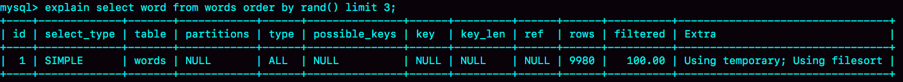
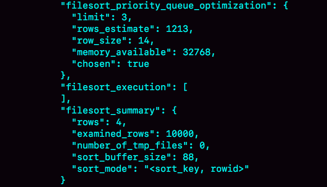

# 17-Order By(2)

加深对 MySQL 排序逻辑的理解。

这个英语学习 App 首页有一个随机显示单词的功能，也就是根据每个用户的级别有一个单词表，然后这个用户每次访问首页的时候，都会随机滚动显示三个单词。他们发现随着单词表变大，选单词这个逻辑变得越来越慢，甚至影响到了首页的打开速度。

现在，如果让你来设计这个 SQL 语句，你会怎么写呢？

为了便于理解，我对这个例子进行了简化：去掉每个级别的用户都有一个对应的单词表这个逻辑，直接就是从一个单词表中随机选出三个单词。这个表的建表语句和初始数据的命令如下：


```sql
mysql> CREATE TABLE `words` (
  `id` int(11) NOT NULL AUTO_INCREMENT,
  `word` varchar(64) DEFAULT NULL,
  PRIMARY KEY (`id`)
) ENGINE=InnoDB;

delimiter ;;
create procedure idata()
begin
  declare i int;
  set i=0;
  while i<10000 do
    insert into words(word) values(concat(char(97+(i div 1000)), char(97+(i % 1000 div 100)), char(97+(i % 100 div 10)), char(97+(i % 10))));
    set i=i+1;
  end while;
end;;
delimiter ;

call idata();
```

为了便于量化说明，我在这个表里面插入了 10000 行记录。接下来，我们就一起看看要随机选择3个单词，有什么方法实现，存在什么问题以及如何改进。

## 内存临时表

首先，会想到用 `order by rand()` 来实现这个逻辑。

这个语句的意思很直白，随机排序取前 3 个。虽然这个 SQL 语句写法很简单，但执行流程却有点复杂的。

我们先用 explain 命令来看看这个语句的执行情况。



Extra 字段显示 Using temporary，表示的是需要使用临时表；Using filesort，表示的是需要执行排序操作。

你觉得对于临时内存表的排序来说，它会选择哪一种算法呢？回顾一下上一篇文章的一个结论：**对于 InnoDB 表来说，执行全字段排序会减少磁盘访问，因此会被优先选择**。

**对于内存表，回表过程只是简单地根据数据行的位置，直接访问内存得到数据，根本不会导致多访问磁盘**。优化器没有了这一层顾虑，那么它会优先考虑的，就是用于排序的行越少越好了，所以， MySQL 这时就会选择 rowid 排序。

理解了这个算法选择的逻辑，我们再来看看语句的执行流程。同时，通过今天的这个例子，我们来尝试分析一下语句的扫描行数。

这条语句的执行流程是这样的：

1. 创建一个临时表。这个临时表使用的是 memory 引擎，表里有两个字段，第一个字段是 double 类型，为了后面描述方便，记为字段 R，第二个字段是 varchar(64) 类型，记为字段 W。并且，这个表没有建索引。

2. 从 words 表中，按主键顺序取出所有的 word 值。对于每一个 word 值，调用 rand() 函数生成一个大于 0 小于 1 的随机小数，并把这个随机小数和 word 分别存入临时表的 R 和 W 字段中，到此，扫描行数是 10000。

3. 现在临时表有 10000 行数据了，接下来你要在这个没有索引的内存临时表上，按照字段 R 排 序。

4. 初始化 sort\_buffer。sort\_buffer 中有两个字段，一个是 double 类型，另一个是整型。

5. 从内存临时表中一行一行地取出 R 值和位置信息（我后面会和你解释这里为什么是“位置信息”），分别存入 sort\_buffer 中的两个字段里。这个过程要对内存临时表做全表扫描，此时扫描行数增加 10000，变成了 20000。

6. 在 sort\_buffer 中根据 R 的值进行排序。注意，这个过程没有涉及到表操作，所以不会增加扫描行数。

7. 排序完成后，取出前三个结果的位置信息，依次到内存临时表中取出 word 值，返回给客户端。这个过程中，访问了表的三行数据，总扫描行数变成了 20003。

接下来，我们通过慢查询日志（slow log）来验证一下我们分析得到的扫描行数是否正确。

```
# Query_time: 0.900376  Lock_time: 0.000347 Rows_sent: 3 Rows_examined: 20003
SET timestamp=1541402277;
select word from words order by rand() limit 3;
```

其中，Rows\_examined：20003 就表示这个语句执行过程中扫描了 20003 行，也就验证了我们分析得出的结论。

现在，我来把完整的排序执行流程图画出来。


图中的pos就是位置信息，你可能会觉得奇怪，这里的“位置信息”是个什么概念？在上一篇文章中，我们对 InnoDB 表排序的时候，明明用的还是 ID 字段。

这时候，我们就要回到一个基本概念：**MySQL 的表是用什么方法来定位“一行数据”的**。

> 如果把一个 InnoDB 表的主键删掉，是不是就没有主键，就没办法回表了？

> 其实不是的。如果你创建的表没有主键，或者把一个表的主键删掉了，那么 InnoDB 会自己生成一个长度为 6 字节的 rowid 来作为主键。

这也就是排序模式里面，rowid 名字的来历。实际上它表示的是：每个引擎用来唯一标识数据行的信息。

- 对于有主键的 InnoDB 表来说，这个 rowid 就是主键 ID；

- 对于没有主键的 InnoDB 表来说，这个 rowid 就是由系统生成的；

- MEMORY 引擎不是索引组织表。在这个例子里面，你可以认为它就是一个数组。因此，这个 rowid 其实就是数组的下标

**order by rand() 使用了内存临时表，内存临时表排序的时候使用了 rowid 排序方法**

## 磁盘临时表

那么，是不是所有的临时表都是内存表呢？

其实不是的。tmp\_table\_size 这个配置限制了内存临时表的大小，默认值是 16 M。如果临时表大小超过了 tmp\_table\_size，那么内存临时表就会转成磁盘临时表。

磁盘临时表使用的引擎默认是 InnoDB，是由参数 internal\_tmp\_disk\_storage\_engine 控制的。

当使用磁盘临时表的时候，对应的就是一个没有显式索引的 InnoDB 表的排序过程。

为了复现这个过程，我把 tmp\_table\_size 设置成 1024，把 sort\_buffer\_size 设置成  32768, 把 max\_length\_for\_sort\_data 设置成 16。


```sql
set tmp_table_size=1024;
set sort_buffer_size=32768;
set max_length_for_sort_data=16;
/* 打开 optimizer_trace，只对本线程有效 */
SET optimizer_trace='enabled=on'; 

/* 执行语句 */
select word from words order by rand() limit 3;

/* 查看 OPTIMIZER_TRACE 输出 */
SELECT * FROM `information_schema`.`OPTIMIZER_TRACE`\G
```



因为将 max\_length\_for\_sort\_data 设置成 16，小于 word 字段的长度定义，所以我们看到 sort\_mode 里面显示的是 rowid 排序，这个是符合预期的，参与排序的是随机值 R 字段和 rowid 字段组成的行。

这时候你可能心算了一下，发现不对。R 字段存放的随机值就 8 个字节，rowid 是 6 个字节，数据总行数是 10000，这样算出来就有 140000 字节，超过了 sort\_buffer\_size 定义的  32768 字节了。但是，number\_of\_tmp\_files 的值居然是 0，难道不需要用临时文件吗？

> rowid 为什么是 6 字节 ？
> 
> 

这个 SQL 语句的排序确实没有用到临时文件，采用是 MySQL 5.6 版本引入的一个新的排序算法，即：优先队列排序算法。

上图的 OPTIMIZER\_TRACE 结果中，filesort\_priority\_queue\_optimization 这个部分的 `chosen=true`，就表示使用了优先队列排序算法，这个过程不需要临时文件，因此对应的 number\_of\_tmp\_files 是 0。

这个流程结束后，我们构造的堆里面，就是这个 10000 行里面 R 值最小的三行。然后，依次把它们的 rowid 取出来，去临时表里面拿到 word 字段，这个过程就跟上一篇文章的 rowid 排序的过程一样了。

我们再看一下上面一篇文章的SQL查询语句：

```sql
mysql> select city,name,age from t where city='杭州' order by name limit 1000;
```

你可能会问，这里也用到了 limit，为什么没用优先队列排序算法呢？原因是，这条 SQL 语句是 `limit 1000`，如果使用优先队列算法的话，需要维护的堆的大小就是 1000 行的(name,rowid)，超过了我设置的 sort\_buffer\_size 大小，所以只能使用归并排序算法。

总之，不论是使用哪种类型的临时表，`order by rand()` 这种写法都会让计算过程非常复杂，需要大量的扫描行数，因此排序过程的资源消耗也会很大。

## 随机排序方法

为了得到严格随机的结果，可以用下面这个流程：

1. 取得整个表的行数，并记为 C。

2. 取得 Y = floor(C * rand())。 floor 函数在这里的作用，就是取整数部分。

3. 再用 limit Y,1 取得一行。

```sql
mysql> select count(*) into @C from t;
set @Y = floor(@C * rand());
set @sql = concat("select * from t limit ", @Y, ",1");
prepare stmt from @sql;
execute stmt;
DEALLOCATE prepare stmt;
```

由于 limit 后面的参数不能直接跟变量，所以我在上面的代码中使用了 `prepare+execute` 的方法。你也可以把拼接 SQL 语句的方法写在应用程序中，会更简单些。

MySQL 处理 `limit Y,1` 的做法就是按顺序一个一个地读出来，丢掉前 Y 个，然后把下一个记录作为返回结果，因此这一步需要扫描 `Y+1` 行。再加上，第一步扫描的 C 行，总共需要扫描 `C+Y+1` 行，执行代价高。

当然，随机算法跟直接 `order by rand()` 比起来，执行代价还是小很多的。

要随机取 3 个 word 值呢？你可以这么做：

```sql
mysql> select count(*) into @C from t;
set @Y1 = floor(@C * rand());
set @Y2 = floor(@C * rand());
set @Y3 = floor(@C * rand());
select * from t limit @Y1，1； //在应用代码里面取Y1、Y2、Y3值，拼出SQL后执行
select * from t limit @Y2，1；
select * from t limit @Y3，1；
```


## Q & A

你可能问了，如果按照这个表有 10000 行来计算的话，C=10000，要是随机到比较大的 Y 值，那扫描行数也跟 20000 差不多了，接近 `order by rand()` 的扫描行数，为什么说随机算法的代价要小很多呢？

A：索引快速扫描

上面的随机算法3的总扫描行数是 `C+(Y1+1)+(Y2+1)+(Y3+1)`，实际上它还是可以继续优化，来进一步减少扫描行数的。

我的问题是，如果你是这个需求的开发人员，你会怎么做，来减少扫描行数呢？说说你的方案，并说明你的方案需要的扫描行数。

这里我给出一种方法，取 Y1、Y2 和 Y3 里面最大的一个数，记为 M，最小的一个数记为 N，然后执行下面这条 SQL 语句：

```sql
mysql> select * from t limit N, M-N+1;
```

再加上取整个表总行数的 C 行，这个方案的扫描行数总共只需要 C+M+1 行。

