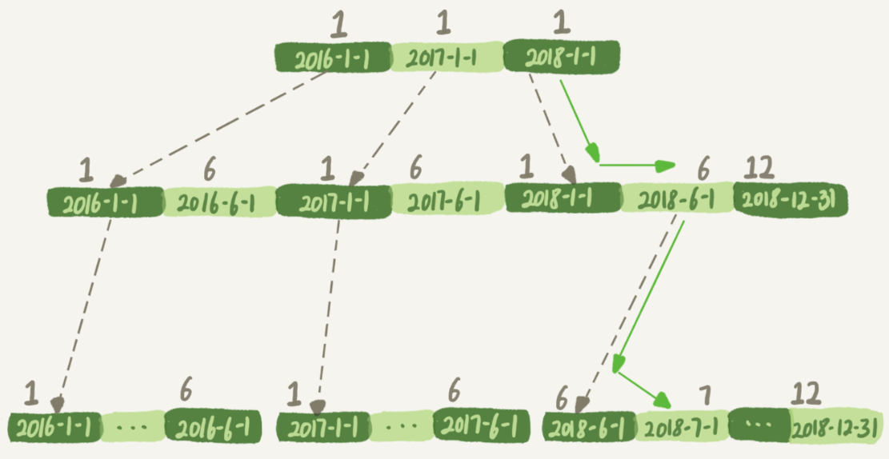
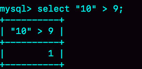

# 18-查询优化


在 MySQL 中，有很多看上去逻辑相同，但性能却差异巨大的 SQL 语句。对这些语句使用不当的话，就会不经意间导致整个数据库的压力变大。

## 案例一：条件字段函数操作


维护了一个交易系统，其中交易记录表 tradelog 包含交易流水号（tradeid）、交易员id（operator）、交易时间（t\_modified）等字段。为了便于描述，我们先忽略其他字段。


```sql
mysql> CREATE TABLE `tradelog` (
  `id` int(11) NOT NULL,
  `tradeid` varchar(32) DEFAULT NULL,
  `operator` int(11) DEFAULT NULL,
  `t_modified` datetime DEFAULT NULL,
  PRIMARY KEY (`id`),
  KEY `tradeid` (`tradeid`),
  KEY `t_modified` (`t_modified`)
) ENGINE=InnoDB DEFAULT CHARSET=utf8mb4;
```

假设，现在已经记录了从 2016 年初到 2018 年底的所有数据，运营部门有一个需求是，要统计发生在所有年份中 7 月份的交易记录总数。这个逻辑看上去并不复杂，你的 SQL 语句可能会这么写：

```sql
mysql> select count(*) from tradelog where month(t_modified)=7;
```

由于 t\_modified 字段上有索引，于是你就很放心地在生产库中执行了这条语句，但却发现执行了特别久，才返回了结果。

如果你问DBA同事为什么会出现这样的情况，他大概会告诉你：**如果对字段做了函数计算，就用不上索引了，这是 MySQL 的规定**。

现在你已经学过了 InnoDB 的索引结构了，可以再追问一句为什么？为什么条件是 `where t_modified='2018-7-1’` 的时候可以用上索引，而改成 `where month(t_modified)=7` 的时候就不行了？

下面是这个 t\_modified 索引的示意图。方框上面的数字就是 month() 函数对应的值。





如果你的 SQL 语句条件用的是 `where t_modified='2018-7-1’` 的话，引擎就会按照上面绿色箭头的路线，快速定位到 `t_modified='2018-7-1’` 需要的结果。

实际上，B+树提供的这个快速定位能力，来源于同一层兄弟节点的有序性。但是，如果计算 month() 函数的话，你会看到传入 7 的时候，在树的第一层就不知道该怎么办了。

> **对索引字段做函数操作，可能会破坏索引值的有序性，因此优化器就决定放弃走树搜索功能**。

> 需要注意的是，优化器并不是要放弃使用这个索引。
> 
> 在这个例子里，放弃了树搜索功能，优化器可以选择遍历主键索引，也可以选择遍历索引t\_modified，优化器对比索引大小后发现，索引 t\_modified 更小，遍历这个索引比遍历主键索引来得更快。因此最终还是会选择索引 t\_modified。

接下来，我们使用 explain 命令，查看一下这条 SQL 语句的执行结果。


`key="t_modified"` 表示的是，使用了 t\_modified 这个索引；我在测试表数据中插入了 10 万行数据，rows=100335，说明这条语句扫描了整个索引的所有值；Extra 字段的 `Using index`，表示的是使用了覆盖索引。

也就是说，由于在 t\_modified 字段加了 month() 函数操作，导致了全索引扫描。为了能够用上索引的快速定位能力，我们就要把 SQL 语句改成基于字段本身的范围查询。按照下面这个写法，优化器就能按照我们预期的，用上 t\_modified 索引的快速定位能力了。


```sql
mysql> select count(*) from tradelog where
    -> (t_modified >= '2016-7-1' and t_modified<'2016-8-1') or
    -> (t_modified >= '2017-7-1' and t_modified<'2017-8-1') or 
    -> (t_modified >= '2018-7-1' and t_modified<'2018-8-1');
```

不过优化器在个问题上确实有“偷懒”行为，即使是对于不改变有序性的函数，也不会考虑使用索引。比如，对于 `select * from tradelog where id + 1 = 10000` 这个 SQL 语句，这个加 1操作并不会改变有序性，但是 MySQL 优化器还是不能用 id 索引快速定位到 9999 这一行。所以，需要你在写 SQL 语句的时候，手动改写成 `where id = 10000 -1` 才可以。


## 隐式类型转换


看一下这条SQL语句：

```sql
mysql> select * from tradelog where tradeid=110717;
```

交易编号 tradeid 这个字段上，本来就有索引，但是 explain 的结果却显示，这条语句需要走全表扫描。你可能也发现了，tradeid 的字段类型是 varchar(32)，而输入的参数却是整型，所以需要做类型转换。

那么，现在这里就有两个问题：

- 数据类型转换的规则是什么？

- 为什么有数据类型转换，就需要走全索引扫描？


#### 验证数据类型转换的规则

这里有一个简单的方法，看 `select “10” > 9` 的结果：



从图中可知，`select “10” > 9` 返回的是 1，所以你就能确认 MySQL 里的转换规则了：**在MySQL中，字符串和数字做比较的话，是将字符串转换成数字**。

#### 为什么有数据类型转换，就需要走全索引扫描？

上面的 SQL 语句相当于：

```sql
mysql> select * from tradelog where  CAST(tradid AS signed int) = 110717;
```

也就是说，这条语句触发了我们上面说到的规则：对索引字段做函数操作，优化器会放弃走树搜索功能。


id 的类型是 int，如果执行下面这个语句，是否会导致全表扫描呢？

```sql
select * from tradelog where id="83126";
```

你可以先自己分析一下，再到数据库里面去验证确认。


## 隐式字符编码转换

假设系统里还有另外一个表 trade\_detail，用于记录交易的操作细节。为了便于量化分析和复现，我往交易日志表 tradelog 和交易详情表 t rade\_detail 这两个表里插入一些数据。

```sql
mysql> CREATE TABLE `trade_detail` (
  `id` int(11) NOT NULL,
  `tradeid` varchar(32) DEFAULT NULL,
  `trade_step` int(11) DEFAULT NULL, /*操作步骤*/
  `step_info` varchar(32) DEFAULT NULL, /*步骤信息*/
  PRIMARY KEY (`id`),
  KEY `tradeid` (`tradeid`)
) ENGINE=InnoDB DEFAULT CHARSET=utf8;

insert into tradelog values(1, 'aaaaaaaa', 1000, now());
insert into tradelog values(2, 'aaaaaaab', 1000, now());
insert into tradelog values(3, 'aaaaaaac', 1000, now());

insert into trade_detail values(1, 'aaaaaaaa', 1, 'add');
insert into trade_detail values(2, 'aaaaaaaa', 2, 'update');
insert into trade_detail values(3, 'aaaaaaaa', 3, 'commit');
insert into trade_detail values(4, 'aaaaaaab', 1, 'add');
insert into trade_detail values(5, 'aaaaaaab', 2, 'update');
insert into trade_detail values(6, 'aaaaaaab', 3, 'update again');
insert into trade_detail values(7, 'aaaaaaab', 4, 'commit');
insert into trade_detail values(8, 'aaaaaaac', 1, 'add');
insert into trade_detail values(9, 'aaaaaaac', 2, 'update');
insert into trade_detail values(10, 'aaaaaaac', 3, 'update again');
insert into trade_detail values(11, 'aaaaaaac', 4, 'commit');
```

这时候，如果要查询 id=2 的交易的所有操作步骤信息，SQL 语句可以这么写：

```sql
mysql> select d.* from tradelog l, trade_detail d where d.tradeid=l.tradeid and l.id=2; /*语句Q1*/
```


我们一起来看下这个结果：

- 第一行显示优化器会先在交易记录表 tradelog 上查到 id=2 的行，这个步骤用上了主键索引， rows=1 表示只扫描一行；

- 第二行key=NULL，表示没有用上交易详情表 trade\_detail 上的 tradeid 索引，进行了全表扫描。

在这个执行计划里，是从 tradelog 表中取 tradeid 字段，再去 trade\_detail 表里查询匹配字段。因此，我们把 tradelog 称为驱动表，把 trade\_detail 称为被驱动表，把 tradeid 称为关联字段。


图中：

- 第1步，是根据 id 在 tradelog 表里找到 L2 这一行；

- 第2步，是从L2中取出tradeid字段的值；

- 第3步，是根据 tradeid 值到 trade\_detail 表中查找条件匹配的行。explain 的结果里面第二行的 key=NULL 表示的就是，这个过程是通过遍历主键索引的方式，一个一个地判断 tradeid 的值是否匹配。

进行到这里，你会发现第3步不符合我们的预期。因为表 trade\_detail 里 tradeid 字段上是有索引的，我们本来是希望通过使用 tradeid 索引能够快速定位到等值的行。但，这里并没有。


为什么字符集不同就用不上索引呢？我们说问题是出在执行步骤的第3步，如果单独把这一步改成SQL语句的话，那就是：

```sql
mysql> select * from trade_detail where tradeid=$L2.tradeid.value; 
```

其中，$L2.tradeid.value的字符集是utf8mb4。

**因为这两个表的字符集不同，一个是utf8，一个是utf8mb4，所以做表连接查询的时候用不上关联字段的索引**

参照前面的两个例子，你肯定就想到了，字符集 utf8mb4 是 utf8 的超集，所以当这两个类型的字符串在做比较的时候，MySQL 内部的操作是，先把 utf8 字符串转成 utf8mb4 字符集，再做比较。

> 这个设定很好理解，utf8mb4是utf8的超集。类似地，在程序设计语言里面，做自动类型转换的时候，为了避免数据在转换过程中由于截断导致数据错误，也都是“按数据长度增加的方向”进行转换的。

因此， 在执行上面这个语句的时候，需要将被驱动数据表里的字段一个个地转换成utf8mb4，再跟L2做比较。

也就是说，实际上这个语句等同于下面这个写法：

```sql
select * from trade_detail  where CONVERT(traideid USING utf8mb4)=$L2.tradeid.value; 
```

`CONVERT()` 函数，在这里的意思是把输入的字符串转成 utf8mb4 字符集。

这就再次触发了我们上面说到的原则：对索引字段做函数操作，优化器会放弃走树搜索功能。

到这里，你终于明确了，字符集不同只是条件之一，**连接过程中要求在被驱动表的索引字段上加函数操作**，是直接导致对被驱动表做全表扫描的原因。


## Q & A


今天我留给你的课后问题是，你遇到过别的、类似今天我们提到的性能问题吗？你认为原因是什么，又是怎么解决的呢？


