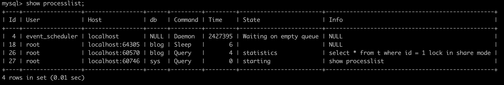

# 19-简单语句的慢查询


82-43=39

42- 3=39

122-83=39

162-123

202-163

242-203


一般情况下，如果说查询性能优化，首先会想到一些复杂的语句，想到查询需要返回大量的数据。但有些情况下，“查一行”，也会执行得特别慢。


需要说明的是，如果 MySQL 数据库本身就有很大的压力，导致数据库服务器 CPU 占用率很高或IO利用率很高，这种情况下所有语句的执行都有可能变慢，不属于本文的讨论范围。


构造一个表，基于这个表来说明今天的问题。这个表有两个字段 id 和 c，并且我在里面插入了 10 万行记录。

```sql
mysql> CREATE TABLE `t` (
  `id` int(11) NOT NULL,
  `c` int(11) DEFAULT NULL,
  PRIMARY KEY (`id`)
) ENGINE=InnoDB;

delimiter ;;
create procedure idata()
begin
  declare i int;
  set i=1;
  while(i<=100000) do
    insert into t values(i,i);
    set i=i+1;
  end while;
end;;
delimiter ;

call idata();
```

## 第一类：查询长时间不返回

在表 t 执行下面的 SQL 语句：


```sql
mysql> select * from t where id=1;
```

查询结果长时间不返回。

一般碰到这种情况的话，大概率是表 t 被锁住了。接下来分析原因的时候，一般都是首先执行一下 show processlist 命令，看看当前语句处于什么状态。

然后再针对每种状态，去分析它们产生的原因、如何复现，以及如何处理。

### 等 MDL 锁

在 MySQL 5.7 版本下复现这个场景：


接着，通过 `show processlist` 查看


出现这个状态表示的是，现在有一个线程正在表 t 上请求或者持有 MDL 写锁，把 `select` 语句堵住了。

> 这类问题的处理方式很简单，就是找到谁持有 MDL 写锁，然后把它 kill 掉。

在上图中，ID 为 23 的线程使用写锁锁住了表，但是直接通过图我们无法直观地看见。

通过查询 `sys.schema_table_lock_waits` 这张表，我们就可以直接找出造成阻塞的 process id，把这个连接用 kill 命令断开即可。

```sql
mysql> select blocking_pid from sys.schema_table_lock_waits;
+--------------+
| blocking_pid |
+--------------+
|           23 |
+--------------+
1 row in set (0.00 sec)
```


> MySQL 启动时需要设置 `performance_schema=on`，相比于设置为 off 会有 10% 左右的性能损失

### 等待 flush

...

### 等行锁

等待 MDL 和 flush 是表级锁的考验，现在终于来到引擎这里。


由于访问 id=1 这个记录时要加读锁，如果这时候已经有一个事务在这行记录上持有一个写锁，我们的 `select` 语句就会被堵住。

复现步骤和现场如下：


通过 `show processlist;` 命令查看线程状况。



如果你用的是 MySQL 5.7 版本，可以通过 `sys.innodb_lock_waits` 表查到。

```sql
mysql> select * from sys.innodb_lock_waits\G;
```

通过下面的信息可以发现查询是阻塞于线程 18，与上图可核实。

```sql
mysql> select * from sys.innodb_lock_waits\G;
*************************** 1. row ***************************
                wait_started: 2020-12-11 19:00:35
                    wait_age: 00:00:05
               wait_age_secs: 5
                locked_table: `blog`.`t`
         locked_table_schema: blog
           locked_table_name: t
      locked_table_partition: NULL
   locked_table_subpartition: NULL
                locked_index: PRIMARY
                 locked_type: RECORD
              waiting_trx_id: 281479722990288
         waiting_trx_started: 2020-12-11 19:00:35
             waiting_trx_age: 00:00:05
     waiting_trx_rows_locked: 1
   waiting_trx_rows_modified: 0
                 waiting_pid: 26
               waiting_query: select * from t where id = 1 lock in share mode
             waiting_lock_id: 281479722990288:87:4:2
           waiting_lock_mode: S,REC_NOT_GAP
             blocking_trx_id: 25429
                blocking_pid: 18
              blocking_query: NULL
            blocking_lock_id: 25429:87:4:2
          blocking_lock_mode: X,REC_NOT_GAP
        blocking_trx_started: 2020-12-11 19:00:33
            blocking_trx_age: 00:00:07
    blocking_trx_rows_locked: 1
  blocking_trx_rows_modified: 1
     sql_kill_blocking_query: KILL QUERY 18
sql_kill_blocking_connection: KILL 18
1 row in set (0.00 sec)

ERROR:
No query specified
```

通过 `KILL 18` 可以杀死阻塞于 SQL 的线程。


