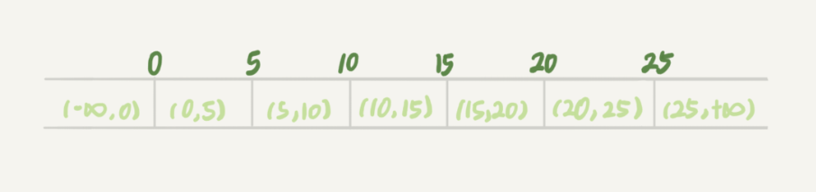

# 20-幻读的概念


再看看 InnoDB 怎么解决幻读的问题。

## 如何解决幻读？

产生幻读的原因是，行锁只能锁住行，但是新插入记录这个动作，要更新的是记录之间的“间隙”。因此，为了解决幻读问题，InnoDB 只好引入新的锁，也就是间隙锁 (Gap Lock)。


顾名思义，间隙锁，锁的就是两个值之间的空隙。表 t 初始化插入了 6 个记录，这就产生了 7 个间隙。



当你执行 `select * from t where d=5 for update` 的时候，就不止是给数据库中已有的个记录加上了行锁，还同时加了间隙锁。这样就确保了无法再插入新的记录。


**跟间隙锁存在冲突关系的，是“往这个间隙中插入一个记录”这个操作。间隙锁之间都不存在冲突关系。**

举个例子：


这里 session B 并不会被堵住。因为表 t 里并没有 c=7 这个记录，因此 session A 加的是间隙锁 (5,10)。而 session B 也是在这个间隙加的间隙锁。它们有共同的目标，即：保护这个间隙，不允许插入值。但，它们之间是不冲突的。

间隙锁和行锁合称 next-key lock，每个 next-key lock 是前开后闭区间

> 间隙锁记为开区间，把 next-key lock 记为前开后闭区间。

间隙锁和 next-key lock 的引入，帮我们解决了幻读的问题，但同时也带来了一些“困扰”。


业务逻辑这样的：任意锁住一行，如果这一行不存在的话就插入，如果存在这一行就更新它的数据，代码如下：

```sql
begin;
select * from t where id=N for update;

/*如果行不存在*/
insert into t values(N,N,N);
/*如果行存在*/
update t set d=N set id=N;

commit;
```

碰到的现象是，这个逻辑一旦有并发，就会碰到死锁。你一定也觉得奇怪，这个逻辑每次操作前用 `for update` 锁起来，已经是最严格的模式了，怎么还会有死锁呢？

这里，我用两个 session 来模拟并发，并假设 N=9。


1. session A 执行 `select ... for update` 语句，由于 id=9 这一行并不存在，因此会加上间隙锁 (5,10);

2. session B 执行 `select ... for update` 语句，同样会加上间隙锁 (5,10)，间隙锁之间不会冲突，因此这个语句可以执行成功；

3. session B 试图插入一行 (9,9,9)，被 session A 的间隙锁挡住了，只好进入等待；

4. session A 试图插入一行 (9,9,9)，被 session B 的间隙锁挡住了。

至此，两个 session 进入互相等待状态，形成死锁。当然，InnoDB 的死锁检测马上就发现了这对死锁关系，让 session A 的 insert 语句报错返回了。

**间隙锁的引入，可能会导致同样的语句锁住更大的范围，这其实是影响了并发度的。**

本文分析的问题都是在可重复读隔离级别下的，间隙锁是在可重复读隔离级别下才会生效的。所以，你如果把隔离级别设置为读提交的话，就没有间隙锁了。但同时，你要解决可能出现的数据和日志不一致问题，需要把 binlog 格式设置为 row。这，也是现在不少公司使用的配置组合。


## Q & A

分析 session B 和 session C 阻塞的原因。


1. c = 15，普通索引的等值查询：(10, 15] & (15, 20] → (10, 15] & (15, 20)
2. c = 20，普通索引的等值查询：(15, 20] & (20, 25] → (15, 20] & (20, 25)
3. c < 20 & c > 15, order by desc，范围查询：(15, 20] & (10, 15] & (5, 10]

加锁范围：索引 c (20, 25) & (15, 20] & (10, 15] & (5, 10] 以及 主键索引的 10、15 和 20 的行锁（由于 `select *` 的原因）。