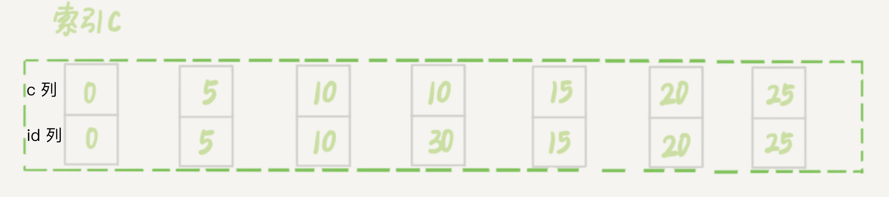
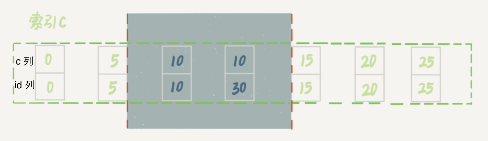
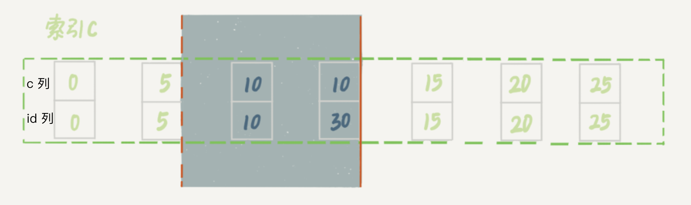

# 21-Next-Key Lock


## <span id="加锁规则"> 加锁规则 </span>


这个规则有以下两条前提说明：

MySQL后面的版本可能会改变加锁策略，所以这个规则只限于截止到现在的最新版本，即 5.x系列<=5.7.24，8.0系列 <=8.0.1


**两个原则、两个优化、一个 bug**

1. 原则 1：加锁的基本单位为 next-key lock，加锁范围为左开右闭；
2. 原则 2：查找过程中访问到的对象才会加锁；
3. 优化 1：索引上的等值查询，给唯一索引加锁的时候，next-key lock 退化为行锁；
4. 优化 2：索引上的等值查询，往查询方向遍历到最后一个值不满足等值条件的时候，next-key lock退化为间隙锁；
5. 一个 bug：范围查询，唯一索引会往查询方向访问到不满足条件的第一个值为止。


```sql
CREATE TABLE `t` (
	`id` int(11) NOT NULL,
	`c`  int(11) NOT NULL,
	`d`  int(11) NOT NULL,
	PRIMARY KEY (`id`),
	KEY `c` (`c`)
) ENGINE=InnoDB;

insert into t values(0, 0, 0), (5, 5, 5), (10, 10, 10), (15, 15, 15), (20, 20, 20), (25, 25, 25);

set auto_commint = 1;
set 隔离级别=repeated read;
```

#### 案例一：等值查询的间隙锁

| session A| session B| session C |
|:--|:--|:--|
|begin;<br/>update t set d=d+1 where id=7;|||
||insert into t values(8,8,8);<br/><font color=#FF0000>[blocked]</font>||
|||update t set d=d+1 where id=10;<br/><font color=#008000>[Query OK]</font>|

<br/>

1. 优化 1：唯一索引等值查询 id=7: (5, 10] → (5, 10) { 由于不存在 id=7 的数据, 只能退化到间隙锁 }

最终的加锁范围： (5, 10)

#### 案例二：非唯一索引等值锁


| session A| session B| session C |
|:--|:--|:--|
|begin;<br/>select id from t where c=5 lock in share mode;|||
||update set d=d+1 where id=5;<br/><font color=#008000>[Query OK]</font>||
|||insert into values(7,7,7);<br/><font color=#FF0000>[blocked]</font>|

<br/>

1. 优化 2: 非唯一索引等值查询c=5: (0, 5] & (5, 10] → (0, 5] & (5, 10)
2. 优化 2: 唯一索引等值查询 id=5: (5, 10] → 行锁 5

最终的加锁范围：

- c 索引：(0, 5] & (5, 10)
- 主键索引：5

> 在这个例子中，`lock in share mode` 只锁覆盖索引，但如果是 `for update`，系统会认为接下来需要更新数据，因此会给主键索引上满足条件的行加行锁。
> 
> 如果需要使用 `lock in share mode` 避免数据被更新，需要绕过覆盖索引的优化，比如可以在查询字段中加入索引中不存在的字段，可以把 session A 改为：`select d from t where c=5 lock in share mode`。

#### 案例三：主键索引范围锁

| session A| session B| session C |
|:--|:--|:--|
|begin;<br/>select * from t id>=10 and id<11 for update;|||
||insert int t values(8,8,8);<br/><font color=#008000>[Query OK]</font><br/>insert into t values(13,13,13)<br/><font color=#FF0000>[blocked]</font>||
|||update t set d=d+1 where id=15;<br/><font color=#FF0000>[blocked]</font>|

<br/>

session A 的加锁判断流程：

1. 优化 1: 主键索引等值查询 id=10 → (5, 10] → 行锁 10

2. 原则 2: 范围查询向后遍历 id>10 & id<11: (10, 15]

最终的加锁范围：行锁 10，(10, 15]

#### 案例四：非唯一索引范围锁

| session A| session B| session C |
|:--|:--|:--|
|begin;<br/>select * from t c>=10 and c<11 for update;|||
||insert int t values(8,8,8);<br/><font color=#FF0000>[blocked]</font></font>||
|||update t set d=d+1 where id=15;<br/><font color=#FF0000>[blocked]</font>|

<br/>

session A 的加锁判断流程：

1. 优化 2: 非唯一索引等值查询 id=10: (5, 10] & (10, 15] → (5, 10] & (10, 15)

2. 原则 2: 范围查询向后遍历 c>10 & c<11: (10, 15]

最终加锁范围：(5, 10) & (10, 15]


#### 案例五：唯一索引的范围锁 bug

| session A| session B| session C |
|:--|:--|:--|
|begin;<br/>select * from t id>10 and id<=15 for update;|||
||update t set d=d+1 where id=20;<br/><font color=#FF0000>[blocked]</font></font>||
|||insert into t values(16,16,16);<br/><font color=#FF0000>[blocked]</font>|

<br/>

session A 的加锁判断流程：

1. 优化 1: 唯一索引等值查询 id=15: (10, 15] → 15

2. 原则 2: 范围查询 id>10 & id<15: (10, 15]

3. bug: 向右遍历: (15, 20]


最终加锁范围：(10, 15] & (15, 20]

#### 案例六：非唯一索引上存在 “等值” 的例子

首先插入一条新的记录 

```sql
mysql> insert into t values(30, 10, 30);
```

索引 c 的结构如下：




<br/>

| session A| session B| session C |
|:--|:--|:--|
|begin;<br/>delete from t where c=10;|||
||insert into t values(12,12,12);<br/><font color=#FF0000>[blocked]</font>||
|||update t set d=d+1 where c=15;<br/><font color=#008000>[Query Ok]</font>|


> 注意：delete 语句加锁的逻辑与 select ... for update 是类似的。

session A 的加锁判断流程：


1. 优化 2: 非唯一索引的等值查询向右遍历 c=10: (5, 10] & (10, 15] → (5, 10) & (10, 15)





#### 案例七：limit 语句加锁

| session A| session B| 
|:--|:--|
|begin;<br/>delete from t where c=10 limit 2;||
||insert into t values(12,12,12);<br/><font color=#008000>[Query OK]</font>|

1. 优化 2: 非唯一索引等值查询向右查询（limit 限制了向右）: (5, 10]

> 这个例子里，session A 的 delete 语句加了 limit 2。我们知道表 t 里 c=10 的记录其实只有两条，因此加不加 limit 2，删除的效果都是一样的，但是加锁的效果却不同。可以看到，session B 的 insert 语句执行通过了，跟案例六的结果不同。

这是因为，在本例里的 delete 语句明确加了 limit 2 的限制，因此在遍历到两条记录后，满足条件的语句已经有两条，循环就结束了。



> 实践的指导意义：在删除数据的时候尽量加 limit。这样不仅可以控制删除数据的条数，让操作更安全，还可以减小加锁的范围。

#### 案例八：一个死锁的例子


session A, B 的加锁判断流程：

1. 优化 2: 非唯一索引等值查询向右遍历 c=10: (5, 10] & (10, 15] → (5, 10] & (10, 15)

2. 优化 2: 非唯一索引等值查询向右遍历 c=10: (5, 10] & (10, 15] → (5, 10] & (10, 15)

3. 插入 c=8 插入，被 session B 的间隙锁锁住。由于出现了死锁，InnoDB 让 session B 回滚。

> 疑问 session B 的 next-key lock 不是还没申请成功吗？

> 其实是这样的，session B 的 `加next-key lock(5,10]` 操作，实际上分成了两步，先是加 (5,10) 的间隙锁，加锁成功；然后加 c=10 的行锁，这时候才被锁住的。所以此时的步骤 2 和步骤 3 都在等待彼此释放间隙锁 (5, 10)

> 也就是说，我们在分析加锁规则的时候可以用 next-key lock 来分析。但是要知道，具体执行的时候，是要分成间隙锁和行锁两段来执行的。


#### 案例九

| session A| session B| 
|:--|:--|
| begin;<br/> select * from t where c>=15 and c<=20 order by c desc lock in share mode; ||
|| insert into t values(6,6,6); <font color=#FF0000>[blocked]</font>|

session A 的加锁判断流程：

1. 优化 2: 非唯一索引等值查询向右遍历: c=20: (15, 20] & (20, 25] → (15, 20] & (20, 25)

2. 优化 2: 非唯一索引等值查询向右遍历: c=15: (10, 15] & (15, 20] → (10, 15] & (15, 20)

3. 原则 2: 范围查询 c>15 & c<20: (5, 10] & (10, 15] & (15, 20] { 由于是 `order by desc` 所以向左遍历 }

4. `select *` 需要在主键索引上加上 c 对应的行锁

综上，索引 c 的加锁范围 (5, 25) & 主键索引 id=10、15、20 三个行锁

--


一些细节：

> - 锁就是加在索引上的，这是 InnoDB 的一个基础设置；
> - <= 到底是间隙锁还是行锁？需要和 “执行过程” 配合起来分析。在 InnoDB 要去找 “第一个值” 的时候，是按照等值判断查询的，用的是等值判断原则；接着在索引内找到 “下一个值”，对应于规则内的范围查询；
> - 最终加锁的索引是根据实际情况执行的，故如果一个 select * from t for update 语句，优化器决定使用全表扫描，那么就会把主键索引加的 next-key lock 全加上；
> - 表中有数据行才会进行加锁，如果查询条件没有命中行，那么加 next-key lock。注意等值判断时，需要做优化，即索引上的等值查询，向右遍历时，在最后一个不满足等值条件的时候，next-key lock 退化为间隙锁。
> - 间隙锁之间不冲突