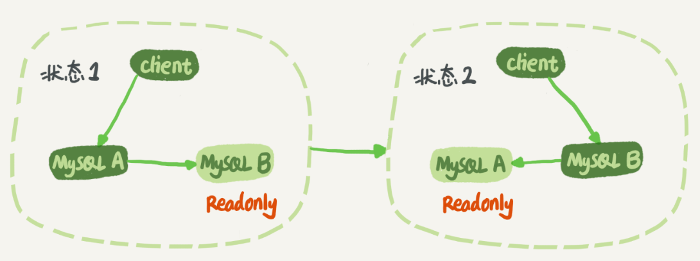
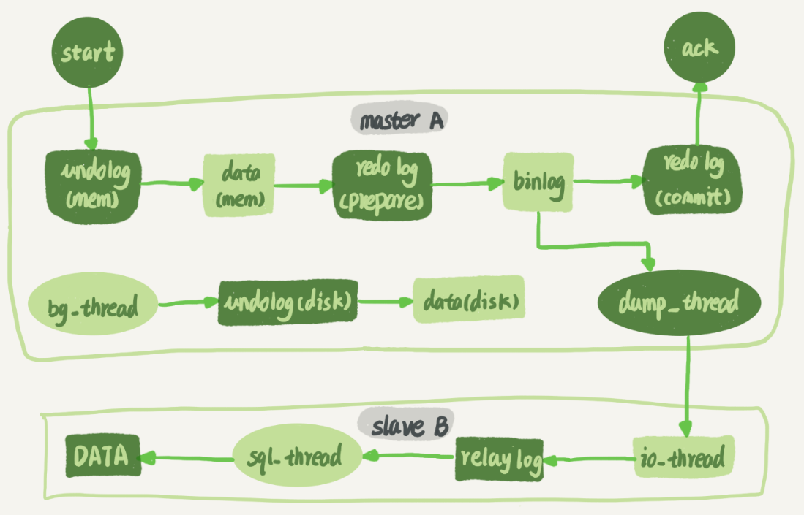
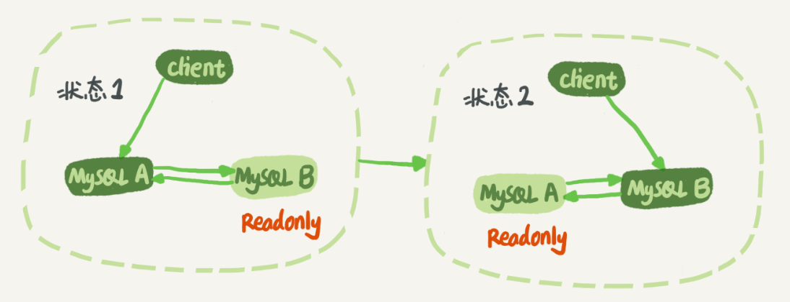

# 24-MySQL 主备一致


大家知道 binlog 可以用来归档，也可以用来做主备同步，但它的内容是什么样的呢？为什么备库执行了 binlog 就可以跟主库保持一致了呢？今天我就正式地和你介绍一下它。


## MySQL 主备的基本原理




在状态 1 中，客户端的读写都直接访问节点 A，而节点 B 是 A 的备库，只是将 A 的更新都同步过来，到本地执行。这样可以保持节点 B 和 A 的数据是相同的。

当需要切换的时候，就切成状态 2。这时候客户端读写访问的都是节点 B，而节点 A 是 B 的备库。

在状态 1 中，虽然节点 B 没有被直接访问，但是我依然建议你把节点 B（也就是备库）设置成只读（readonly）模式。这样做，有以下几个考虑：

- 有时候一些运营类的查询语句会被放到备库上去查，设置为只读可以防止误操作；

- 防止切换逻辑有bug，比如切换过程中出现双写，造成主备不一致；

- 可以用 readonly 状态，来判断节点的角色。

> 把备库设置成只读了，还怎么跟主库保持同步更新呢？

> 这个问题，不用担心。因为 readonly 设置对超级(super)权限用户是无效的，而用于同步更新的线程，就拥有超级权限。


节点 A 到 B 这条线的内部流程是什么样的。下图中画出的就是一个 update 语句在节点 A 执行，然后同步到节点 B 的完整流程图。




可以看到：主库接收到客户端的更新请求后，执行内部事务的更新逻辑，同时写 binlog。


备库 B 跟主库 A 之间维持了一个长连接。主库 A 内部有一个线程，专门用于服务备库 B 的这个长连接。一个事务日志同步的完整过程是这样的：

1. 在备库 B 上通过 change master 命令，设置主库 A 的IP、端口、用户名、密码，以及要从哪个位置开始请求 binlog，这个位置包含文件名和日志偏移量。

2. 在备库 B 上执行 start slave 命令，这时候备库会启动两个线程，就是图中的 io\_thread和 sql\_thread。其中 io\_thread 负责与主库建立连接。

3. 主库 A 校验完用户名、密码后，开始按照备库 B 传过来的位置，从本地读取 binlog，发给B。

4. 备库 B 拿到 binlog 后，写到本地文件，称为中转日志（relay log）。

5. sql\_thread 读取中转日志，解析出日志里的命令，并执行。

> 这里需要说明，后来由于多线程复制方案的引入，sql\_thread演化成为了多个线程，跟我们今天要介绍的原理没有直接关系。


## binlog 里面到底是什么内容 ？

binlog 有两种格式，一种是 statement，一种是 row。可能你在其他资料上还会看到有第三种格式，叫作 mixed，其实它就是前两种格式的混合。

为了便于描述 binlog 的这三种格式间的区别，我创建了一个表，并初始化几行数据。

```sql
mysql> CREATE TABLE `t` (
  `id` int(11) NOT NULL,
  `a` int(11) DEFAULT NULL,
  `t_modified` timestamp NOT NULL DEFAULT CURRENT_TIMESTAMP,
  PRIMARY KEY (`id`),
  KEY `a` (`a`),
  KEY `t_modified`(`t_modified`)
) ENGINE=InnoDB;

insert into t values(1,1,'2018-11-13');
insert into t values(2,2,'2018-11-12');
insert into t values(3,3,'2018-11-11');
insert into t values(4,4,'2018-11-10');
insert into t values(5,5,'2018-11-09');
```

如果要在表中删除一行数据的话，我们来看看这个 delete 语句的 binlog 是怎么记录的。

> 注意，下面这个语句包含注释，如果你用 MySQL 客户端来做这个实验的话，要记得加 `-c` 参数，否则客户端会自动去掉注释。

```sql
mysql> delete from t /*comment*/  where a>=4 and t_modified<='2018-11-10' limit 1;
```

当 `binlog_format=statement时`，binlog 里面记录的就是 SQL 语句的原文。你可以用

```sql
mysql> show binlog events in 'master.000001';
```

命令看 binlog 中的内容。


现在，我们来看一下上图的输出结果。

- 第一行SET @@SESSION.GTID_NEXT='ANONYMOUS’你可以先忽略，后面文章我们会在介绍主备切换的时候再提到；

- 第二行是一个 BEGIN，跟第四行的 COMMIT 对应，表示中间是一个事务；

- 第三行就是真实执行的语句了。可以看到，在真实执行的 delete 命令之前，还有一个 “use ‘test’;” 命令。这条命令不是我们主动执行的，而是 MySQL 根据当前要操作的表所在的数据库，自行添加的。这样做可以保证日志传到备库去执行的时候，不论当前的工作线程在哪个库里，都能够正确地更新到 test 库的表 t。

	use 'test’ 命令之后的 delete 语句，就是我们输入的 SQL 原文了。可以看到，binlog “忠实”地记录了 SQL 命令，甚至连注释也一并记录了。
	
- 最后一行是一个 COMMIT。你可以看到里面写着 xid=61。

为了说明 statement 和 row 格式的区别，我们来看一下这条 delete 命令的执行效果图：


可以看到，运行这条 delete 命令产生了一个 warning，原因是当前 binlog 设置的是 statement 格式，并且语句中有 limit，所以这个命令可能是 unsafe 的。

由于 statement 格式下，记录到 binlog 里的是语句原文，因此可能会出现这样一种情况：在主库执行这条 SQL 语句的时候，用的是索引 a；而在备库执行这条 SQL 语句的时候，却使用了索引 t\_modified。因此，MySQL 认为这样写是有风险的。

那么，如果我把 binlog 的格式改为 `binlog_format=‘row’`， 是不是就没有这个问题了呢？我们先来看看这时候 binog 中的内容吧。


可以看到，与 statement 格式的 binlog 相比，前后的 BEGIN 和 COMMIT 是一样的。但是，row 格式的 binlog 里没有了 SQL 语句的原文，而是替换成了两个 event：Table_map 和 Delete_rows。

- Table\_map event，用于说明接下来要操作的表是 test 库的表 t;

- Delete\_rows event，用于定义删除的行为。

其实，我们通过上图看不到详细信息的，还需要借助 mysqlbinlog 工具，用下面这个命令解析和查看 binlog 中的内容。因为上图中的信息显示，这个事务的 binlog 是从 8900 这个位置开始的，所以可以用 `start-position` 参数来指定从这个位置的日志开始解析。

```sql
mysqlbinlog  -vv data/master.000001 --start-position=8900;
```

当 `binlog\_format` 使用 row 格式的时候，binlog 里面记录了真实删除行的主键 id，这样 binlog 传到备库去的时候，就肯定会删除 id=4 的行，不会有主备删除不同行的问题。

#### 为什么会有mixed格式的binlog？


- 因为有些 statement 格式的 binlog 可能会导致主备不一致，所以要使用 row 格式。

- 但row格式的缺点是，很占空间。比如你用一个 delete 语句删掉 10 万行数据，用 statement 的话就是一个 SQL 语句被记录到 binlog 中，占用几十个字节的空间。但如果用 row 格式的 binlog，就要把这 10 万条记录都写到 binlog 中。这样做，不仅会占用更大的空间，同时写 binlog 也要耗费 IO 资源，影响执行速度。

- 所以，MySQL 就取了个折中方案，也就是有了 mixed 格式的 binlog。mixed 格式的意思是，MySQL 自己会判断这条 SQL 语句是否可能引起主备不一致，如果有可能，就用 row 格式，否则就用 statement 格式。

现在越来越多的场景要求把 MySQL 的 binlog 格式设置成 row。这么做的理由有很多，我来给你举一个可以直接看出来的好处：**恢复数据**。

分别从 delete、insert 和 update 这三种 SQL 语句的角度，来看看数据恢复的问题。

- delete语句：row 格式的 binlog 也会把被删掉的行的整行信息保存起来。所以，如果你在执行完一条 delete 语句以后，发现删错数据了，可以直接把 binlog 中记录的 delete 语句转成insert，把被错删的数据插入回去就可以恢复；

- insert语句：row 格式下，insert 语句的 binlog 里会记录所有的字段信息，这些信息可以用来精确定位刚刚被插入的那一行。这时，你直接把 insert 语句转成 delete 语句，删除掉这被误插入的一行数据就可以了；

- update语句：binlog 里面会记录修改前整行的数据和修改后的整行数据。所以，如果你误执行了 update 语句的话，只需要把这个 event 前后的两行信息对调一下，再去数据库里面执行，就能恢复这个更新操作


我之前看过有人在重放 binlog 数据的时候，是这么做的：用 mysqlbinlog 解析出日志，然后把里面的 statement 语句直接拷贝出来执行。

你现在知道了，这个方法是有风险的。因为有些语句的执行结果是依赖于上下文命令的，直接执行的结果很可能是错误的。

所以，用 binlog 来恢复数据的标准做法是，用 mysqlbinlog 工具解析出来，然后把解析结果整个发给 MySQL 执行。类似下面的命令：

```sql
mysqlbinlog master.000001  --start-position=2738 --stop-position=2973 | mysql -h127.0.0.1 -P13000 -u$user -p$pwd;
```

这个命令的意思是，将 master.000001 文件里面从第 2738 字节到第 2973 字节中间这段内容解析出来，放到 MySQL 去执行。

## 循环复制问题

通过上面对 MySQL 中 binlog 基本内容的理解，你现在可以知道，binlog 的特性确保了在备库执行相同的 binlog，可以得到与主库相同的状态。

因此，我们可以认为正常情况下主备的数据是一致的。也就是说，图 1 中 A、B 两个节点的内容是一致的。其实，实际生产上使用比较多的是双 M 结构，也就是下图所示的主备切换流程。



可以发现，双 M 结构和 M-S 结构，其实区别只是多了一条线，即：节点 A 和 B 之间总是互为主备关系。这样在切换的时候就不用再修改主备关系。

但是，双M结构还有一个问题需要解决。

业务逻辑在节点 A 上更新了一条语句，然后再把生成的 binlog 发给节点 B，节点 B 执行完这条更新语句后也会生成 binlog。（我建议你把参数 `log_slave_updates` 设置为 on，表示备库执行 relay log 后生成 binlog）。

那么，如果节点 A 同时是节点 B 的备库，相当于又把节点 B 新生成的 binlog 拿过来执行了一次，然后节点 A 和 B 间，会不断地循环执行这个更新语句，也就是循环复制了。这个要怎么解决呢？

我们可以用下面的逻辑，来解决两个节点间的循环复制的问题：

1. 规定两个库的 server id 必须不同，如果相同，则它们之间不能设定为主备关系；

2. 一个备库接到 binlog 并在重放的过程中，生成与原 binlog 的 server id 相同的新的 binlog；

3. 每个库在收到从自己的主库发过来的日志后，先判断 server id，如果跟自己的相同，表示这个日志是自己生成的，就直接丢弃这个日志。

按照这个逻辑，如果我们设置了双 M 结构，日志的执行流就会变成这样：

1. 节点 A 更新的事务，binlog 里面记的都是 A 的 server id；

2. 传到节点 B 执行一次以后，节点 B 生成的 binlog 的 server id 也是 A 的server id；

3. 再传回给节点A，A 判断到这个 server id 与自己的相同，就不会再处理这个日志。所以，死循环在这里就断掉了


## Q & A

说到循环复制问题的时候，我们说 MySQL 通过判断 server id 的方式，断掉死循环。但是，这个机制其实并不完备，在某些场景下，还是有可能出现死循环。

你能构造出一个这样的场景吗？又应该怎么解决呢？

一种场景是，在一个主库更新事务后，用命令 `set global server_id=x` 修改了 server_id。等日志再传回来的时候，发现 server\_id 跟自己的 server\_id 不同，就只能执行了。
