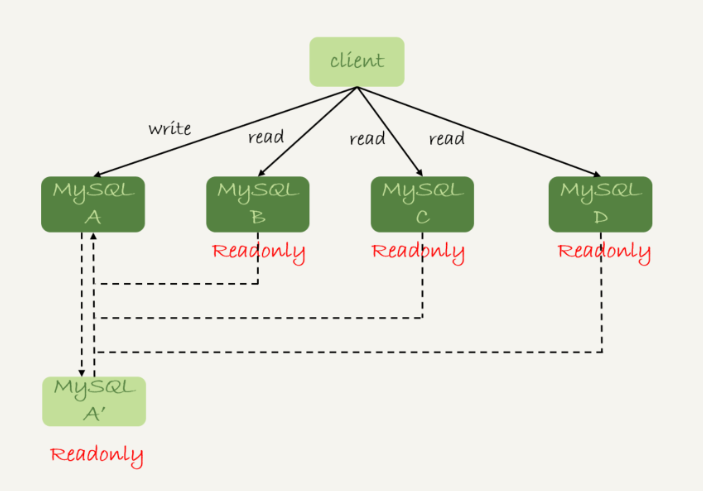
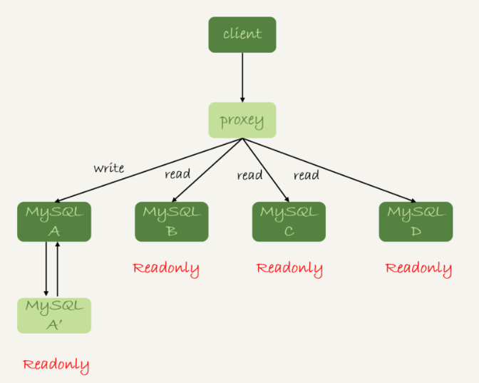
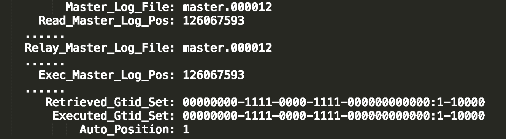
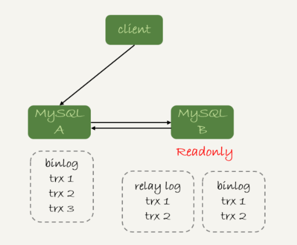
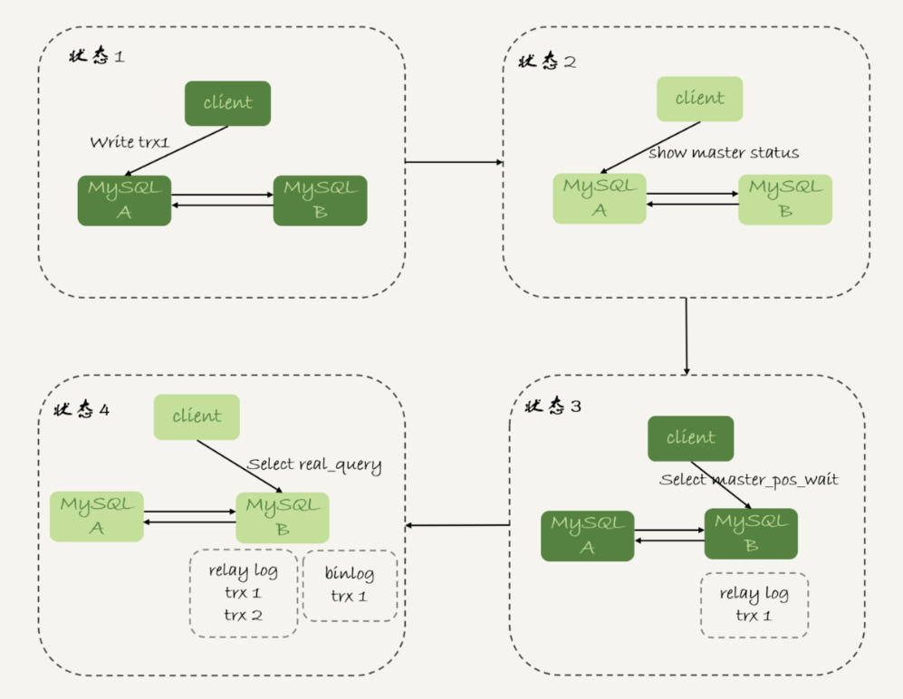

# 28-读写分离


主多从架构的应用场景：读写分离，以及怎么处理主备延迟导致的读写分离问题。




读写分离的主要目标就是分摊主库的压力。上图中的结构是客户端（client）主动做负载均衡，这种模式下一般会把数据库的连接信息放在客户端的连接层。也就是说，由客户端来选择后端数据库进行查询。




客户端直连和带proxy的读写分离架构，各有哪些特点。

- 客户端直连方案，因为少了一层 proxy 转发，所以查询性能稍微好一点儿，并且整体架构简单，排查问题更方便。但是这种方案，由于要了解后端部署细节，所以在出现主备切换、库迁移等操作的时候，客户端都会感知到，并且需要调整数据库连接信息。

	你可能会觉得这样客户端也太麻烦了，信息大量冗余，架构很丑。其实也未必，一般采用这样的架构，一定会伴随一个负责管理后端的组件，比如 Zookeeper，尽量让业务端只专注于业务逻辑开发。

- 带 proxy 的架构，对客户端比较友好。客户端不需要关注后端细节，连接维护、后端信息维护等工作，都是由 proxy 完成的。但这样的话，对后端维护团队的要求会更高。而且，proxy 也需要有高可用架构。因此，带 proxy 架构的整体就相对比较复杂。

理解了这两种方案的优劣，具体选择哪个方案就取决于数据库团队提供的能力了。但目前看，趋势是往带 proxy 的架构方向发展的


但是，不论使用哪种架构，你都会碰到我们今天要讨论的问题：由于主从可能存在延迟，客户端执行完一个更新事务后马上发起查询，如果查询选择的是从库的话，就有可能读到刚刚的事务更新之前的状态。

**在从库上会读到系统的一个过期状态”的现象，在这篇文章里，我们暂且称之为 “过期读”**

前面我们说过了几种可能导致主备延迟的原因，主从延迟还是不能 100% 避免的。不论哪种结构，客户端都希望查询从库的数据结果，跟查主库的数据结果是一样的。

## 强制走主库方案

强制走主库方案其实就是，将查询请求做分类。通常情况下，我们可以将查询请求分为这么两类：

- 对于必须要拿到最新结果的请求，强制将其发到主库上。

- 对于可以读到旧数据的请求，才将其发到从库上。

> 你可能会说，这个方案是不是有点畏难和取巧的意思，但其实这个方案是用得最多的。

当然，这个方案最大的问题在于，有时候你会碰到 “所有查询都不能是过期读” 的需求，比如一些金融类的业务。这样的话，你就要放弃读写分离，所有读写压力都在主库，等同于放弃了扩展性。


## Sleep 方案


主库更新后，读从库之前先 sleep 一下。具体的方案就是，类似于执行一条 `select sleep(1)` 命令。

这个方案的假设是，大多数情况下主备延迟在 1 秒之内，做一个sleep可以有很大概率拿到最新的数据。

这个方案给你的第一感觉，很可能是不靠谱儿，应该不会有人用吧？并且，你还可能会说，直接在发起查询时先执行一条 sleep 语句，用户体验很不友好啊。

但，这个思路确实可以在一定程度上解决问题。为了看起来更靠谱儿，我们可以换一种方式。

> 以卖家发布商品为例，商品发布后，用 Ajax（Asynchronous JavaScript + XML，异步JavaScript 和 XML）直接把客户端输入的内容作为“新的商品”显示在页面上，而不是真正地去数据库做查询。

> 这样，卖家就可以通过这个显示，来确认产品已经发布成功了。等到卖家再刷新页面，去查看商品的时候，其实已经过了一段时间，也就达到了 sleep 的目的，进而也就解决了过期读的问题。

也就是说，这个 sleep 方案确实解决了类似场景下的过期读问题。但，从严格意义上来说，这个方案存在的问题就是不精确。这个不精确包含了两层意思：

- 如果这个查询请求本来 0.5 秒就可以在从库上拿到正确结果，也会等1秒；

- 如果延迟超过 1 秒，还是会出现过期读。

看到这里，你是不是有一种“你是不是在逗我”的感觉，这个改进方案虽然可以解决类似Ajax场景下的过期读问题，但还是怎么看都不靠谱儿。别着急，接下来我就和你介绍一些更准确的方案。


## 判断主备无延迟方案

要确保备库无延迟，通常有三种做法。


#### 判断 seconds\_behind\_master

`show slave status` 结果里的 seconds\_behind\_master 参数的值，可以用来衡量主备延迟时间的长短。

每次从库执行查询请求前，先判断 seconds\_behind\_master 是否已经等于 0。如果还不等于 0，那就必须等到这个参数变为 0 才能执行查询请求。

> seconds\_behind\_master的单位是秒，精度可能不够。

#### 对比位点

`show slave status` 结果的部分截图



- Master\_Log\_File 和 Read\_Master\_Log\_Pos，表示的是读到的主库的最新位点；

- Relay\_Master\_Log\_File 和 Exec\_Master\_Log\_Pos，表示的是备库执行的最新位点。

如果 Master\_Log\_File 和 Relay\_Master\_Log\_File、Read\_Master\_Log\_Pos 和 Exec\_Master\_Log\_Pos 这两组值完全相同，就表示接收到的日志已经同步完成。

#### 对比 GTID 集合

- `Auto_Position=1` ，表示这对主备关系使用了 GTID 协议；

- Retrieved\_Gtid\_Set，是备库收到的所有日志的 GTID 集合；

- Executed\_Gtid\_Set，是备库所有已经执行完成的 GTID 集合。

如果这两个集合相同，也表示备库接收到的日志都已经同步完成。可见，对比位点和对比 GTID 这两种方法，都要比判断 seconds\_behind\_master 是否为 0 更准确。但还是没有达到 “精确” 的程度。为什么这么说呢？

一个事务的 binlog 在主备库之间的状态：

1. 主库执行完成，写入 binlog，并反馈给客户端；

2. binlog 被从主库发送给备库，备库收到；

3. 在备库执行binlog完成。

我们上面判断主备无延迟的逻辑，是“备库收到的日志都执行完成了”。但是，从 binlog 在主备之间状态的分析中，不难看出还有一部分日志，处于客户端已经收到提交确认，而备库还没收到日志的状态。



这时，主库上执行完成了三个事务 trx1、trx2 和 trx3，其中：

- trx1 和 trx2 已经传到从库，并且已经执行完成了；

- trx3 在主库执行完成，并且已经回复给客户端，但是还没有传到从库中。

如果这时候你在从库 B 上执行查询请求，按照我们上面的逻辑，从库认为已经没有同步延迟，但还是查不到 trx3 的。严格地说，就是出现了过期读。

那么，这个问题有没有办法解决呢？

## 配合 semi-sync

半同步复制：semi-sync replication

semi-sync做了这样的设计：

1. 事务提交的时候，主库把 binlog 发给从库；

2. 从库收到 binlog 以后，发回给主库一个ack，表示收到了；

3. 主库收到这个 ack 以后，才能给客户端返回“事务完成”的确认。

也就是说，如果启用了 semi-sync，就表示所有给客户端发送过确认的事务，都确保了备库已经收到了这个日志。

> 如果主库掉电的时候，有些 binlog 还来不及发给从库，会不会导致系统数据丢失？

> 答案是，如果使用的是普通的异步复制模式，就可能会丢失，但 semi-sync 就可以解决这个问题。


但是，semi-sync+位点判断的方案，只对一主一备的场景是成立的。在一主多从场景中，主库只要等到一个从库的ack，就开始给客户端返回确认。这时，在从库上执行查询请求，就有两种情况：

- 如果查询是落在这个响应了 ack 的从库上，是能够确保读到最新数据；

- 但如果是查询落到其他从库上，它们可能还没有收到最新的日志，就会产生过期读的问题。

其实，判断同步位点的方案还有另外一个潜在的问题，即：如果在业务更新的高峰期，主库的位点或者 GTID 集合更新很快，那么上面的两个位点等值判断就会一直不成立，很可能出现从库上迟迟无法响应查询请求的情况。

> 实际上，回到我们最初的业务逻辑里，当发起一个查询请求以后，我们要得到准确的结果，其实并不需要等到“主备完全同步”。

到这里，我们小结一下，semi-sync 配合判断主备无延迟的方案，存在两个问题：

- 一主多从的时候，在某些从库执行查询请求会存在过期读的现象；

- 在持续延迟的情况下，可能出现过度等待的问题。

接下来，我要和你介绍的等主库位点方案，就可以解决这两个问题。


## 等主库位点方案

要理解等主库位点方案，我需要先和你介绍一条命令：

```sql
select master_pos_wait(file, pos[, timeout]);
```

这条命令的逻辑如下：

- 它是在从库执行的；

- 参数 file 和 pos 指的是主库上的文件名和位置；

- timeout 可选，设置为正整数 N 表示这个函数最多等待 N 秒。

返回数据：

- 正常返回的结果是一个正整数 M，表示从命令开始执行，到应用完 file 和 pos 表示的 binlog 位置，执行了多少事务。

- 如果执行期间，备库同步线程发生异常，则返回 NULL；

- 如果等待超过 N 秒，就返回 -1；

- 如果刚开始执行的时候，就发现已经执行过这个位置了，则返回 0。

业务逻辑先执行 trx1，再执行一个查询请求的逻辑，要保证能够查到正确的数据，我们可以使用这个逻辑：

1. trx1 事务更新完成后，马上执行 `show master status` 得到当前主库执行到的 File 和Position；

2. 选定一个从库执行查询语句；

3. 在从库上执行 `select master_pos_wait(File, Position, 1)`；

4. 如果返回值是 >=0 的正整数，则在这个从库执行查询语句；

5. 否则，到主库执行查询语句。



这里我们假设，这条 select 查询最多在从库上等待 1 秒。那么，如果 1 秒内 master\_pos\_wait 返回一个大于等于 0 的整数，就确保了从库上执行的这个查询结果一定包含了 trx1 的数据。

步骤 5 到主库执行查询语句，是这类方案常用的退化机制。因为从库的延迟时间不可控，不能无限等待，所以如果等待超时，就应该放弃，然后到主库去查。

> 如果所有的从库都延迟超过 1 秒了，那查询压力不就都跑到主库上了吗？确实是这样。

> 但是，按照我们设定不允许过期读的要求，就只有两种选择，一种是超时放弃，一种是转到主库查询。具体怎么选择，就需要业务开发同学做好限流策略了。


## GTID 方案

如果你的数据库开启了GTID模式，对应的也有等待GTID的方案。

MySQL 中同样提供了一个类似的命令：

```sql
select wait_for_executed_gtid_set(gtid_set, 1);
```

这条命令的逻辑是：

- 等待，直到这个库执行的事务中包含传入的 gtid\_set，返回 0；

- 超时返回1。

MySQL 5.7.6 版本开始，允许在执行完更新类事务后，把这个事务的 GTID 返回给客户端。

这时，等 GTID 的执行流程就变成了：

1. trx1 事务更新完成后，从返回包直接获取这个事务的 GTID，记为 gtid1；

2. 选定一个从库执行查询语句；

3. 在从库上执行 `select wait_for_executed_gtid_set(gtid1, 1)`；

4. 如果返回值是 0，则在这个从库执行查询语句；

5. 否则，到主库执行查询语句。

等待超时后是否直接到主库查询，需要业务开发同学来做限流考虑。

> 有个问题是，怎么能够让 MySQL 在执行事务后，返回包中带上 GTID 呢？

> 只需要将参数 session\_track\_gtids 设置为 OWN\_GTID，然后通过 API 接口 mysql\_session\_track\_get\_first 从返回包解析出 GTID 的值即可。


## Q & A

假设你的系统采用等 GTID 的方案，现在你要对主库的一张大表做 DDL，可能会出现什么情况呢？为了避免这种情况，你会怎么做呢？


假设，这条语句在主库上要执行 10 分钟，提交后传到备库就要 10 分钟（典型的大事务）。那么，在主库 DDL 之后再提交的事务的 GTID，去备库查的时候，就会等 10 分钟才出现。

这样，这个读写分离机制在这 10 分钟之内都会超时，然后走主库。

这种预期内的操作，应该在业务低峰期的时候，确保主库能够支持所有业务查询，然后把读请求都切到主库，再在主库上做 DDL。等备库延迟追上以后，再把读请求切回备库。

通过这个思考题，我主要想让关注的是，大事务对等位点方案的影响。

