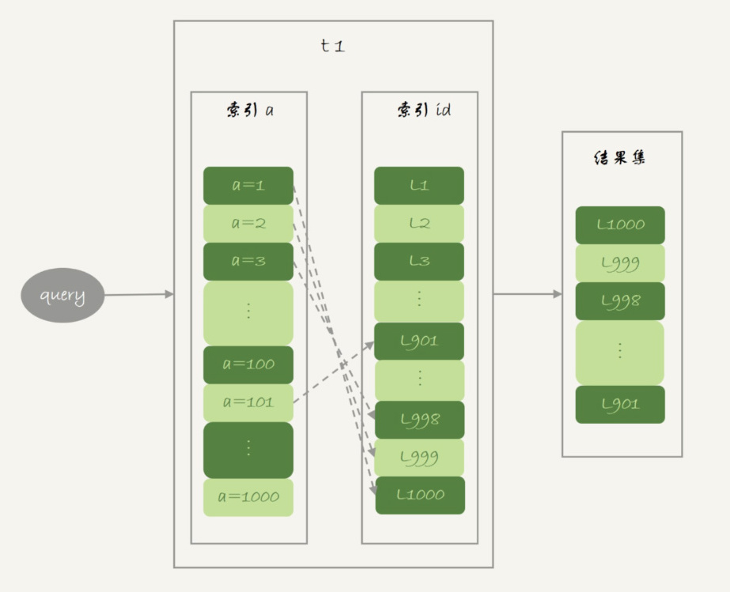
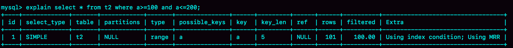

# 35-join 语句优化


我们发现在使用NLJ算法的时候，其实效果还是不错的，比通过应用层拆分成多个语句然后再拼接查询结果更方便，而且性能也不会差。

但是，BNL算法在大表join的时候性能就差多了，比较次数等于两个表参与join的行数的乘积，很消耗CPU资源。

当然了，这两个算法都还有继续优化的空间，我们今天就来聊聊这个话题。

为了便于分析，我还是创建两个表t1、t2来展开今天的问题。


```sql
create table t1(id int primary key, a int, b int, index(a));
create table t2 like t1;
drop procedure idata;
delimiter ;;
create procedure idata()
begin
  declare i int;
  set i=1;
  while(i<=1000)do
    insert into t1 values(i, 1001-i, i);
    set i=i+1;
  end while;
  
  set i=1;
  while(i<=1000000)do
    insert into t2 values(i, i, i);
    set i=i+1;
  end while;

end;;
delimiter ;
call idata();
```

为了便于后面量化说明，在表 t1 里，插入了 1000 行数据，每一行的 a=1001-id 的值。也就是说，表 t1 中字段 a 是逆序的。同时，我在表 t2 中插入了 100 万行数据。

## Multi-Range Read 优化

这个优化的主要目的是尽量使用顺序读盘。

**回表过程是一行行地查数据，还是批量地查数据 ？**

假设，执行这个语句：

```sql
select * from t1 where a>=1 and a<=100;
```

主键索引是一棵 B+ 树，在这棵树上，每次只能根据一个主键 id 查到一行数据。因此，回表肯定是一行行搜索主键索引的，基本流程如下图所示。



如果随着 a 的值递增顺序查询的话，id 的值就变成随机的，那么就会出现随机访问，性能相对较差。虽然“按行查”这个机制不能改，但是调整查询的顺序，还是能够加速的。

**因为大多数的数据都是按照主键递增顺序插入得到的，所以我们可以认为，如果按照主键的递增顺序查询的话，对磁盘的读比较接近顺序读，能够提升读性能。**

这，就是MRR优化的设计思路。此时，语句的执行流程变成了这样：

1. 根据索引 a，定位到满足条件的记录，将 id 值放入 read\_rnd\_buffer 中;

2. 将 read\_rnd\_buffer 中的 id 进行递增排序；

3. 排序后的 id 数组，依次到主键 id 索引中查记录，并作为结果返回。

这里，read\_rnd\_buffer 的大小是由 read\_rnd\_buffer\_size 参数控制的。如果步骤1中，read\_rnd\_buffer 放满了，就会先执行完步骤 2 和 3，然后清空 read\_rnd\_buffer，之后继续找索引 a 的下个记录，并继续循环。

> 另外需要说明的是，如果你想要稳定地使用 MRR 优化的话，需要设置 `set optimizer_switch="mrr_cost_based=off"`。（官方文档的说法，是现在的优化器策略，判断消耗的时候，会更倾向于不使用 MRR，把 mrr\_cost\_based 设置为 off，就是固定使用MRR了。）

下面两幅图就是使用了 MRR 优化后的执行流程和 explain 结果。




从上图的 explain 结果中，我们可以看到 Extra 字段多了 Using MRR，表示的是用上了 MRR 优化。而且，由于我们在 read\_rnd\_buffer 中按照 id 做了排序，所以最后得到的结果集也是按照主键 id 递增顺序的，也就是与图 1 结果集中行的顺序相反。


MRR能够提升性能的核心在于，这条查询语句在索引 a 上做的是一个范围查询（也就是说，这是一个多值查询），可以得到足够多的主键 id。这样通过排序以后，再去主键索引查数据，才能体现出“顺序性”的优势。


## Batched Key Access

理解了 MRR 性能提升的原理，我们就能理解 MySQL 在 5.6 版本后开始引入的 Batched Key Acess(BKA) 算法了。这个 BKA 算法，其实就是对 NLJ 算法的优化。

> NLJ算法执行的逻辑是：从驱动表 t1，一行行地取出值，再到被驱动表 t2 去做 join。也就是说，对于表 t2 来说，每次都是匹配一个值。这时，MRR 的优势就用不上了。

那怎么才能一次性地多传些值给表 t2 呢？方法就是，从表 t1 里一次性地多拿些行出来，一起传给表 t2。

既然如此，我们就把表 t1 的数据取出来一部分，先放到一个临时内存。这个临时内存不是别人，就是 join\_buffer。

NLJ 算法优化后的 BKA 算法的流程。


图中，在 join\_buffer 中放入的数据是 P1~P100，表示的是只会取查询需要的字段。当然，如果 join buffer 放不下 P1~P100 的所有数据，就会把这 100 行数据分成多段执行上图的流程。

那么，这个 BKA 算法到底要怎么启用呢？

如果要使用 BKA 优化算法的话，你需要在执行 SQL 语句之前，先设置

```sql
set optimizer_switch='mrr=on,mrr_cost_based=off,batched_key_access=on';
```

其中，前两个参数的作用是要启用MRR。这么做的原因是，BKA 算法的优化要依赖于 MRR。

## BNL 算法的性能问题


使用 Block Nested-Loop Join(BNL) 算法时，可能会对被驱动表做多次扫描。如果这个被驱动表是一个大的冷数据表，除了会导致 IO 压力大以外，还会对系统有什么影响呢？

> InnoDB 的 LRU 算法的时候提到，由于 InnoDB 对 Bufffer Pool 的 LRU 算法做了优化，即：第一次从磁盘读入内存的数据页，会先放在 old 区域。如果 1 秒之后这个数据页不再被访问了，就不会被移动到 LRU 链表头部，这样对 Buffer Pool 的命中率影响就不大。

但是，如果一个使用 BNL 算法的 join 语句，多次扫描一个冷表，而且这个语句执行时间超过 1 秒，就会在再次扫描冷表的时候，把冷表的数据页移到 LRU 链表头部。

这种情况对应的，是冷表的数据量小于整个 Buffer Pool的3/8，能够完全放入 old 区域的情况。

如果这个冷表很大，就会出现另外一种情况：业务正常访问的数据页，没有机会进入 young 区域。

由于优化机制的存在，一个正常访问的数据页，要进入 young 区域，需要隔 1 秒后再次被访问到。但是，由于我们的 join 语句在循环读磁盘和淘汰内存页，进入 old 区域的数据页，很可能在 1 秒之内就被淘汰了。这样，就会导致这个 MySQL 实例的 Buffer Pool 在这段时间内，young 区域的数据页没有被合理地淘汰。

也就是说，这两种情况都会影响Buffer Pool的正常运作。

**大表join操作虽然对IO有影响，但是在语句执行结束后，对IO的影响也就结束了。但是，对Buffer Pool的影响就是持续性的，需要依靠后续的查询请求慢慢恢复内存命中率。**

为了减少这种影响，你可以考虑增大 join\_buffer\_size 的值，减少对被驱动表的扫描次数。

也就是说，BNL 算法对系统的影响主要包括三个方面：

- 可能会多次扫描被驱动表，占用磁盘IO资源；

- 判断 join 条件需要执行 M*N 次对比（M、N分别是两张表的行数），如果是大表就会占用非常多的 CPU 资源；

- 可能会导致 Buffer Pool 的热数据被淘汰，影响内存命中率。

我们执行语句之前，需要通过理论分析和查看 explain 结果的方式，确认是否要使用 BNL 算法。如果确认优化器会使用 BNL 算法，就需要做优化。优化的常见做法是，给被驱动表的 join 字段加上索引，把 BNL 算法转成 BKA 算法。

## 小结

1. BKA 优化是 MySQL 已经内置支持的，建议你默认使用；

2. BNL 算法效率低，建议你都尽量转成 BKA 算法。优化的方向就是给被驱动表的关联字段加上索引；

## Q & A

现在有一个三个表 join 的需求，假设这三个表的表结构如下：

```sql
CREATE TABLE `t1` (
 `id` int(11) NOT NULL,
 `a` int(11) DEFAULT NULL,
 `b` int(11) DEFAULT NULL,
 `c` int(11) DEFAULT NULL,
  PRIMARY KEY (`id`)
) ENGINE=InnoDB;

create table t2 like t1;
create table t3 like t2;
insert into ... //初始化三张表的数据
```

语句的需求实现如下的 join 逻辑：

```sql
select * from t1 join t2 on(t1.a=t2.a) join t3 on (t2.b=t3.b) where t1.c>=X and t2.c>=Y and t3.c>=Z;
```

现在为了得到最快的执行速度，如果让你来设计表t1、t2、t3上的索引，来支持这个join语句，你会加哪些索引呢？

同时，如果我希望你用straight_join来重写这个语句，配合你创建的索引，你就需要安排连接顺序，你主要考虑的因素是什么呢？

