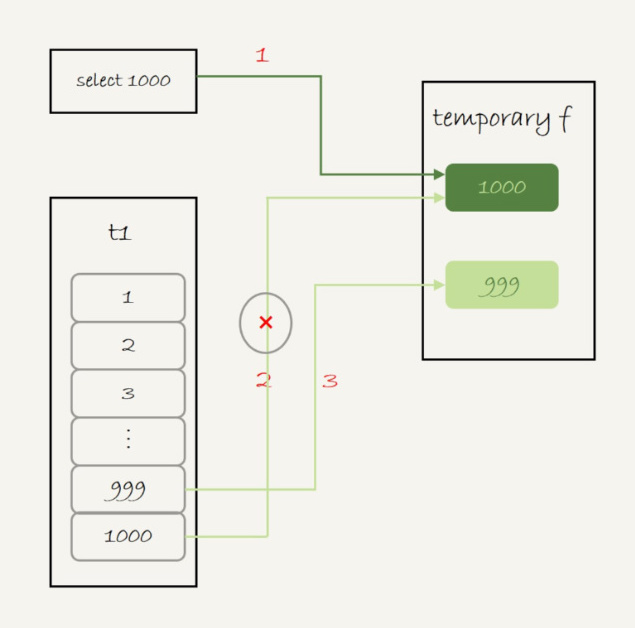
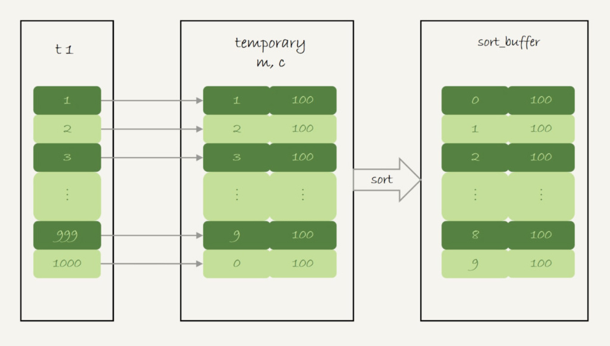
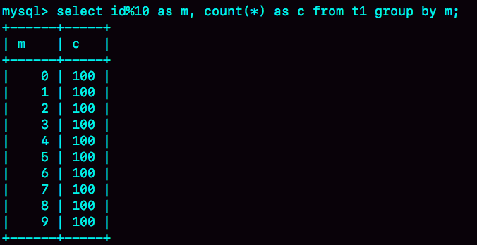
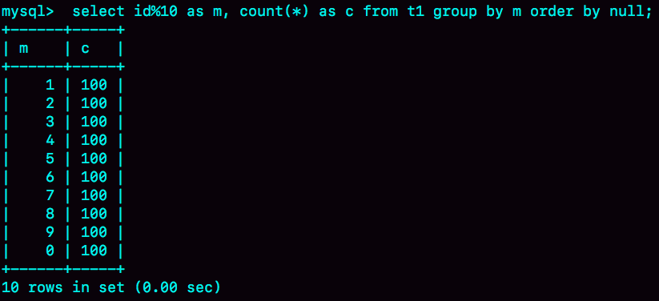
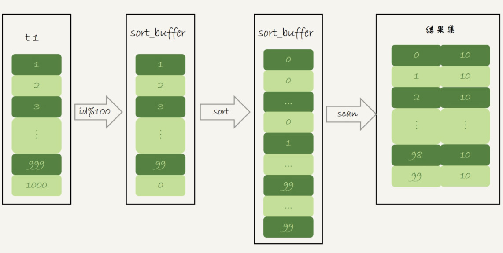

# 37-内部临时表


举两个需要用到内部临时表的例子，来看看内部临时表是怎么工作的。然后，我们再来分析，什么情况下会使用内部临时表。

## union 执行流程


为了便于量化分析，用下面的表 t1 来举例。

```sql
create table t1(id int primary key, a int, b int, index(a));
delimiter ;;
create procedure idata()
begin
  declare i int;

  set i=1;
  while(i<=1000)do
    insert into t1 values(i, i, i);
    set i=i+1;
  end while;
end;;
delimiter ;
call idata();
```

然后，执行下面这条语句：

```sql
(select 1000 as f) union (select id from t1 order by id desc limit 2);
```

这条语句用到了 union，它的语义是，取这两个子查询结果的并集。并集的意思就是这两个集合加起来，重复的行只保留一行。


可以看到：

- 第二行的 key=PRIMARY，说明第二个子句用到了索引 id。

- 第三行的 Extra 字段，表示在对子查询的结果集做 union 的时候，使用了临时表 (Using temporary)。

这个语句的执行流程是这样的：

1. 创建一个内存临时表，这个临时表只有一个整型字段 f，并且 f 是主键字段。

2. 执行第一个子查询，得到 1000 这个值，并存入临时表中。

3. 执行第二个子查询：

	1. 拿到第一行 id=1000，试图插入临时表中。但由于 1000 这个值已经存在于临时表了，违反了唯一性约束，所以插入失败，然后继续执行；
	
	2. 取到第二行 id=999，插入临时表成功。

4. 从临时表中按行取出数据，返回结果，并删除临时表，结果中包含两行数据分别是 1000 和 999。



可以看到，这里的内存临时表起到了暂存数据的作用，而且计算过程还用上了临时表主键 id 的唯一性约束，实现了 union 的语义。


> 顺便提一下，如果把上面这个语句中的 union 改成 union all 的话，就没有了“去重”的语义。这样执行的时候，就依次执行子查询，得到的结果直接作为结果集的一部分，发给客户端。因此也就不需要临时表了。


## group by 执行流程

另外一个常见的使用临时表的例子是 group by，我们来看一下这个语句：

```sql
select id%10 as m, count(*) as c from t1 group by m;
```

这个语句的逻辑是把表 t1 里的数据，按照 id%10 进行分组统计，并按照 m 的结果排序后输出


在 Extra 字段里面，我们可以看到三个信息：

- Using index：表示这个语句使用了覆盖索引，选择了索引 a，不需要回表；

- Using temporary：表示使用了临时表；

- Using filesort，表示需要排序。

这个语句的执行流程是这样的：

1. 创建内存临时表，表里有两个字段 m 和 c，主键是 m；

2. 扫描表 t1 的索引 a，依次取出叶子节点上的 id 值，计算 id%10 的结果，记为 x；

	- 如果临时表中没有主键为 x 的行，就插入一个记录 (x,1);
	
	- 如果表中有主键为 x 的行，就将 x 这一行的 c 值加 1。

3. 遍历完成后，再根据字段 m 做排序，得到结果集返回给客户端。


这个流程的执行图如下：



上图中最后一步，对内存临时表的排序：


这条语句的执行结果：



如果需求并不需要对结果进行排序，那你可以在 SQL 语句末尾增加 order by null，也就是改成：

```sql
select id%10 as m, count(*) as c from t1 group by m order by null;
```

这样就跳过了最后排序的阶段，直接从临时表中取数据返回。返回的结果如下图所示。



由于表 t1 中的 id 值是从 1 开始的，因此返回的结果集中第一行是 id=1；扫描到 id=10 的时候才插入 m=0 这一行，因此结果集里最后一行才是 m=0。

这个例子里由于临时表只有 10 行，内存可以放得下，因此全程只使用了内存临时表。但是，内存临时表的大小是有限制的，参数 tmp\_table\_size 就是控制这个内存大小的，默认是 16M。


## group by 优化方法：直接排序

如果我们明明知道，一个 group by 语句中需要放到临时表上的数据量特别大，却还是要按照“先放到内存临时表，插入一部分数据后，发现内存临时表不够用了再转成磁盘临时表”，看上去就有点儿傻。

那么，我们就会想了，MySQL 有没有让我们直接走磁盘临时表的方法呢？

> 答案是，有的。


在 group by 语句中加入 SQL\_BIG\_RESULT 这个提示（hint），就可以告诉优化器：这个语句涉及的数据量很大，请直接用磁盘临时表。

MySQL 的优化器一看，磁盘临时表是 B+ 树存储，存储效率不如数组来得高。所以，既然你告诉我数据量很大，那从磁盘空间考虑，还是直接用数组来存吧。


因此，下面这个语句

```sql
select SQL_BIG_RESULT id%100 as m, count(*) as c from t1 group by m;
```

的执行流程就是这样的：

1. 初始化 sort\_buffer，确定放入一个整型字段，记为 m；

2. 扫描表 t1 的索引 a，依次取出里面的 id 值, 将 id%100 的值存入 sort\_buffer 中；

3. 扫描完成后，对 sort\_buffer 的字段 m 做排序（如果 sort\_buffer 内存不够用，就会利用磁盘临时文件辅助排序）；

4. 排序完成后，就得到了一个有序数组。

根据有序数组，得到数组里面的不同值，以及每个值的出现次数。




基于上面的 union、union all 和 group by 语句的执行过程的分析，回答开头的问题：MySQL 什么时候会使用内部临时表？

如果语句执行过程可以一边读数据，一边直接得到结果，是不需要额外内存的，否则就需要额外的内存，来保存中间结果；

join\_buffer 是无序数组，sort_buffer 是有序数组，临时表是二维表结构；

如果执行逻辑需要用到二维表特性，就会优先考虑使用临时表。比如我们的例子中，union 需要用到唯一索引约束， group by 还需要用到另外一个字段来存累积计数。

