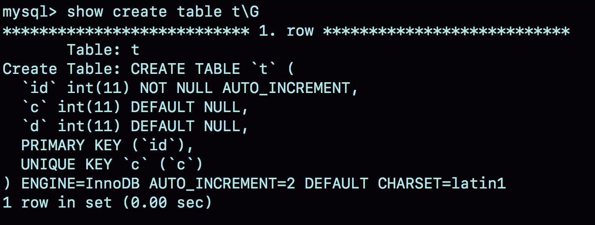

# 39-自增主键为什么不是连续的


自增主键可以让主键索引尽量地保持递增顺序插入，避免了页分裂，因此索引更紧凑。

如果业务设计依赖于自增主键的连续性，也就是说，这个设计假设自增主键是连续的。但实际上，这样的假设是错的，因为自增主键不能保证连续递增。


今天这篇文章，我们就来说说这个问题，看看什么情况下自增主键会出现 “空洞”？

为了便于说明，创建一个表 t，其中 id 是自增主键字段、c 是唯一索引。

```sql
CREATE TABLE `t` (
  `id` int(11) NOT NULL AUTO_INCREMENT,
  `c` int(11) DEFAULT NULL,
  `d` int(11) DEFAULT NULL,
  PRIMARY KEY (`id`),
  UNIQUE KEY `c` (`c`)
) ENGINE=InnoDB;
```

## 自增值保存在哪儿？

1. 在这个空表 t 里面执行 `insert into t values(null, 1, 1);` 

2. 再执行 `show create table` 命令，就可以看到如下图所示的结果：



可以看到，表定义里面出现了一个 AUTO\_INCREMENT=2，表示下一次插入数据时，如果需要自动生成自增值，会生成 id=2。

其实，这个输出结果容易引起这样的误解：自增值是保存在表结构定义里的。实际上，表的结构定义存放在后缀名为 .frm 的文件中，但是并不会保存自增值。

不同的引擎对于自增值的保存策略不同：

- MyISAM 引擎的自增值保存在数据文件中

- InnoDB 引擎的自增值，其实是保存在了内存里，并且到了 MySQL 8.0 版本后，才有了“自增值持久化”的能力，也就是才实现了“如果发生重启，表的自增值可以恢复为 MySQL 重启前的值”，具体情况是：

	- 在 MySQL 5.7 及之前的版本，自增值保存在内存里，并没有持久化。每次重启后，第一次打开表的时候，都会去找自增值的最大值 max(id)，然后将 max(id)+1 作为这个表当前的自增值。
举例来说，如果一个表当前数据行里最大的 id 是 10，AUTO\_INCREMENT=11。这时候，我们删除 id=10 的行，AUTO_INCREMENT 还是 11。但如果马上重启实例，重启后这个表的AUTO\_INCREMENT 就会变成 10。
	
	> 也就是说，MySQL 重启可能会修改一个表的 AUTO\_INCREMENT 的值。
	
	- 在 MySQL 8.0 版本，将自增值的变更记录在了 redo log 中，重启的时候依靠 redo log 恢复重启之前的值。


## 自增值修改机制

在 MySQL 里面，如果字段 id 被定义为 AUTO\_INCREMENT，在插入一行数据的时候，自增值的行为如下：

- 如果插入数据时 id 字段指定为 0、null 或未指定值，那么就把这个表当前的  AUTO\_INCREMENT 值填到自增字段；

- 如果插入数据时id字段指定了具体的值，就直接使用语句里指定的值。

	根据要插入的值和当前自增值的大小关系，自增值的变更结果也会有所不同。假设，某次要插入的值是 X，当前的自增值是 Y。

	- 如果 X < Y，那么这个表的自增值不变；
	
	- 如果 X ≥ Y，就需要把当前自增值修改为新的自增值。

**新的自增值生成算法**是：从 auto\_increment\_offset 开始，以 auto\_increment\_increment 为步长，持续叠加，直到找到第一个大于 X 的值，作为新的自增值。

其中，auto\_increment\_offset 和 auto\_increment\_increment 是两个系统参数，分别用来表示自增的初始值和步长，默认值都是 1。

> 备注：在一些场景下，使用的就不全是默认值。比如，双 M 的主备结构里要求双写的时候，我们就可能会设置成 auto\_increment\_increment=2，让一个库的自增 id 都是奇数，另一个库的自增 id 都是偶数，避免两个库生成的主键发生冲突。

当 auto\_increment\_offset 和 auto\_increment\_increment 都是 1 的时候，新的自增值生成逻辑很简单，就是：

1. 如果准备插入的值>=当前自增值，新的自增值就是 “准备插入的值 + 1”；

2. 否则，自增值不变。

这就引入了我们文章开头提到的问题，在这两个参数都设置为 1 的时候，自增主键 id 却不能保证是连续的，这是什么原因呢 ？

## 自增值的修改时机

假设，表 t 里面已经有了 (1,1,1) 这条记录，这时我再执行一条插入数据命令：

```sql
insert into t values(null, 1, 1); 
```

这个语句的执行流程就是：

1. 执行器调用 InnoDB 引擎接口写入一行，传入的这一行的值是 (0,1,1);

2. InnoDB 发现用户没有指定自增 id 的值，获取表 t 当前的自增值 2；

3. 将传入的行的值改成 (2,1,1);

4. 将表的自增值改成3；

5. 继续执行插入数据操作，由于已经存在 c=1 的记录，所以报 Duplicate key error，语句返回。

可以看到，这个表的自增值改成 3，是在真正执行插入数据的操作之前。这个语句真正执行的时候，因为碰到唯一键 c 冲突，所以 id=2 这一行并没有插入成功，但也没有将自增值再改回去。

所以，在这之后，再插入新的数据行时，拿到的自增 id 就是 3。也就是说，出现了自增主键不连续的情况。

可见，**唯一键冲突是导致自增主键 id 不连续的第一种原因**。

**回滚也会产生类似的现象，这就是第二种原因**

下面这个语句序列就可以构造不连续的自增 id：

```sql
insert into t values(null,1,1);
begin;
insert into t values(null,2,2);
rollback;
insert into t values(null,2,2);
//插入的行是(3,2,2)
```

为什么在出现唯一键冲突或者回滚的时候，MySQL 没有把表 t 的自增值改回去呢？如果把表 t 的当前自增值从 3 改回 2，再插入新数据的时候，不就可以生成 id=2 的一行数据了吗？

其实，MySQL这么设计是为了提升性能。


## 自增锁的优化

在 MySQL 5.0 版本的时候，自增锁的范围是语句级别。也就是说，如果一个语句申请了一个表自增锁，这个锁会等语句执行结束以后才释放。显然，这样设计会影响并发度。

MySQL 5.1.22 版本引入了一个新策略，新增参数 innodb\_autoinc\_lock\_mode，默认值是 1。

- 这个参数的值被设置为0时，表示采用之前 MySQL 5.0 版本的策略，即语句执行结束后才释放锁；

- 这个参数的值被设置为 1 时：

	- 普通 insert 语句，自增锁在申请之后就马上释放；

	- 类似 `insert … select` 这样的批量插入数据的语句，自增锁还是要等语句结束后才被释放；

- 这个参数的值被设置为2时，所有的申请自增主键的动作都是申请后就释放锁。


为什么默认设置下，`insert … select` 要使用语句级的锁？为什么这个参数的默认值不是 2？

> **答案是，这么设计还是为了数据的一致性。**


我们一起来看一下这个场景：


你可以设想一下，如果 session B 是申请了自增值以后马上就释放自增锁，那么就可能出现这样的情况：

- session B 先插入了两个记录，(1,1,1)、(2,2,2)；

- 然后，session A 来申请自增 id 得到 id=3，往 t2 插入了（3,5,5)；

- 之后，session B 继续执行，插入两条记录 (4,3,3)、 (5,4,4)。


你可能会说，这也没关系吧，毕竟session B的语义本身就没有要求表t2的所有行的数据都跟session A相同。

是的，从数据逻辑上看是对的。但是，如果我们现在的 `binlog_format=statement`，你可以设想下，binlog 会怎么记录呢？

由于两个 session 是同时执行插入数据命令的，所以 binlog 里面对表 t2 的更新日志只有两种情况：要么先记 session A 的，要么先记 session B 的。

但不论是哪一种，这个 binlo g拿去从库执行，或者用来恢复临时实例，备库和临时实例里面，session B 这个语句执行出来，生成的结果里面，id 都是连续的。这时，这个库就发生了数据不一致。

你可以分析一下，出现这个问题的原因是什么？

其实，这是因为原库 session B 的 insert 语句，生成的 id 不连续。这个不连续的 id，用 statement 格式的 binlog 来串行执行，是执行不出来的。

而要解决这个问题，有两种思路：

- 让原库的批量插入数据语句，固定生成连续的 id 值。所以，自增锁直到语句执行结束才释放，就是为了达到这个目的。

- 在 binlog 里面把插入数据的操作都如实记录进来，到备库执行的时候，不再依赖于自增主键去生成。这种情况，其实就是 `innodb_autoinc_lock_mode=2`，同时 `binlog_format=row`。

因此，在生产上，尤其是有 `insert … select` 这种批量插入数据的场景时，从并发插入数据性能的角度考虑，我建议你这样设置：`innodb_autoinc_lock_mode=2` ，并且 `binlog_format=row`。这样做，既能提升并发性，又不会出现数据一致性问题。

> 批量插入数据，包含的语句类型是 `insert … select`、`replace … select` 和 `load data` 语句。

但是，在普通的 insert 语句里面包含多个 value 值的情况下，即使 `innodb_autoinc_lock_mode=1`，也不会等语句执行完成才释放锁。因为这类语句在申请自增 id 的时候，是可以精确计算出需要多少个 id 的，然后一次性申请，申请完成后锁就可以释放了。

也就是说，批量插入数据的语句，之所以需要这么设置，是因为“不知道要预先申请多少个id”。

既然预先不知道要申请多少个自增 id，那么一种直接的想法就是需要一个时申请一个。但如果一个 `select … insert` 语句要插入 10 万行数据，按照这个逻辑的话就要申请 10 万次。显然，这种申请自增 id 的策略，在大批量插入数据的情况下，不但速度慢，还会影响并发插入的性能。

因此，对于批量插入数据的语句，MySQL 有一个批量申请自增 id 的策略：

1. 语句执行过程中，第一次申请自增id，会分配 1 个；

2. 1 个用完以后，这个语句第二次申请自增id，会分配 2 个；

3. 2 个用完以后，还是这个语句，第三次申请自增 id，会分配 4 个；

依此类推，同一个语句去申请自增 id，每次申请到的自增 id 个数都是上一次的两倍。

举个例子，我们一起看看下面的这个语句序列：


```sql
insert into t values(null, 1,1);
insert into t values(null, 2,2);
insert into t values(null, 3,3);
insert into t values(null, 4,4);
create table t2 like t;
insert into t2(c,d) select c,d from t;
insert into t2 values(null, 5,5);
```

`insert…select`，实际上往表 t2 中插入了4行数据。但是，这四行数据是分三次申请的自增 id，第一次申请到了 `id=1`，第二次被分配了 `id=2` 和 `id=3`， 第三次被分配到 `id=4` 到 `id=7`。

由于这条语句实际只用上了 4 个id，所以 `id=5` 到 `id=7` 就被浪费掉了。之后，再执行 `insert into t2 values(null, 5,5)`，实际上插入的数据就是（8,5,5)。

**这是主键id出现自增id不连续的第三种原因。**


## Q & A

在最后一个例子中，执行 `insert into t2(c,d) select c,d from t;` 这个语句的时候，如果隔离级别是可重复读（repeatable read），`binlog_format=statement`。这个语句会对表 t 的所有记录和间隙加锁。

你觉得为什么需要这么做呢？

