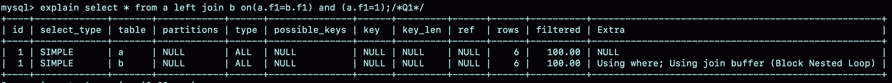
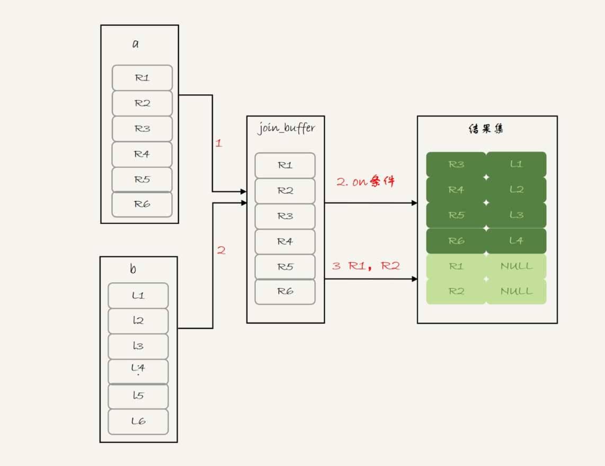
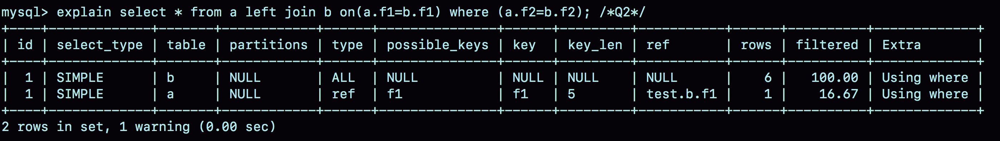
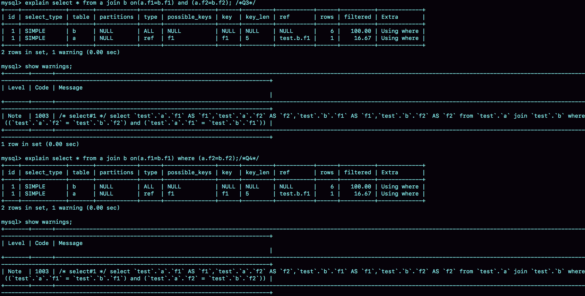

# 44-Join 答疑


## join 的写法

两个问题：

1. 如果用 left join 的话，左边的表一定是驱动表吗？

2. 如果两个表的 join 包含多个条件的等值匹配，是都要写到 on 里面呢，还是只把一个条件写到 on 里面，其他条件写到 where 部分？

为了同时回答这两个问题，构造两个表 a 和 b：

```sql
create table a(f1 int, f2 int, index(f1))engine=innodb;
create table b(f1 int, f2 int)engine=innodb;
insert into a values(1,1),(2,2),(3,3),(4,4),(5,5),(6,6);
insert into b values(3,3),(4,4),(5,5),(6,6),(7,7),(8,8);
```


表 a 和 b 都有两个字段 f1 和 f2，不同的是表 a 的字段 f1 上有索引。然后，往两个表中都插入了 6 条记录，其中在表 a 和 b 中同时存在的数据有 4 行。

第二个问题，其实就是下面这两种写法的区别：


```sql
select * from a left join b on(a.f1=b.f1) and (a.f2=b.f2); /*Q1*/
select * from a left join b on(a.f1=b.f1) where (a.f2=b.f2);/*Q2*/
```

首先，需要说明的是，这两个 left join 语句的语义逻辑并不相同。我们先来看一下它们的执行结果。


可以看到：

- 语句 Q1 返回的数据集是 6 行，表 a 中即使没有满足匹配条件的记录，查询结果中也会返回一行，并将表 b 的各个字段值填成NULL

- 语句 Q2 返回的是 4 行。从逻辑上可以这么理解，最后的两行，由于表 b 中没有匹配的字段，结果集里面 b.f2 的值是空，不满足 where 部分的条件判断，因此不能作为结果集的一部分。

接下来，我们看看实际执行这两条语句时，MySQL 是怎么做的

我们先一起看看语句 Q1 的 explain 结果：



可以看到，这个结果符合我们的预期：

- 驱动表是表 a，被驱动表是表 b；

- 由于表 b 的 f1 字段上没有索引，所以使用的是 Block Nexted Loop Join（简称 BNL） 算法。

看到 BNL 算法，你就应该知道这条语句的执行流程其实是这样的：

1. 把表 a 的内容读入 join\_buffer 中。因为是 `select *`，所以字段 f1 和 f2 都被放入 join\_buffer了。

2. 顺序扫描表 b，对于每一行数据，判断 join 条件（也就是 `a.f1=b.f1 and a.f2=b.f2`)是否满足，满足条件的记录, 作为结果集的一行返回。如果语句中有 where 子句，需要先判断 where 部分满足条件后，再返回。

3. 表 b 扫描完成后，对于没有被匹配的表 a 的行（在这个例子中就是(1,1)、(2,2)这两行），把剩余字段补上 NULL，再放入结果集中。

对应的流程图如下：



可以看到，这条语句确实是以表 a 为驱动表，而且从执行效果看，也和使用 straight\_join 是一样的。

你可能会想，语句 Q2 的查询结果里面少了最后两行数据，是不是就是把上面流程中的步骤 3 去掉呢？我们还是先看一下语句 Q2 的 expain 结果吧。




可以看到，这条语句是以表 b 为驱动表的。

> 如果一条 join 语句的 Extra 字段什么都没写的话，就表示使用的是 Index Nested-Loop Join（简称 NLJ）算法。

因此，语句 Q2 的执行流程是这样的：顺序扫描表 b，每一行用 b.f1 到表 a 中去查，匹配到记录后判断 `a.f2=b.f2` 是否满足，满足条件的话就作为结果集的一部分返回。

**那么，为什么语句 Q1 和 Q2 这两个查询的执行流程会差距这么大呢？其实，这是因为优化器基于 Q2 这个查询的语义做了优化。**

> 在 MySQL 里，NULL 跟任何值执行等值判断和不等值判断的结果，都是 NULL。这里包括， `select NULL = NULL` 的结果，也是返回 NULL。

因此，语句 Q2 里面 `where a.f2=b.f2` 就表示，查询结果里面不会包含 b.f2 是 NULL 的行，这样这个 left join 的语义就是“找到这两个表里面，f1、f2 对应相同的行。对于表 a 中存在，而表 b 中匹配不到的行，就放弃”。

这样，这条语句虽然用的是 left join，但是语义跟 join 是一致的。

因此，优化器就把这条语句的 left join 改写成了 join，然后因为表 a 的 f1 上有索引，就把表 b 作为驱动表，这样就可以用上 NLJ 算法。在执行 explain 之后，你再执行 `show warnings`，就能看到这个改写的结果，如下图所示。


这个例子说明，即使我们在 SQL 语句中写成 left join，执行过程还是有可能不是从左到右连接的。也就是说，**使用 left join 时，左边的表不一定是驱动表**。

这样看来，**如果需要 left join 的语义，就不能把被驱动表的字段放在 where 条件里面做等值判断或不等值判断，必须都写在 on 里面。那如果是 join 语句呢**？

这时候，我们再看看这两条语句：

```sql
select * from a join b on(a.f1=b.f1) and (a.f2=b.f2); /*Q3*/
select * from a join b on(a.f1=b.f1) where (a.f2=b.f2);/*Q4*/
```

我们再使用一次看 explain 和 `show warnings` 的方法，看看优化器是怎么做的。



可以看到，这两条语句都被改写成：

```sql
mysql> select * from a join b where (a.f1=b.f1) and (a.f2=b.f2);
```

执行计划自然也是一模一样的。

也就是说，在这种情况下，join 将判断条件是否全部放在 on 部分就没有区别了。

## Simple Nested Loop Join 的性能问题


我们在文中说到，虽然 BNL 算法和 Simple Nested Loop Join 算法都是要判断 M \* N 次（M 和 N 分别是 join 的两个表的行数），但是 Simple Nested Loop Join 算法的每轮判断都要走全表扫描，因此性能上 BNL 算法执行起来会快很多。

为了便于说明，我还是先为你简单描述一下这两个算法。

BNL 算法的执行逻辑是：

1. 首先，将驱动表的数据全部读入内存 join\_buffer 中，这里 join\_buffer 是无序数组；

2. 然后，顺序遍历被驱动表的所有行，每一行数据都跟 join\_buffer 中的数据进行匹配，匹配成功则作为结果集的一部分返回。

Simple Nested Loop Join 算法的执行逻辑是：

1. 顺序取出驱动表中的每一行数据，到被驱动表去做全表扫描匹配，匹配成功则作为结果集的一部分返回。

Simple Nested Loop Join 算法，其实也是把数据读到内存里，然后按照匹配条件进行判断，为什么性能差距会这么大呢？

1. 在对被驱动表做全表扫描的时候，如果数据没有在 Buffer Pool 中，就需要等待这部分数据从磁盘读入；

	从磁盘读入数据到内存中，会影响正常业务的 Buffer Pool 命中率，而且这个算法天然会对被驱动表的数据做多次访问，更容易将这些数据页放到 Buffer Pool 的头部

2. 即使被驱动表数据都在内存中，每次查找 “下一个记录的操作”，都是类似指针操作。而 join\_buffer 中是数组，遍历的成本更低。


所以说，BNL 算法的性能会更好。

## distinct 和 group by 的性能

如果只需要去重，不需要执行聚合函数，distinct 和group by 哪种效率高一些呢？

展开一下他的问题：如果表 t 的字段 a 上没有索引，那么下面这两条语句的性能是否相同：

```sql
select a from t group by a order by null;
select distinct a from t;
```

首先需要说明的是，这种 group by 的写法，并不是 SQL 标准的写法。标准的 group by 语句，是需要在 select 部分加一个聚合函数，比如：

```sql
mysql> select a,count(*) from t group by a order by null;
```

这条语句的逻辑是：按照字段 a 分组，计算每组的 a 出现的次数。在这个结果里，由于做的是聚合计算，相同的 a 只出现一次。

没有了 `count(*)` 以后，也就是不再需要执行 “计算总数” 的逻辑时，第一条语句的逻辑就变成是：按照字段 a 做分组，相同的 a 的值只返回一行。而这就是 distinct 的语义，所以不需要执行聚合函数时，distinct 和 group by 这两条语句的语义和执行流程是相同的，因此执行性能也相同。

这两条语句的执行流程是下面这样的：

1. 创建一个临时表，临时表有一个字段 a，并且在这个字段 a 上创建一个唯一索引；

2. 遍历表 t，依次取数据插入临时表中：

	- 如果发现唯一键冲突，就跳过；

	- 否则插入成功；

3. 遍历完成后，将临时表作为结果集返回给客户端。


## 备库自增主键问题


