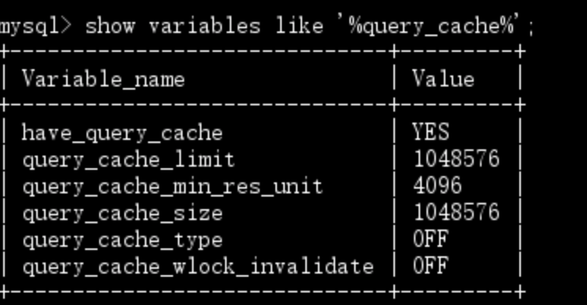
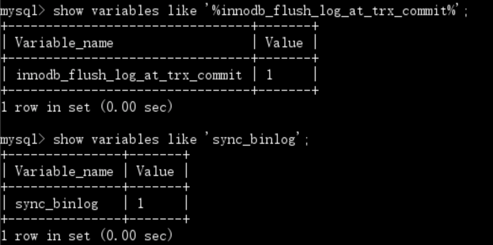

# 应用


### Explain

#### id 列

#### select\_type 列

#### table 列

#### type 列

MySQL 决定如何查找表中的行，下面是最重要的访问方法，依次从最差到最优。

- ALL

	全表扫描。（有个例外，例如在查询中使用 LIMIT，或在 Extra 列显示 "Using distinct/not exists"）
	
- index

	扫描表时按索引次序扫描整张表。优点是避免了排序，缺点是意味着使用随机次序访问数据行。

- range

	有限制的索引扫描，比全索引扫描较好。显而易见的范围扫描是带有 BETWEEN 或 WHERE 子句中带有 > 的查询。
	
	当 MySQL 使用索引查找一系列值，比如 In() 或 OR 列表，也显示范围扫描。然而二者是相当不同的访问类型，性能上有重要差异。查看《高性能 MySQL》 第 5 章，”什么是范围条件“。
	
- ref

	索引访问，返回所有匹配某个单个值的行，是查找和扫描的混合体。此类索引访问只有当使用非唯一索引或唯一索引的前缀时才会发生。
	
	ref\_or\_null 是 ref 上的一个变体，意味着 MySQL 必须在初次查找的结果进行第二次查找以找出 NULL 条目。
	
- eq_ref

	最多返回一条符合条件的记录，该访问方法可以在 MySQL 使用主键或唯一索引查找时出现。

- const, system

	MySQL 能够对查询的某部分进行优化，并将其转换成一个常量时。比如，通过将某一行的主键放在 WHERE 子句中，MySQL 就能将此查询转换为一个常量，然后可以高效地将表从联接执行中移除。
	
- NULL

	MySQL 在优化阶段分解查询语句，在执行阶段甚至不用再访问表或索引。比如，从一个索引列中选取最小值可以通过单独查找索引完成，不需要回表。

#### possible\_keys 列

显示了查询可以使用哪些索引，基于查询访问的列和使用的比较操作符来判断。这个列表是在优化过程的早期创建的，因此有些罗列出来的索引可能对于后续优化过程没用。

#### key 列

MySQL 决定采用哪个索引优化对该表的访问。如果该索引没有出现在 possible\_keys 列中，那么 MySQL 选用它是出于另外的原因，比如可能选择了覆盖索引，哪怕没有 WHERE 子句。

possible\_keys 列揭示了哪一个索引有助于高效查找，而 key 显示的是优化采用哪一个索引可以最小化查询成本。

#### key\_len 列

MySQL 在索引里使用的字节数。如果 MySQL 正在使用的只是索引里的某些列，那么就可以用这个值来算出具体是哪些列（指的是索引的最左前缀）。

由于是字节数，需要考虑列的字符集。key\_len 显示的是索引字段中可能的最大长度，是根据查找表的定义而计算出。


#### ref 列

表在 key 列记录的索引中查找值所用的列或者常量。

#### rows 列

MySQL 认为它要检查的行数，而不是结果集的行数。同时也要认识到有很多优化手段（如关联缓冲区和缓存）无法影响到行数的显示。


#### Extra 列

- *Using index*

	MySQL 将使用覆盖索引，以避免回表。

- *Using where*
	
	MySQL 服务器将在存储引擎检索行后再进行过滤。
	
	许多 WHERE 条件里涉及索引中的列，如果读取索引时，就能被存储引擎检验，因此不是所有带 WHERE 子句的查询都会显示 "Using where"，有时它是一个暗示：查询可受益于不同的索引。
	
- *Using temporary*

	在磁盘或内存中对查询结果排序时使用一个临时表。

- *Using filesort*

	在内存或磁盘上完成排序。
	
- 使用 join 查询	
	
	- *Using join buffer(Block Nested Loop)*

	- *Using MRR*

### SQL\_CACHE 应该开启

当表进行更新时，SQL\_CACHE 会清空对应的表信息，因此反而会造成性能下降，在 MySQL 8.0 版本被废弃。

那么如果应用中的表大部分时间都是读操作，就应该开启 SQL\_CACHE。

强制使用 SQL\_CACHE。

```sql
mysql> select SQL_CACHE * from T where ID=10；
```

`query_cache_type = 0` 时表示关闭，1 时表示打开。




### innodb\_flush\_log\_at\_trx\_commit & sync\_binlog

redo log 用于保证 crash-safe 能力。innodb\_flush\_log\_at\_trx\_commit 这个参数设置成 1 的时候，表示每次事务的 redo log 都直接持久化到磁盘。这个参数建议设置成 1，这样可以保证 MySQL 异常重启之后数据不丢失。

sync\_binlog 这个参数设置成1的时候，表示每次事务的 binlog 都持久化到磁盘。这个参数也建议设置成 1，这样可以保证 MySQL 异常重启之后 binlog 不丢失。



###  autocommit

`set autocommit=0`，这个命令会将这个线程的自动提交关掉。意味着如果你只执行一个 select 语句，这个事务就启动了，而且并不会自动提交。这个事务持续存在直到你主动执行 commit 或 rollback 语句，或者断开连接。

有些客户端连接框架会默认连接成功后先执行一个 `set autocommit=0` 的命令。这就导致接下来的查询都在事务中，如果是长连接，就导致了意外的长事务。

建议你总是使用 `set autocommit=1`, 通过显式语句的方式来启动事务。

```sql
mysql> show variables like '%autocommit%';
+---------------+-------+
| Variable_name | Value |
+---------------+-------+
| autocommit    | ON    |
+---------------+-------+
1 row in set (0.02 sec)
```

### innodb\_deadlock\_detect

出现死锁以后，有两种策略：

- 直接进入等待，直到超时。这个超时时间可以通过参数 innodb\_lock\_wait\_timeout 来设置。

- 死锁检测，发现死锁后，主动回滚死锁链条中的某一个事务，让其他事务得以继续执行。将参数 innodb\_deadlock\_detect 设置为 on，表示开启这个逻辑。

在 InnoDB 中，innodb\_lock\_wait\_timeout 的默认值是 50s，意味着如果采用第一个策略，当出现死锁以后，第一个被锁住的线程要过 50s 才会超时退出，然后其他线程才有可能继续执行。对于在线服务来说，这个等待时间往往是无法接受的。

所以，正常情况下我们还是要采用第二种策略，即：主动死锁检测，而且  innodb\_deadlock\_detect 的默认值本身就是 on。主动死锁检测在发生死锁的时候，是能够快速发现并进行处理的，但是它也是有额外负担的。

```sql
mysql> show variables like '%innodb_lock_wait_timeout%';
+--------------------------+-------+
| Variable_name            | Value |
+--------------------------+-------+
| innodb_lock_wait_timeout | 50    |
+--------------------------+-------+
1 row in set (0.01 sec)

mysql> show variables like '%innodb_deadlock_detect%';
+------------------------+-------+
| Variable_name          | Value |
+------------------------+-------+
| innodb_deadlock_detect | ON    |
+------------------------+-------+
1 row in set (0.00 sec)
```

### 慢查询日志

查看慢查询日志，分析查询时间，以及扫描的数据行是否符合预期。

```sql
mysql> show variables like 'slow_query%';
+---------------------+------------------------------------------------------+
| Variable_name       | Value                                                |
+---------------------+------------------------------------------------------+
| slow_query_log      | OFF                                                  |
| slow_query_log_file | /usr/local/mysql/data/ackermandeMacBook-Pro-slow.log |
+---------------------+------------------------------------------------------+
2 rows in set (0.00 sec)
```

开启慢查询，设置慢查询时间为 0，分析完之后需要关闭。

```sql
mysql> set global slow_query_log = on;
mysql> set long_query_time=0;
```


### 文件排序

在 explian 结果的 Extra 字段中的 “Using filesort” 表示的就是需要排序，MySQL 会给每个线程分配一块内存用于排序，称为 sort\_buffer。

当 sort\_buffer\_size 太小不足以进行排序时，需要使用磁盘临时文件进行排序。

用下面介绍的方法，来确定一个排序语句是否使用了临时文件。

```sql
/* 打开optimizer_trace，只对本线程有效 */
SET optimizer_trace='enabled=on'; 

/* @a保存Innodb_rows_read的初始值 */
select VARIABLE_VALUE into @a from  performance_schema.session_status where variable_name = 'Innodb_rows_read';

/* 执行语句 */
select city, name,age from t where city='杭州' order by name limit 1000; 

/* 查看 OPTIMIZER_TRACE 输出 */
SELECT * FROM `information_schema`.`OPTIMIZER_TRACE`\G

/* @b保存Innodb_rows_read的当前值 */
select VARIABLE_VALUE into @b from performance_schema.session_status where variable_name = 'Innodb_rows_read';

/* 计算Innodb_rows_read差值 */
select @b-@a;
```

这个方法是通过查看 OPTIMIZER\_TRACE 的结果来确认的，可以从 number\_of\_tmp\_files 中看到是否使用了临时文件。

如果 sort\_buffer\_size 超过了需要排序的数据量的大小，number\_of\_tmp\_files 就是 0，表示排序可以直接在内存中完成。


**内存临时表**


### 


-- 

### 普通索引和唯一索引的选择

对于查询过程，性能差别不大，普通索引可能需要多一次或多次的判断，但对于 B+ 树的索引搜索开销很小。

如果要表中插入一个新记录的话，InnoDB 的处理流程是怎样的。

- 第一种情况是，这个记录要更新的目标页在内存中。这时，InnoDB 的处理流程如下：

	- 对于唯一索引：判断有没有冲突，没有则插入这个值，语句执行结束；
	
	- 对于普通索引：找到合适的位置，插入这个值，语句执行结束。

	普通索引和唯一索引对更新语句性能影响的差别只有微小的 CPU 时间。
	
- 第二种情况是，这个记录要更新的目标页不在内存中。这时，InnoDB 的处理流程如下：

	- 对于唯一索引：需要将数据页读入内存，判断有没有冲突，插入这个值，语句执行结束；
	
	- 对于普通索引：则是将更新记录在 change buffer，语句执行就结束了。
	
	将数据从磁盘读入内存涉及随机 IO 的访问，是数据库里面成本最高的操作之一。change buffer 因为减少了随机磁盘访问，所以对更新性能的提升是会很明显的。


Flink

Flink 结构化数据入库 ElasticSearch
Flink 关联分析设备告警报文、IP 黑名单检测
Flink 监控设备数据流量的突增
各种数据的查询服务
分行、系统告警数据量的排行定时更新与缓存


Flink、Kafka、ElasticSearch、MySQL、Redis

ID 的方案：告警设备的 ID +  提取数据的时间戳 + 数据的 HASH 取后